# AZURE DEVOPS CI/CD PIPELINE FOR ASP.NET CORE APPLICATION
**2018-11-20 COSTIN MORARIU**

**DEVOPS, TESTING**

Two months ago [Scott Hanselman](https://www.hanselman.com/) wrote a nice [blog post](https://www.hanselman.com/blog/AzureDevOpsContinuousBuildDeployTestWithASPNETCore22PreviewInOneHour.aspx) where he describes how to use [Azure DevOps](https://azure.microsoft.com/en-us/services/devops/) to build/deploy/test an ASP.NET Core application.

My goal here is to extend Scott's configuration by using [Docker](https://www.docker.com/) containers and by adding a pipeline stage for running acceptance tests with [Selenium](https://www.seleniumhq.org/). I'll use one of my ASP.NET Core sample applications [E-BikesShop](https://ebikesshopserver.azurewebsites.net/retailcalculator) which implements a simple retail calculator. 

Having E-BikesShop application [GitHub repository](https://github.com/stonemonkey/BlazorInAction) I'd like to automate the following CI/CD process on it:
*   Each time a push is made to the GitHub master branch a build will be triggered.
*   The build will fail on red unit tests. A report/visualization should be made available.
*   A successful build will create a Docker image and push it to an Azure Container Repository.
*   The image will be deployed to an Azure App Service instance.
*   A successfull deployment will trigger acceptance tests with [Selenium](https://www.seleniumhq.org/). A report/visualization should be made available.
*   ~~In case of red/failed acceptance tests, redeploy last successfull release image.~~

Before jumping into the CI/CD pipeline configuration I need to prepare the following: 
*   A Microsoft Azure account. Create a free* one [here](https://azure.microsoft.com/en-us/free/?v=18.45).
*   Azure CLI. Install locally from [here**](https://docs.microsoft.com/en-us/cli/azure/install-azure-cli?view=azure-cli-latest).
*   ~~VSTS CLI. Install locally from [here**](https://docs.microsoft.com/en-us/cli/vsts/install?view=vsts-cli-latest).~~
*	Docker. Install locally from [here**](https://www.docker.com/get-started).
 
(*) Read carefully what you can do with the free account. Even it's "free" it may involve some costs in certain conditions at some point.

(**) Don't forget to add the paths to the Azure CLI and Docker executables in Path environment variable so that you can run them from the console.

## Setting up Azure Resources for hosting the app

Since this is a .NET application it makes sense for me to host it in Azure. However, I decided to use Docker for packaging the parts of deployment because nowadays it looks like a standard way supported by all major cloud platforms. If I want in the future to try another cloud platform it should be easy to switch. So here I am to try it out.

For the moment E-BikesShop's client web UI and its backend API are hosted in the same ASP.NET Core application. This means they'll share the same Docker container for which I need an [Azure Container Registry](https://azure.microsoft.com/en-us/services/container-registry/) to store the Docker image and an [Azure App Services for containers](https://azure.microsoft.com/en-us/services/app-service/containers/) to host the application Docker container. Possibly later I'll add a SQL database in a separated container.

Working my way through the documentation I found it easyer to use the console (cmd/bash) for setting up Azure Resources. So I open my favorite console, change directory to the locally cloned [GitHub repository](https://github.com/stonemonkey/BlazorInAction) folder and run the following Azure CLI commands.

1. First I need to create the Azure Resource group that will glue together the image and the service: 
```batch
az group create -n BlazorInAction -l northeurope
```

`BlazorInAction` is the name of the GitHub repository and I'll continue using this as an 'aggregator' name for all resurces of the E-BikesShop application.

2. Then I can create the Azure Container Registry, with adminstration enabled (--admin-enabled) because I'll need access to push the image later:
```batch
az acr create -g BlazorInAction -n EBikesShopServer --sku Basic --admin-enabled true
```

3. And an Azure Service Plan, needed for the App Service to define the capabilities and pricing tire:
```batch
az appservice plan create -g BlazorInAction -n BlazorInActionPlan -l northeurope --sku B1 --is-linux
```

4. And finaly I can create a Linux (--is-linux) Azure App Service host with the group and the plan from the previous steps:
```batch
az appservice plan create -g BlazorInAction -n BlazorInActionPlan -l northeurope --sku B1 --is-linux
```

At this moment browsing the BlazorInAction resources group page in Azure portal shows this:

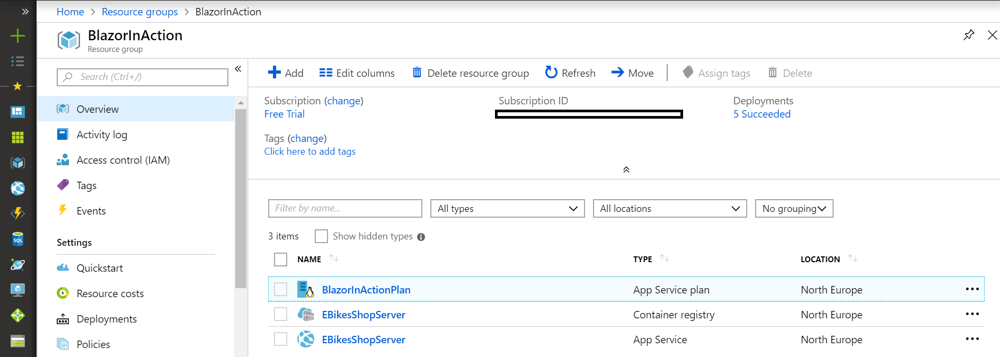

## Build, unit tests and run the application inside a local Docker container (manually)

This operations are going to be automated later by the Azure DevOps build but for the moment I want to run them manually to prove each one works as expected. 

Before starting the application I need a Docker image which is the blueprint of my container. The instructions to create the image are written in a Dockerfile, in my case [build.dockerfile](https://github.com/stonemonkey/BlazorInAction/blob/master/build.dockerfile) which tells Docker to copy all files from the current directory into the container `/src` directory on top of a base image (`microsoft/dotnet:sdk`), then to run dotnet core build, test and publish commands and to expose the application on port `80`. Beside the .NET Core runtime, the sdk base Docker image contains all the tools needed to build an .NET Core application. 

1. Build the Docker image locally:
```batch
docker build -f build.dockerfile -t ebikesshopserver.azurecr.io/stonemonkey/blazorinaction:initial .
```
Use `docker images` command to see all local cached images. The output should contain `ebikesshopserver.azurecr.io/stonemonkey/blazorinaction` repository with `initial` tag.

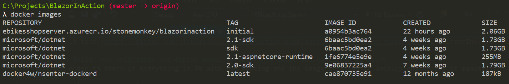

2. Run the image locally in the background (`-d`), mapping the ports (`-p`) and removing it on stop (`--rm`):
```batch
docker run --name ebikesshop -p 8080:80 --rm -d ebikesshopserver.azurecr.io/stonemonkey/blazorinaction:initial
```
Use `docker ps` command to see all local containers running. The output should contain `ebikeshop` container with status `Up ...` and ports `0.0.0.0:8080->80/tcp`. The ports column is showing the mapping of the local host 8080 port to the container 80 port.

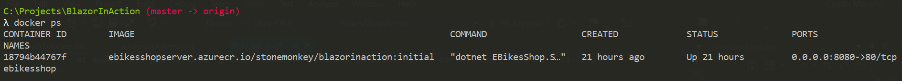

At this moment the application should be accessible in browser at http://localhost:8080.

4. Copy the dotnet build output directory from the container to the local machine:
```batch
docker cp ebikesshop:src/EBikesShop.Server/out .
```
The content of the `./out` directory should look like in the next picture.

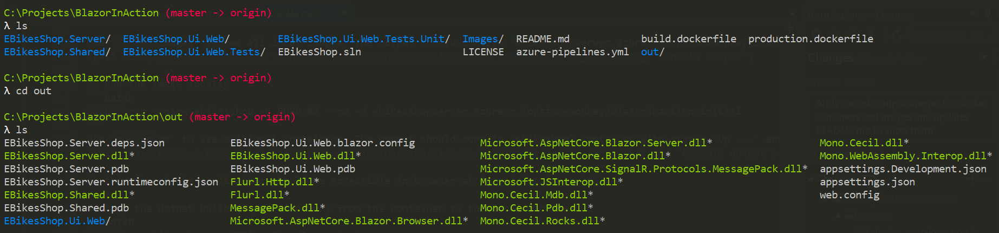

5. Now, I can stop the container:
```batch
docker stop ebikesshop
```
Using `docker ps --all` should't show anymore the container `ebikesshop`. It was stopped and removed (remember `--rm` option from docker run command). 

6. Build Docker production image:
```batch
docker build -f production.dockerfile -t ebikesshopserver.azurecr.io/stonemonkey/blazorinaction:initial .
```
Again the instructions are in a Dockerfile, now called [production.dockerfile](https://github.com/stonemonkey/BlazorInAction/blob/master/production.dockerfile). This time I'm using a runtime base image (`microsoft/dotnet:aspnetcore-runtime`) which is optimized for production environments and on top of it I'm copying local `./out` directory containing the dotnet build output from a previous step. Again port `80` is exposed and the entry point is set to the assembly responsible to start the application.

Using `docker images` command I should still see the image in the list but the size should be much smaller now (hundreds of MBs, instead of GBs).

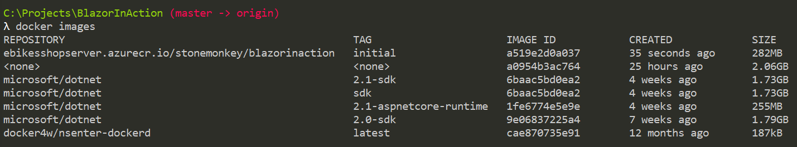

## Deploying the first image and container to Azure (manually)

This steps are going to be automated later by an Azure DevOps Release stage named `Deploy`.

1. Obtain credentials to access the Azure Container Registry:
```batch
az acr credential show -n EBikesShopServer
```

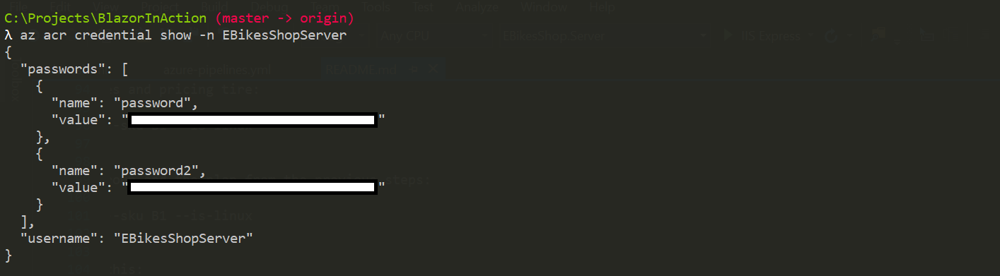

2. Login to the Azure Container Registry with the username and one of the password obtained in the previous step:
```batch
docker login https://ebikesshopserver.azurecr.io -u EBikesShopServer -p <password>
```

3. Push Docker image into the Azure Container Registry:
```batch
docker push ebikesshopserver.azurecr.io/stonemonkey/blazorinaction:initial
```
This is taking some time depending how big the image is.

4. Configure Azure Service to use the image I just pushed:
```batch
az webapp config container set -g BlazorInAction -n EBikesShopServer --docker-custom-image-name ebikesshopserver.azurecr.io/stonemonkey/blazorinaction:initial --docker-registry-server-url https://ebikesshopserver.azurecr.io -p EBikesShopServer -p <password> 
```
At this moment I can browse the application hosted in Azure https://ebikesshopserver.azurewebsites.net/.

## Seting up Azure DevOps Project

In order to automate a CI/CD pipeline in Azure I need to create an account and sign in to the [Azure DevOps](https://azure.microsoft.com/en-us/services/devops/). I used my Microsoft Account credentials to authenticate.

I gave up to VSTS CLI console approach because I couldn't find a full CLI path to achieve what I wanted and it felt wrong to mix console commands with actions in the portal UI for the same use case.
~~For being able to use VSTS CLI command in console I need to create a Personal Access Token (click on the user avatar from the top right corner of the page, then select Security and + New Token). As a result the portal gives me token which I must save locally safe for further authorisation agains VSTS API. This is not needed if I'll use the portal for setting up the pipeline.~~

Then I create a new public project (BlazorInAction) for Git with Agile process even I'm not planning to use the Bords, Repos, Test Plans and Artifacts features.

## Adding Azure DevOps GitHub and Resource Manager connections

Before creating the build pipeline I need to setup a connection to GitHub for fetching the sources. I go to Project settings -> Pipelines -> Service connections -> New service connection and select GitHub.

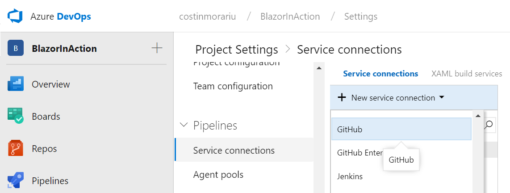

I name the connection `stonemonkey` and save it performing the authorization.

In order to connect to the Azure Resource Manager for pushing Docker images to Azure Container Registry I need a Resource Manager Connection.

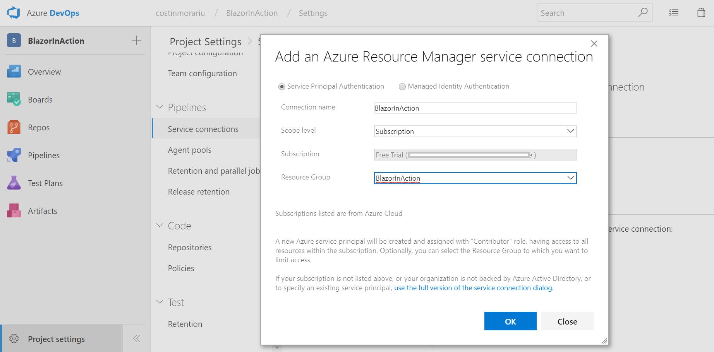

## Creating the Azure DevOps Build pipeline

Azure DevOps Pipelines automate their CI/CD Pipelines interpreting [YAML](https://docs.microsoft.com/en-us/azure/devops/pipelines/yaml-schema?view=vsts&tabs=schema) templates. Basically the instructions for the automations are writen in a file named [azure-pipelines.yml](https://github.com/stonemonkey/BlazorInAction/blob/master/azure-pipelines.yml) from the root folder of the repository. All the commands I run manually in the previous sections (and more) are present in this file.

It's time to add my build pipeline.

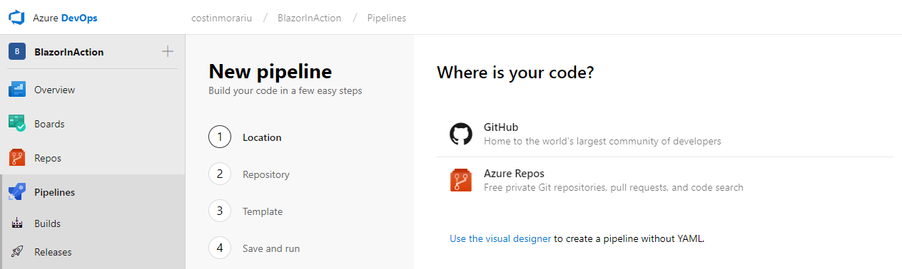

I select GitHub and use my existing `stonemonkey` connection.

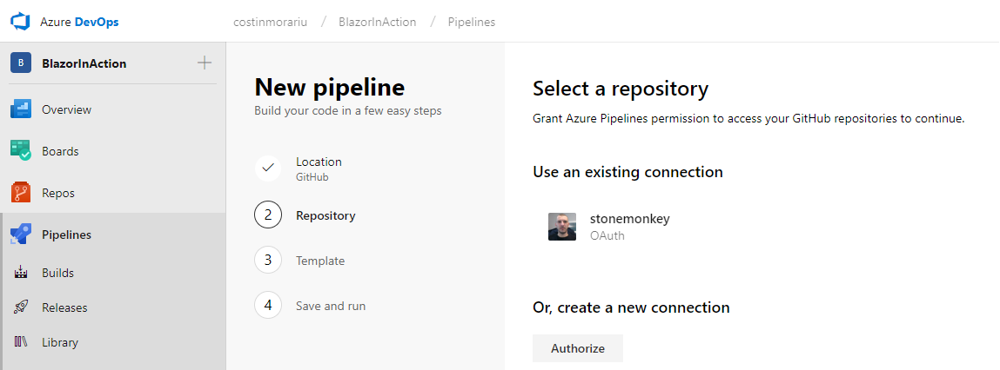

Then I select my GitHub repository, review the azure-pipeline.yml file and press Run.

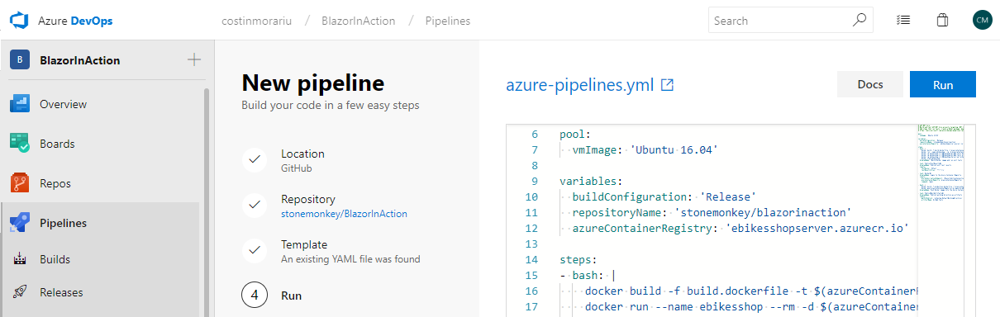

Now Azure DevOps finds a pool and an agent. Then it starts to run the tasks described in my azure-pipeline.yml file. If everything is OK all tasks are green.

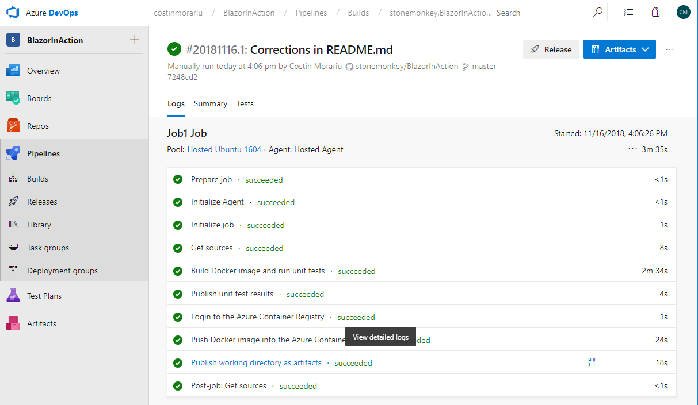

I can click on any to see their console log output.

## Creating the Azure DevOps Release Deploy stage

In Azure Pipelines deployments are handled within the release jobs. I can start adding one by pressing Release button on top right corner of a particular build instance page. The last step from the previous section related creating the build pipeline just landed me there, so I go on select and Apply `Azure App Service deployment` template.

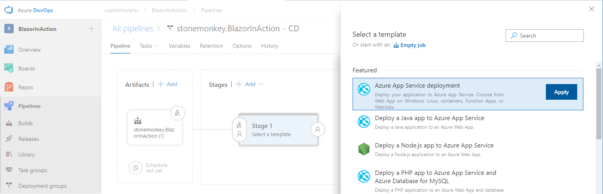

I rename the stage to `Deploy` and click on `1 job, 1 task` link to edit job and task details.

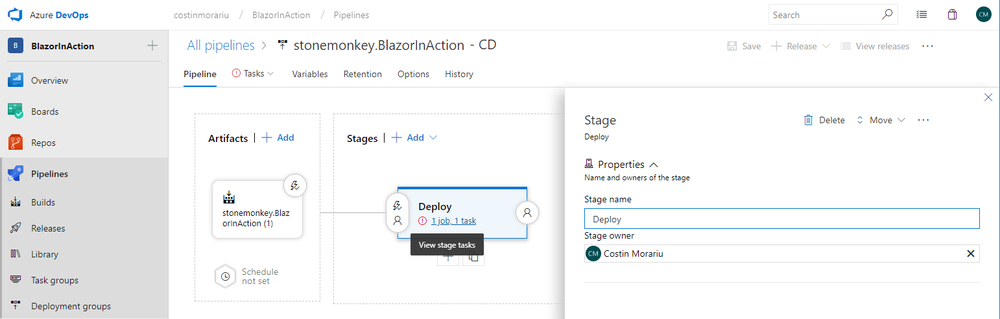

Now the page asks me to fill some parameters that will be shared among all the tasks of the pipeline. I just skip this by selecting `Unlink all` and confirming the operation.

Then I select `Deploy Azure App Service` task and fill the following fields:
*   Version dropdown: `4.* (preview)`
*   Display name input: `Deploy EBikesShopServer image`
*   Azure subscription dropdown: `BlazorInActionConnection`, this is the connection I added in a previous section for being able to push Docker image with Azure Resource Manager.
*   App Service type dropdown: `Web App for Containers (Linux)`
*   App Service name dropdown: `EBikesShopServer`, this is the Azure App Service I added up in one of the first sections.
*   Registry or Namespace input: `ebikesshopserver.azurecr.io`, this is the unique name of the Azure Registry Container configured up in one of the first sections.
*   Image input: `stonemonkey/blazorinaction`, this is the name of the repository where the images are stored.
*   Startup command input: `dotnet EBikesShop.Server.dll`

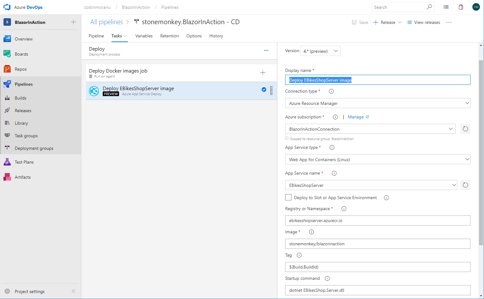

At this moment the pipeline looks like this:

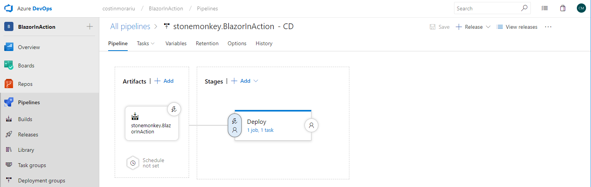

And I can manually start a build and a deploy by pressing `+ Release` button in the top right corner of the page. Or I can push into the master branch of my repository which will trigger the pipeline automatically. 

## Creating the Azure DevOps Release QA stage

Now I want to add a new stage to the pipeline which will run my Selenium acceptance tests.

In the Stages box I select the Deploy stage and click `+ Add` followed by `+ New stage`. Then I click on the `Empty job` link and rename the stage to `Run QA`. Again, I click on the `1 job, 0 tasks` link and select the `Agent job` job. Then I rename it to `Run Acceptance tests job` and make sure Agent pool is set to `Hosted VS2017`. This will run my tasks in an environment containing (among other stuff) Visual Studio 2017 Build Tools and Selenium Chrome driver which are needed to run my acceptance tests.

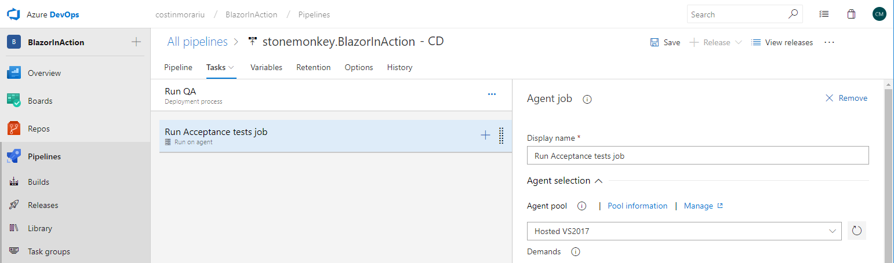

I press `+` button on the job, add `.NET Core` task and fill the fieds:
*   Display name input: `dotnet test`
*   Command dropdown: `test`
*   Path to project(s): `stonemonkey.BlazorInAction\Ui.Web.Tests\EBikesShop.Ui.Web.Tests\EBikesShop.Ui.Web.Tests.csproj`, I only have one test project for the moment.
*   Arguments: `-c Release`, although the task will not rebuild the project, I need to specify the configuration so that `dotnet test` command picks the right already buit assemblies.
*   Check `Publish test results and code coverage` checkbox.

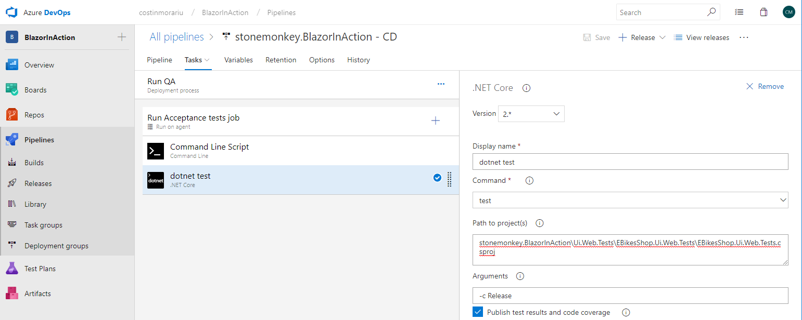

For debugging purpose I used a `Command Line Script` task to print in the log console certain things like content of folder for example. This kind of task can be placed before and/or after any task to check its input or output states.

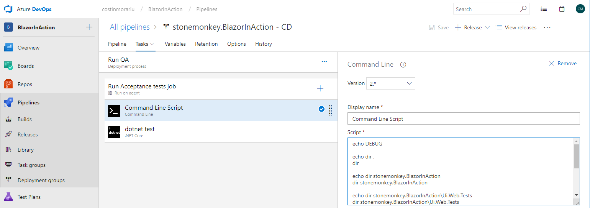

The pipeline looks like this now:

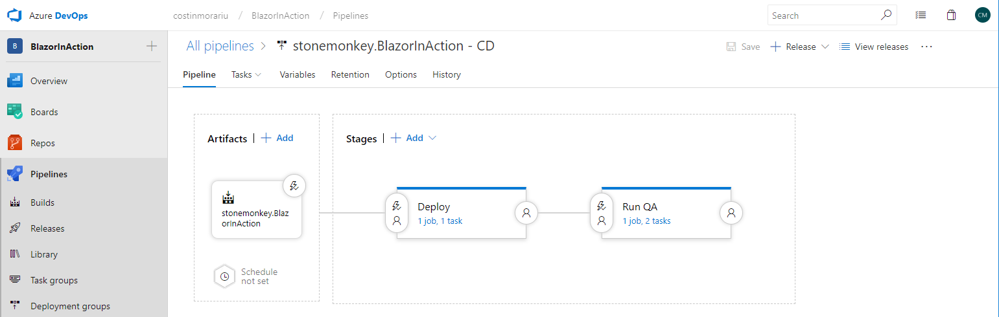

The CI/CD pipeline dashboard is accessible [here](https://dev.azure.com/costinmorariu/BlazorInAction/_dashboards/dashboard/a235a86e-f670-4789-8d22-1a35dcb022c2?fullScreen=true).

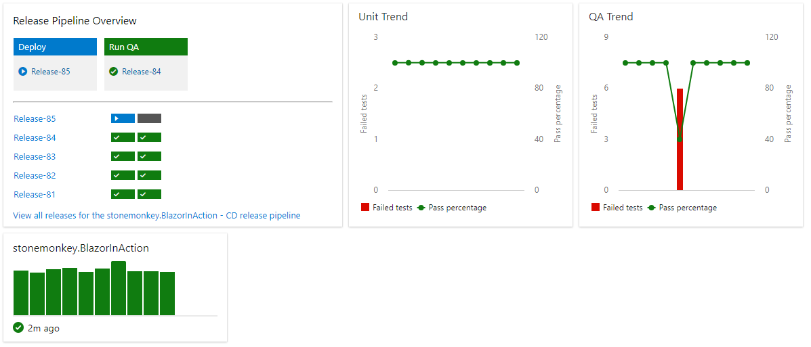

Now I a have a decent CI/CD pipeline that builds, tests and deploys my E-BikesShop sample application.

**Tags: MICROSOFT DEVOPS, AZURE, DOCKER, .NET CORE**


# CLOUD-NATIVE APPLICATIONS BEST PRACTICES
**2018-11-20 JÉFERSON MACHADO**

**UNCATEGORIZED**


Creating cloud-native applications is challenging. The cloud environment consists of machines running all over the world. It’s very sensitive and different issues could happen, such as network partitions, instances that goes down or even entire regions that disappear.

One thing that I’ve learned during these last years creating applications for the cloud, is that I would need to change my mindset for how to write software. The mindset I have right now is: **everything can and will fail in the cloud**.

When I changed my mindset, I started to embrace failure in order for the applications to be ready to deal with any kinds of failure scenarios. In the end, this provides better experience for the user.

There are some best practices on how to create cloud-native applications that I’ve learned during the last years and I would like to share some of them in this post.

## Resiliency

Recovering quickly from errors is really important for the application in order to keep a high availability.

To be resilient, there are two important aspects that need to be taken into account: design for failure and graceful degradation.

## Design for failure

One service must not mess with others. If an error happens, it should be isolated.

So when developing your applications, think about what could go wrong and build a mechanism to repair the possible failure. For example, when calling remote services, add timeout and retry to the code in order to deal with the possibility of that other service being unresponsive or malfunctioning, so that your application won’t be impacted by it.

I’ve created a code example of retry and timeout that can be found here: https://github.com/jefersonm/cloud-native-utilities

Netflix Hystrix (https://github.com/Netflix/Hystrix) is a good tool to add resiliency to the application, as it helps to isolate failure, stop cascading errors and also provides good metrics about the calls that are being made.

## Graceful degradation

When a failure is inevitable, one way to deal with this is to degrade some specific feature. For example, a video streaming application is having issues with the recommendation service as it’s providing slow response times. The recommendation service should not impact the whole video streaming application. Instead, what could be done is to show a cached list of the latest movies for the user.

The drawback is that the user won’t have the most updated movie recommendations because of the service degradation, but the main functionality of watching movies is not impacted.

## Chaos Monkey

Chaos monkey is a resilience tool (https://github.com/Netflix/chaosmonkey) that helps us to simulate random failures scenarios in order to ensure that the application is resilient. 

What does happen if a network interface fails? If a server or even an entire region goes down? Chaos Monkey helps to simulate and automate this kind of scenarios.

Simulating these failures will help us to understand how our application would behave in different situations, giving us the power to be able to anticipate issues.

## Observability

Knowing that running a distributed application in the cloud is challenging, having good information about what is happening is really necessary. Observability helps to predict, analyze, giving you more information to improve the application.

Logging, tracing and monitoring tools can all help to find information on different levels for different purposes.

## Logging

Good and informative logs are really important to the application, it helps to find the necessary information to understand in more details what is happening.

When developing applications, think about what is important to log and include just the necessary information in a way that helps you find useful information in the future. Adding too much unnecessary information to the logs will make it more difficult to debug and troubleshoot.

Finding all logs for a distributed application isn’t a simple task, because they could be residing on different machines. Having a centralized logging infrastructure will help with this. So instead of going into each different machine, we could see information for all services in a single place, making it easier to debug and see correlation information between the services.

Example of centralized logging tools:

* [ELK](https://www.elastic.co/)
* [Splunk](https://www.splunk.com/)

## Tracing

Logs help in finding useful information, but sometimes it isn’t enough. Distributed tracing tools allows you to see more information, such as following a request through the system from start to end, see the time between requests, find services errors etc. 

Example of distributed tracing tools:

* [Zipkin](https://zipkin.io/) 
* [OpenTracing](http://opentracing.io/documentation/)

## Monitoring

Having good monitoring in place helps to better visualize the information about your application’s metrics, such as CPU consumption, memory usage, health of API endpoints and application throughput.

Having metrics in place, alerts could be set up in order to highlight issues, alerting teams to act, fix or prevent issues to happen.

Example of monitoring tools:

* [Datadog](https://www.datadoghq.com/)
* [SignalFx](https://www.signalfx.com/)

## Summary

Always keep in mind that failures happen in a cloud environment, so embrace it and create resilient applications that can deal with it.

Embracing observability will provide insights to applications in order to predict and act before incidents happen.

Creating fault-tolerant and highly available services is key for providing the best possible user experience, free from disruptions and unexpected downtime.

[@jefersonm](https://twitter.com/jefersonm)


# DOS AND DON'TS OF CONTINUOUS DELIVERY
**2018-05-22 TOMY TYNJÄ**

**CONTINUOUS DELIVERY, DEVOPS, CONFERENCES & EVENTS**

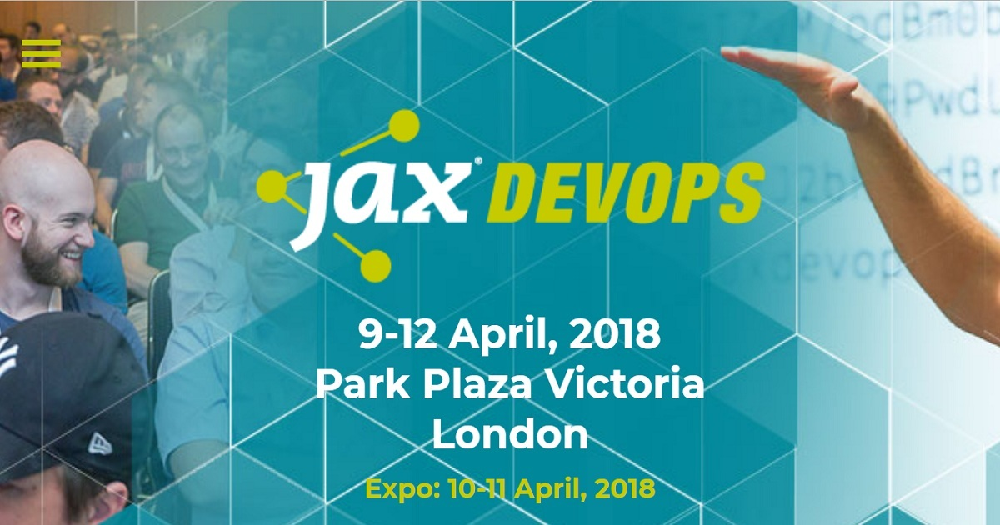

Senior Software Engineer and Continuous Delivery Consultant, Tommy Tynjä, sits down with JAXenter editor Gabriela Motroc to discuss common challenges and best practices for implementing Continuous Delivery.


Tommy was in London this year for the JAXDevOps London conference to perform two talks: "Continuous Delivery with Jenkins: the Good, the Bad and the Ugly" and "The Road to Continuous Delivery".

To get the full story and learn more about JAXDevOps, visit: https://jaxenter.com/continuous-delivery-jax-devops-interview-144533.html 


# DIABOL RECOMMENDS: AWS SUMMIT STOCKHOLM 2018
**2018-04-24 JAMES DALTAS & PETER BENGTSON**

**CLOUD, CONTINUOUS DELIVERY, CONFERENCES & EVENTS**

## Will you be attending this years AWS Summit in Stockholm on May 16th? If you are, check out our recommended talk tracks.


This year's AWS Summit Stockholm looks to be the largest one yet. Last year [Amazon announced that their cloud infrastructure business would be expanding in 2018 to open a new European region to be based out of Stockholm](https://aws.amazon.com/blogs/aws/coming-in-2018-new-aws-region-in-sweden/) - huge news for organisations working in regulated industries such as the public sector, banking, and finance. As a certified AWS Advanced Consulting Partner, we saw first hand the amount of cloud interest spike from our clients following this big announcement and hope to learn more about the timeline at this years event. 

If you haven't already, [navigate here to review this year's agenda and register](https://aws.amazon.com/summits/Stockholm-2018/agenda/). We had one our very own AWS Consultants, Peter Bengtson, review the agenda on your behalf. Below you will find our two recommended talk tracks - one for managers and one for developers:

## Managers

The manager path is fairly straightforward: the Go-to-market track provides general background, [CI/CD is what we at Diabol](https://www.diabol.se/consulting) do (but alternatively, the Security workshop I suppose is designed to allay any worries about cloud security for management new to the cloud). The Serverless computing segment should give management an understanding of a very important new trend which they need to get used to as soon as possible, not least from a cost savings perspective. Scaling to a million users highlights the typical cloud journey they’re about to make, and everyone is worried about GDPR.

08:00 - 09:00: Registration

09:00 - 09:10: Welcome Remarks

09:10 - 11:00: Keynote - Wener Vogels, CTO at [Amazon.com](http://amazon.com/)

11:20 - 12:10: (Startups) Go-to-market with AWS for Startups

13:10 - 13:55: (Cloud Ops) Improve Productivity with Continuous Integration and & Delivery 
OR (Let's Start) Security & Compliance in the Cloud

14:00 - 14:40: (Rapid Application Development) Severless Computing: Build and Run Applications without Thinking About Servers

15:10 - 15:55: (Cloud Operations) Scaling From Zero to 1 Million Users

16:00 - 16:50: (Move IT) Navigating GDPR to the Compliance on AWS 

## Developers

The developer track is quite straight forward: it’s the entire Rapid Application Development theme, simply because it represents the direction in which program development on AWS is going. It’s about containers on AWS, Kubernetes, and most of all about Serverless computing.

08:00 - 09:00: Registration

09:00 - 09:10: Welcome Remarks

09:10 - 11:00: Keynote - Wener Vogels, CTO at [Amazon.com](http://amazon.com/)

11:20 - 12:10: (Rapid Application Development) Amazon Container Sevices: Highly Scalable, Easy to User Container Management and Registry Services

13:10 - 13:55: (Rapid Application Development) Running Kubernetes in AWS

14:00 - 14:40: (Rapid Application Development) Severless Computing: Build and Run Applications without Thinking About Servers

15:10 - 15:55: (Rapid Application Development) Severless Architectural Patterns

16:00 - 16:50: (Rapid Application Development) Building Real-Time Serverless Back Ends

Interested in learning more about Amazon Web Services, but  don't have the time to attend this year's event in Stockholm? Get in touch with us today to [book an introduction to Amazon Web Services with one of our certified AWS Architects](https://www.diabol.se/contact).


# WHY ORGANISATIONAL TRANSFORMATION REQUIRES TRANSPARENCY
**2018-04-16 CAROLINE ILIS & MARTIN LAGUS**

**CONTINUOUS DELIVERY, DIGITAL TRANSFORMATION, LEAN/AGILE PRACTICES**

## Start doing agile transformation, for real!


Organisations that experience transformations, due to the change of the outside world or due to the internal reorganisations, have some important matters to put at hand. We have observed that transparency sometimes is a key factor for enabling organisations to transform. This blogpost is about transparency, why it is needed, the possible reasons and situations to why lack of transparency can occur, and suggestions how to get more transparency. We will share our thoughts on what happens if transparency is handled as a key factor, in terms of adaptation and how to become a quicker player at the marketplace.

When it comes to enabling the organisation to make the needed transformations, there can sometimes be a feeling of us and them. Especially, when it comes to responsibility and ownership. “We did this, and they need to do that. It is not our fault that they failed”.
From our experience, this type of behaviour is often rooted in prejudices, a limited understanding for how others works, with what, and a lack of transparency between the different departments in the organisation - hence silos. 

A typical silo culture is when people have limited insight of what is happening outside their “own” department and have very limited communication and transparency in relation to other parts of the organisations. Other signs of a silo culture can be expressed as employees reflect and express themselves in terms of “ours” and “theirs”, “we” and “them”. These type of expressions implicates that there are invisible walls between the departments (and/or groups) in the organisation. These invisible opaque walls becomes a threshold when the organisation needs to transform and adapt to the outside world. Friction between the departments is inevitable, because there are no obvious paths for communication.

For example, if a company decides to adopt continuous delivery for their software development, but doesn’t consider to change the decision-making processes for what software to develop. The result will be that, the decision-making process will slow down the end-to-end product delivery lead time of the software. 

This is because, in general, all software development project must be approved by business stakeholders and stakeholders might require verified data that the product / feature will be successful (i.e. they want to know that they make the right decision), followed by a complete requirement specification. 

Therefore, getting the approval to begin develop a new feature or product, can consume more time than it takes to actually code it. Consequently, the window of opportunity in the outside market can easily be missed, because of the in-effective decision-making processes, and if there is a silo culture, the business might blame IT, that it takes too much time to develop or that “wrong” feature was completed. 

However, the business must understand how their decision-making process affect the end-to-end product delivery lead time, which can only be visualised through transparency. Continuous delivery is not exclusively for IT, but for the whole organisation. Without transparency in to IT and to Business, the business side won’t be able to see and realise how their decisions affect IT and IT won’t be able to see how the business assesses new ideas and products. 

The lack of transparency can lead to common situations between IT and business that blocks the Agile ways of working. It is not uncommon to hear that the business side holds IT as unpredictable, not being able to deliver on time, never according to expectations, and above all, that IT project always exceeds the budget. On the other hand, from IT’s point of view, the business is incapable of submitting clear specifications, always submit late changes in waterfall-like organisations, and requests of additional features just before deployment. 

Late changes and requests for additional features affect the development teams planning. A small feature that seems simple to add, could potentially require rebuilding a major part of the product and consequently delaying the whole product’s development time, making it difficult for IT to deliver on time. Of course, this is an extreme example. Today many organisations don’t run their projects in a “Waterfall manner”, but have adopted Agile methods (such as Scrum or XP). 

It is not always clear, how the actions of the business and IT are associated, it is not always clear due to the lack of transparency what will happen if business pushes IT as in the former examples. How different ways of working, semantics and silos in cultures affect the overall outcomes of the company are crucial, and especially the need of transparency is crucial to see what will happen if i as a business pushes changes.

Transparency is more important than ever, and a way to create transparency is to introduce some carefully selected KPIs. KPIs are a simple starting factor, often considered as a key factor to build transparency, and give people in the organisation understanding for each other. Without asking, claiming ownership discussions, KPIs can give each other in the organisation information of the transformation being made and current situation in the organisation.

* Created vs Resolved KPI

This is a KPI that is based on a selected area/team/department, and measures the relation between all work that is done, and not done. If this KPI is visualised in a trending fashion with separate staples, then increase of both done or “resolved” work will occur. It is possible  then to see if one of these (created/”resolved” work) increases faster than the other. If the created staple increases higher than the Finished work (Resolved) that this indicates that to much work is being given to the selected area/team/department, or that the area is understaffed.

* Time to resolution

To get an understanding of how long things take, and to investigate the time as an KPI, then Time to resolution can be a good way. Time to resolution measures from the date a work item has been created, until the work item was done/resolved. All work items resolved in a specific time period, for example a month, could get a calculated average of days of all work items resolved a specific month. Then it is interesting to compare each month and see how long time to resolution a selected area has. If this increases it might be worth to investigate why, and also if this decreases its worth to know how others work so other areas can learn from the increased speed - or if the area just has gotten less to do.

Conclusively, driving change to transform an organisation is never an easy job. Creating transparency through visualisation of carefully selected KPIs that is important for your organisation will make the people in the organisations more aware of the present situation. It will give the people a holistic view of the ongoing project, incentives and interdependencies, which in turn creates better understanding for each other and affect the company culture to become more open and adaptive to change. 

[@carolineilis]()
[@mlagus](https://twitter.com/mlagus)

## Start doing agile transformation, for real!

# INTEGRATION TESTING DO'S AND DON'TS
**2018-04-13 TOMY TYNJÄ**

**CONTINUOUS DELIVERY, TESTING, QUALITY ASSURANCE, MICROSERVICES**

**Let’s address the pitfalls that integration testing still creates in our industry.**


I’ve had many discussions with clients and colleagues about integration testing, especially in a microservice-oriented architecture. One of the main reasons for using such an architecture is to be able to develop, test and deploy parts of a system independently. These architectures are typically backed by automated Continuous Delivery pipelines that aim to give the user fast feedback and lower risk when deploying to production.

## The shared integration environment, a.k.a. staging

A very common scenario is to have a shared integration environment (a.k.a. staging or continuous integration environment), where teams deploy their services to test these and their integrations towards other services. I've seen environments where over 35 teams were deploying their services to above on a regular and frequent basis. The environment is supposed to be treated as production but in reality, it never is. Usually the environment is not set up with an architecture matching production, and it lacks proper monitoring, alarms and necessary feedback-loops to the developers.

**Even in companies where all those aspects are addressed, teams tend not to care about the overall health of the shared integration environment as they think it is time consuming with minimal return on investment.**

In most cases there is some end-to-end test suite running tests in this environment. Theoretically it might sound like a feasible idea to run extensive tests to catch bugs before hitting production. In practice, quality assurance teams responsible for the overall quality of the system have to run around and hunt down teams to find out why certain tests fail and why these failures are not addressed.

With 100+ services in such an environment there is always new code being deployed and tests executing all the time with flakiness as a common result. A helpful pattern is to reduce the amount of tests to just a few critical flows. One seldomly debated question is how to warrant the time and cost of keeping this environment up and running at all times. There is a lot of waste to be removed from processes that involves a shared integration environment.

**What version to test against?**

One of the biggest problems testing in a shared integration environment is that you seldom test services against versions that are being used in production. If you test a service and its interactions towards other services that run a different version than in production, how can you be sure that you test the right thing? This provides a false sense of security and invalidates the whole purpose of those tests.

**Here is a real world example.**

A team had developed a code change which made an addition to an existing API endpoint. The code change passed the commit and test stages and was therefore deployed to the shared integration (staging) environment. Normally, the deployment pipeline was supposed to automatically proceed with deploying this change to the production environment. However, the deployment pipeline happened to be broken between the staging environment and production due to a environment-specific configuration issue. Another team wanted to use this new API addition and tested their service in the staging environment, where it existed. 

This second team deemed that their functionality worked as expected and proceeded with deploying their code change to their production environment. They did not notice that the API endpoint used had a different version in the production environment where the new functionality did not exist. Therefore, the second team’s software broke miserably with a broken customer experience as a result, until the code change was quickly rolled back. 

**This could have been avoided if the service was tested against the same version as running in production.**

How to do this, then? Always tag each service with a "production-latest" label after it has been successfully deployed to production and use is versions when testing the integrations of a service. This gives high confidence in that the tests are accurate, in comparison with tests running in a shared integration environment where versions seldom are the ones expected. 

## Integration testing without a shared integration environment
## Consumer-driven contract testing

Consumer-driven contract testing is a great alternative to a shared integration environment approach. Especially in a microservice-oriented architecture, where a big benefit is being able to speed up development and delivery by composing a system based on smaller building blocks. Each single deployment pipeline represents a single deployable unit, e.g. a service. With consumer-driven contract testing, the interactions between services are tested by verifying the protocol between them. These tests are fast to run and thus provides fast feedback. Keep in mind that it is important to validate both sides of the API contract.

## The next-door neighbour approach

For some teams, consumer-driven contract testing with existing tools is not possible, for instance if a custom protocol is used to communicate between services. An alternative approach is to run integration tests for a particular service by just testing their “next door neighbor”. In the real world, a dependency graph can be daunting to traverse for a particular service. As the idea is to have short feedback loops to test each service, which are deployable on their own, you do not focus on the overall system as such. Therefore scoping what to test to the current service and the service(s) it integrates with is enough. To support this, services have to be able to start without all of their dependencies up and running. An approach is to allow services to run with degraded performance and capabilities, so that neighbouring services can use them even though not all of its dependencies are satisfied.

## Mocks and stubs

Most services can use mocked or stubbed equivalents of their dependencies as in many test cases it is not of interest to validate the behaviour of the integrated service.

For cases that there is an interest, the drawback is that you have to mimic the behaviour of real services which can leave bugs unnoticed. Interactions are better tested using consumer-driven contracts or the next-door neighbour approach mentioned above.

Tests against mocks and stubs run fast and are therefore suitable for unit tests running in the deployment pipeline commit stage.

Keep in mind that too complex mocking can leave you spending a lot of time re-implementing logic from the real service in your mock, which will also require maintenance down the road. Ideally, you want to spend most of your coding in the service you are developing and not in the mock. **If too much complex logic has to be mimicked, ask yourself whether the mock is the right choice or if you would be better off just using the real system instead.** This can be the case for e.g. off-the-shelf third party products.

## Here’s what to keep in mind

Key is to have stable APIs. Don't just change the behaviour of existing methods. Instead, add new methods or provide new services with new functionality. This fosters stability, quality and easy maintenance.

A single deployment pipeline represents a single deployable unit, such as a service. Services that must be tested together should therefore also be deployed together.
Test services and their interactions by verifying the protocol that is used between them. Prioritize fast-running tests that can be run as early as possible in the deployment pipeline to reduce waste and to encourage small frequent changes with less risk.

Testing for all possible scenarios is impossible, as the problem space is infinite. No matter how much effort spent on testing before production, bugs will happen. It might be due to user input, growing data sets or infrastructure failures. Therefore **it is of utmost importance that the proper feedback loops are in place in order to quickly discover errors and to have the ability to quickly roll back a code change.** Mean time to recovery trumps mean time between failures. The best thing we can do, is to have the right tools and feedback loops in place to be able to get feedback as fast as possible whether a given code change works or not and to be able to react to situations when it is not.

I’m here for any questions.

[@tommysdk](https://twitter.com/tommysdk)


# BELIEVE IN YOUR VISION!
**2017-12-19 PETER FERM**

**VISION**


## Our Story

When we took Continuous Delivery, a methodology to streamline software development processes to the Nordics in 2009, nobody believed that it would work. Today, it’s on everyone’s lips. Our hard work paid off as we’ve now been recognized as a Dagens Industri Gasell company, due to our fast growth and strong financials over the past four years.

Our customer base ranges from large banks to small start-up companies that wants to be more efficient in their software development and delivery process. That allows our clients to get a faster time-to-market and higher quality on the software that they deliver. With that in place they can satisfy their customers needs.

“We help businesses that are on the brink of big transformations with a software delivery process that takes a very long time. These businesses have a hard time getting their products and services out to their customers”, says Tommy Tynjä, Team Manager at Diabol.

Diabol was founded in 2003 and started out as a consultancy focusing on expertise within Java development. Today, we cover all aspects of software development, from idea to production. We are now 30 consultants specialized on Continuous Delivery and cover all aspects of the software development process.

“For years, companies complained about their slow, expensive and inflexible software development processes and they had a hard time to deliver any new features. In 2008, we started focusing on this problem, but there was no method to make it more efficient. Everything changed when a couple of Brits coined the term Continuous Delivery in 2010. We adapted the method and started our first project at an online gaming company the year after. The goal was to implement Continuous Delivery, to automate everything in order to increase speed and quality. The project was a huge success and we were able to reduce their whole software development process with thousands of percent. But when we talked about that back then nobody believed us. Today, we are the market leaders in the Nordics when it comes to transforming IT-organisations into effective business machines.”, says Peter Ferm, CEO at Diabol.

“Our success factors has been our perseverance, focus and passion. Traits which definitely have been needed since we were so doubted in the beginning. As many other successful companies, we believed in our vision and didn’t go for what the clients requested at the time”, Tommy Tynjä finishes.

Peter Ferm
CEO, Diabol AB
https://www.diabol.se/


# RELEASE OF JENKINS DELIVERY PIPELINE PLUGIN 1.1.0
**2017-12-15 TOMMY TYNJÄ**

**DEVOPS, JENKINS, PIPELINE, UNCATEGORIZED**

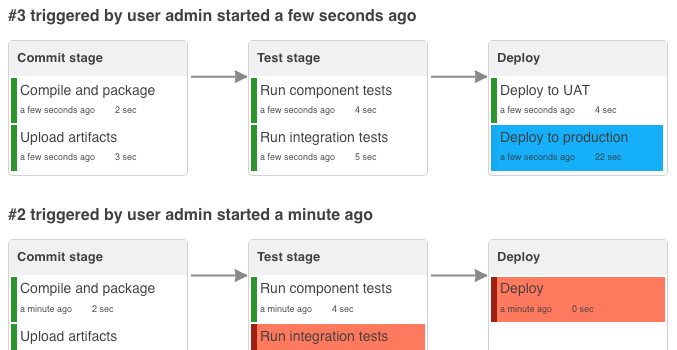

We are happy to announce a new release of the Jenkins Delivery Pipeline plugin with major improvements for views based on Jenkins pipelines. You can find the official release notes here: https://github.com/Diabol/delivery-pipeline-plugin/releases/tag/release-1.1.0

With the Delivery Pipeline plugin 1.1.0, there is support for fine grained visualization of Jenkins pipeline stages in the delivery pipeline view with proper progress and task status visualization. For Jenkins pipelines, the Delivery Pipeline plugin provides a task pipeline step which allows the delivery pipeline view to render fine grained information about what tasks are involved within a stage, rather than just having one big block visualized for the entire stage and all the operations involved within, which is what you get if you use the default [Pipeline Stage View plugin](https://wiki.jenkins.io/display/JENKINS/Pipeline+Stage+View+Plugin). For e.g. pipeline failures, tasks allows for better information on information radiators on what went wrong without requiring users to actively find this information through the Jenkins UI. You can see a short video example of how Jenkins pipelines can be rendered using the Delivery Pipeline plugin here: https://www.instagram.com/p/BcSLeeBgH__/?taken-by=diabolab

In Delivery Pipeline plugin 1.1.0, the task step can now take a body (also referred to as closures), which now is the recommended way to use the task step in order to render the pipeline view in the most accurate way. You can find an example pipeline here: https://github.com/Diabol/delivery-pipeline-plugin/blob/master/examples/JENKINS-45738-declarative-pipeline-with-task-closures.txt

A core feature that has been available for years for delivery pipeline views based on traditional Jenkins jobs is the ability to render multiple pipelines in the same view. This is now also possible for views based on Jenkins pipelines.

All delivery pipeline views created with a version prior to 1.1.0, where this feature was not present, will still work after upgrading to 1.1.0. The internal structure for how the pipeline configurations are stored has changed, but the Delivery Pipeline plugin is able to convert views created prior to this version to a compatible configuration when a view is edited. The configuration for a particular view (and its corresponding config.xml) are preserved until it is edited in the UI where the configuration will be migrated to use the new internal structure. With these changes, views that are created, or has been edited, when using the Delivery Pipeline 1.1.0 will not be able to be rendered with an older version of the Delivery Pipeline Plugin (for instance if rolling back to a previous version, since the internal structure of the configuration is different). In such cases, view configurations will be preserved, with the exception for the Jenkins pipeline job configuration and pipeline name visible in the view.

In order to drive future development and sustainable maintenance of this project, the minimum required Java version in order to support the Delivery Pipeline plugin has been raised from Java 7 to Java 8. Delivery Pipeline plugin 1.1.0 therefore requires you to run your Jenkins instance using Java 8.

There are a lot of great ideas (you can find them in the issue tracker on component delivery-pipeline-plugin) on how to evolve the Delivery Pipeline plugin, but development time for the current maintainers are unfortunately limited. Since this is an open source project, we welcome all new contributions! If you are a user of the project and want to give a hand back to support future development, we are more than happy to help you get started.

[@tommysdk](https://twitter.com/tommysdk)

https://www.diabol.se


# GOOGLE CLOUD ONBOARD 2017
**2017-11-17 PIERRE LEMERLE**

**CLOUD, DEVOPS, CONFERENCE**

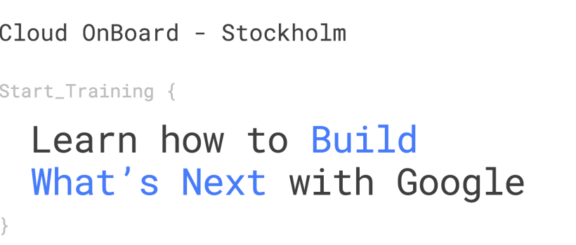

One month after the Google Cloud Summit, which was a real success (you can find a summary of that event here), is the follow up event: Google Cloud On Board. Taking place in downtown Stockholm, this was the perfect next step in the Google Cloud Platform (GCP) world, a fantastic opportunity for Diabol to “get started” with four of our consultants attending the event. Even if three times smaller than “Summit” once again the event reached full capacity with 500 persons registered.

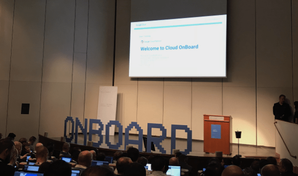

To be precise, 464 persons joined the training sessions and slightly less at the very end of this really intense event. Trying to introduce all the different tools and concepts available on GCP, the event was made up of the eight following modules of 1h each:

* Introducing Google Cloud Platform
* Getting Started with GCP: Projects and Products
* GCP Infrastructure as a Service: Google Compute Engine
* Containers on GCP: Google Container Engine
* GCP Platform as a Service: Google App Engine
* Storage Options on GCP: Cloud Storage, SQL and more!
* GCP Big Data: BigQuery, DataFlow and Pub/Sub
* Machine Learning APIs on GCP: Vision, Translate and more!

I am personally satisfied with this program and I think that on this aspect the event clearly succeeded to give us a full overview of GCP. To be fair, I also know from discussions that some attendees were disappointed to have only 1h on the really wide “Machine Learning” topic, for example. But regarding all the aspects I think that this schedule was well balanced and covered a little bit of everything. 

To illustrate these modules, 316 slides covering all the different tools and concepts available on GCP but also playing few videos. Usually on a funny tone (look for Google gnome or the self driving bike) they were giving a good illustration of the Google way of thinking. As they say themselves: “People say, the sky’s the limit… We think bigger”. Another thing that I appreciated is that these slides were almost always providing some link to more detailed online documentations and sometimes even available tutorials for people who wish to go further in a specific topic.

Above all the day was full of live demonstrations. Starting with the networking and security features with some basic demonstrations on how to generate private keys to secure access,  until the Machine Learning APIs with a high level demonstration on how to aggregate and interpret taxi ride’s data. All of these modules were mainly made of demonstrations which I think everyone really appreciated even if the “demonstration gods” were not always on Jerry Jalava’s side (our trainer for the day) as he mentioned himself.

Skipping on the difficulty to interact and ask questions as it is quite understandable regarding the full schedule and number of attendees, I would point out one negative aspect of this event: most of the content in the slides, at least the theoretical content, were the same as the online GCP fundamentals course (available on Coursera https://www.coursera.org/learn/gcp-fundamentals/home/welcome ) That I already did some time ago by myself.

In the past month, I have had the opportunity to start working on Google Cloud for Diabol so in my case this event was something I was looking forward to. It gave me some much needed feedback and a lot of small ideas to investigate further on my own. For example, from a Continuous Delivery aspect, I am quite interested in trying the Google Cloud Deployment Manager, to provide repeatable deployments through yaml files. Examples like this are very applicable to Diabol’s core business and makes participating events like this a great use of time.


# A GAP OF KNOWLEDGE
**2017-10-04 CAROLINE ILIS**

**UNCATEGORIZED**


When I joined Diabol in May 2017 my knowledge of IT was quite limited. My background as a management consultant had made me view IT as a support system, which purpose was to enhance and facilitate the value creating processes within the organisation. However, a few years back, the rise of IoT, the smart connected home and the hype of big-data, made me curious about how IT would change the world and transform the way we make business. One thing was clear, we were inevitably heading towards a more connected and digitalised world at a raging speed.

My first step into the tech-world was through the start-up scene (I even joined a SaaS start-up) and now I am at Diabol, an IT-consultancy firm who focus on reinventing software development using Continuous Delivery and Lean principles. That might sound like a bit of a leap, but in reality, it was the logical next step, as the next step at Diabol is to combine IT and management, and bridge business and technology.

As a consultant, my expertise was Operational Excellence, optimising the organisation’s processes and workflows. It could be anything from digitalise processes to visualise workflows, but one thing all projects had in common was the challenge to align IT with the overall goal. In the end, we always ended up working around IT, because IT always lacked resources and time. That concerned me, as from the start-up scene I knew that, within IT lay a huge untapped potential and becoming digital is the only way forward.

A question I remember asking myself back then was: What if we could connect all IT-systems and visualise the information needed for the moment on a dashboard. And through that simple user interface, being able to act, make decisions and real-time changes, which would be automatically updated into the background systems.

I knew it was possible to create such system back then, but I also knew that it would never happen. Investing heavily in IT was, and still is, considered to be a risk. At a hypothetical level, everyone agree that companies must become digital and adopt new technologies to survive and excel in the digital era. However, over the years I’ve seen how many organisations struggle to begin their digital journey. For every day that passes, they’re getting further and further behind the digital innovators. At Diabol, we believe the reason is a  **gap of knowledge** between IT and management, and we will focus on bridging that gap. Because without IT at the core of the business, incumbents will go down, while data-driven companies will rise and continue to innovate the marketplace.

During the autumn, I’ll continue to write and address what we at Diabol, together with clients and partners, have discovered. I will share our thoughts about how IT and management must learn from each other, to succeed to become digital and how it is possible to build an organisation that has the ability to untap the potential that lies within data.

If you find this topic interesting, please comment, like, share, repost, and of course, if  you would give feedback or get involved, please do not hesitate to contact me.

[@carolineilis]()


# PROGRAMMATICALLY CONFIGURE JENKINS PIPELINE SHARED GROOVY LIBRARIES
**2017-07-26 TOMMY TYNJÄ**

**CONFIGURATION MANAGEMENT, CONTINUOUS DELIVERY, DEVOPS, JENKINS, PIPELINES**


If you’re a Jenkins user adopting Jenkins pipelines, it is likely that you have run in to the scenario where you want to break out common functionality from your pipeline scripts, instead of having to duplicate it in multiple pipeline definitions. To cater for this scenario, Jenkins provides the [Pipeline Shared Groovy Libraries plugin](https://wiki.jenkins.io/display/JENKINS/Pipeline+Shared+Groovy+Libraries+Plugin).

You can configure your shared global libraries through the Jenkins UI (Manage Jenkins > Configure System), which is what most resource online seems to suggest. But if you are like me and looking to automate things, you do not want configure your shared global libraries through the UI but rather doing it programmatically. This post aims to describe how to automate the configuration of your shared global libraries.

Jenkins stores plugin configuration in its home directory as XML files. The expected configuration file name for the Shared Groovy Libraries plugin (version 2.8) is: ```org.jenkinsci.plugins.workflow.libs.GlobalLibraries.xml```

Here’s an example configuration to add an implicitly loaded global library, checked out from a particular Git repository:

```xml
<?xml version=’1.0′ encoding=’UTF-8’?>
<org.jenkinsci.plugins.workflow.libs.GlobalLibraries plugin=”workflow-cps-global-lib@2.8″>
    <libraries>
        <org.jenkinsci.plugins.workflow.libs.LibraryConfiguration>
            <name>my-shared-library</name>
            <retriever class=”org.jenkinsci.plugins.workflow.libs.SCMSourceRetriever”>
                <scm class=”jenkins.plugins.git.GitSCMSource” plugin=”git@3.4.1″>
                    <id>7356ba0d-a25f-4f61-8c56-b3c565a39929</id>
                    <remote>ssh://git@github.com:Diabol/jenkins-pipeline-shared-library-template.git</remote>
                    <credentialsId>ssh</credentialsId>
                    <traits>
                        <jenkins.plugins.git.traits.BranchDiscoveryTrait/>
                    </traits>
                </scm>
            </retriever>
            <defaultVersion>master</defaultVersion>
            <implicit>true</implicit>
            <allowVersionOverride>true</allowVersionOverride>
        </org.jenkinsci.plugins.workflow.libs.LibraryConfiguration>
    </libraries>
</org.jenkinsci.plugins.workflow.libs.GlobalLibraries>
```

You can also find a copy/paste friendly version of the above configuration on GitHub: https://gist.github.com/tommysdk/e752486bf7e0eeec0ed3dd32e56f61a4

If your version control system requires authentication, e.g. ssh credentials, create those credentials and use the associated id’s in your ```org.jenkinsci.plugins.workflow.libs.GlobalLibraries.xml```.

Store the XML configuration file in your Jenkins home directory (```echo “$JENKINS_HOME”```) and start your Jenkins master for it to load the configuration.

If you are running Jenkins with Docker, adding the configuration is just a copy directive in your Dockerfile:

```
FROM jenkins:2.60.1
...
COPY org.jenkinsci.plugins.workflow.libs.GlobalLibraries.xml $JENKINS_HOME/org.jenkinsci.plugins.workflow.libs.GlobalLibraries.xml
```

Jenkins environment used: 2.60.1, Pipeline Shared Groovy Libraries plugin 2.8

[@tommysdk](https://twitter.com/tommysdk)

http://www.diabol.se

**Tags: CONFIGURATION, CONTINUOUS DELIVERY, JENKINS, PIPELINES**


# SUMMARY OF DEVOPSDAYS STOCKHOLM 2017 
**2017-05-12 JIFENG ZHANG**

**CONFERENCE, DEVOPS**


[DevOpsDays](https://www.devopsdays.org/) is an community driven conference held world wide. This is the first time a DevOpsDays event come to Stockholm, and even though the [agenda](https://www.devopsdays.org/events/2017-stockholm/program/) didn’t look like the most super interesting one, the takeaways turned out quite valuable and made the conference worth attending. The audience is composed of around 50% OPS people, 40% DEV, 10% people with other background.

The event was not super focused on the technical level, as DevOps itself is more of a culture thing than just technology. This might be disappointing for some attendees, but to me, it is actually addressing the core essence of DevOps: the CULTURE.

Another “famous” theme for DevOpsDays, are their open space sessions. Unlike most conferences that are filled with tons of talks, it uses the most of the afternoon for open space discussions. Basically open space discussions are self organized, open, with breakout sessions people can leave and join freely.

### DevOps Culture

The biggest take away from this conference, is the continuous reminder, that DevOps is a culture, not a technology. Different talks have addressed this from different angles:

### Building Connections

Employees burned out is one of the many signs of a broken culture. DevOps can address the burn out problem by creating more connections. An employee usually “burns out” not because of the work itself, it is because of the feeling of disconnect, disconnect from the impact of the work, disconnect from other people from other tech teams, or even from the same team, disconnect from the overall picture of the product.

So a DevOps culture can solve some part of this problem. Developers by doing more OPS worked related to their project they are working one, OPS by ”outsourcing” some of their work to developers, it start to creating connections. In some companies it will naturally form a tribe of people that does both dev and ops work,  some might call it a ”DevOps team”, but it doesn’t mean if you setup a team do both of the work, you get DevOps, it is the other way around, which is driven by culture.

Some companies goes even further, as shown in the talk from Pager Duty, they require everyone in dev and ops team to take on call responsibilities, the vivid reflection of the term ”You build it, You own it, You operate it”.

This is not an easy change, it is a hard one, The most difficult problems to solve usually are non tech problems, they are people problems. Quoting from one slide of the Pager Duty talk:

* Some changes are not for everyone
* Some people who thrive in old ways, will fail in new ways.
* They are not trying to be jerks
* Expect 10% attrition or managed exits.

Katherine Daniels, the speaker of the Etsy talk, Effective DevOps building collaboration, suggested that this connection building should cover an area that is more than the literal meaning of DevOps, bridging the gap between engineering and none-engineering. They have routine rotations, that assign developers to customer support roles for a short amount of time, so that they can really see how customers use the product they have built. Countless times have shown that this helped a lot for developers to understand the real need of the customers, to solve the real problems the customers are facing, hence brings more value for the company.

### Transparency

Transparency is one important part of DevOps culture. Some practical suggestions from the talks:

* Open planning meeting
* Open architecture reviews
* Open operability reviews
* Open post-mortems
* Open email lists
* Open slack channel

### Privileges

This seems to be a topic not seen very common in the DevOps area. Privileges is something very interesting: if you don’t feel it, you probably have it. The background here is for people work in tech, it is not as diversify as many people think. According to the speaker of ”Build A Healthy Work Life/Balance”Jon Cowie, the majority of the people work in tech, falls in to this category ”**White, Male, Straight**”. So he believes that most people work in IT, don’t feel they are privileged, because of they actually are. The minority part of tech faces many challenges that the privileged people has never thought of, since the culture was formed from the privileged people, which has the majority. There are many examples:

* People less privileged might be not as brave to say No to their boss, as people have the privileged, due to for example visa issues, culture backgrounds.
* They might don’t feel welcomed when facing the culture created by geeks.
* They might even feel being offended when facing the jokes that do no harm in the culture of privileged people
* etc, etc

This indeed has an important role to play in creating the culture that DevOps has been claiming. This is something you can not pretend that it does not exists. You can admit it is something exits but you don’t understand, and you can of course be open and embrace it, the only thing you can not do, is to ignore its existence, because ”that kind of makes you an ass***e”, quoting from the speaker on this topic.

### Talking

Talking to each other, is the most basic and original way of communication between humans, yet it is actually a powerful one. Comparing with modern tools, like e-mail, chat, etc, what is said, is said, it is immutable, you don’t have too much time to phrase your talk when you talk to a human. Talking motivates people to think spontaneously, hence creating innovative discussions. It is not like modern tools does not allow spontaneous thinking, but like with chat, people tend to spend more time phrasing themselves before sending the message, which to some degree, discourage the brain to think spontaneously.

So encourage people to talk to each other in the same team and among different teams, is a very important way in creating DevOps culture. This is why many companies believes doing off-sites, kickoffs, company breakfast/lunch/dinner, meet-ups, conferences,  etc, will create more chance for people to talk to each other and many discussions will lead to creative solutions.

### Open Spaces.

Open Spaces itself is a great way to organise discussions but in my opinion, on this occasion it can be done better. There were not so many topics and to my observation people were not very engaged.

The biggest take way from open space though, is that most people hate Jenkins and it is a monster. People got stuck to it, only because there is no better solution. This might be an big opportunity for creating a tool that solves problem in a better way.

[@zjfroot]()

[Linkedin profile]()

http://www.diabol.se

**Tags: CONFERENCE, CULTURE, DEVOPS**


# HOW TO USE THE DELIVERY PIPELINE PLUGIN WITH JENKINS PIPELINES
**2017-04-11 TOMMY TYNJÄ**

**CONTINUOUS DELIVERY, JENKINS, PIPELINES**


Since we’ve just released support for Jenkins pipelines in the Delivery Pipeline plugin ([you can read more about it here](http://blog.diabol.se/?p=1017)), this article aims to describe how to use the Delivery Pipeline plugin from your Jenkins pipelines.

First, you need to have a Jenkins pipeline or a multibranch pipeline. Here is an example configuration:

```
node {
  stage 'Commit stage' {
    echo 'Compiling'
    sleep 2

    echo 'Running unit tests'
    sleep 2
  }

  stage 'Test'
  echo 'Running component tests'
  sleep 2

  stage 'Deploy' {
    echo 'Deploy to environment'
    sleep 2
  }
}
```

You can either group your stages with or without curly braces as shown in the example above, depending on which versions you use of the Pipeline plugin. The stages in the pipeline configuration are used for the visualization in the Delivery Pipeline views.

To create a new view, press the + tab on the Jenkins landing page as shown below.


Give your view a new and select “Delivery Pipeline View for Jenkins Pipelines”.

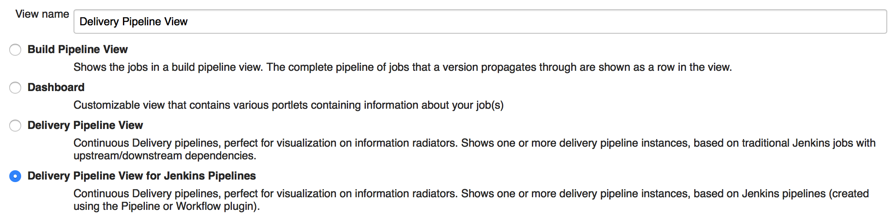

Configure the view according to your needs, and specify which pipeline project to visualize.

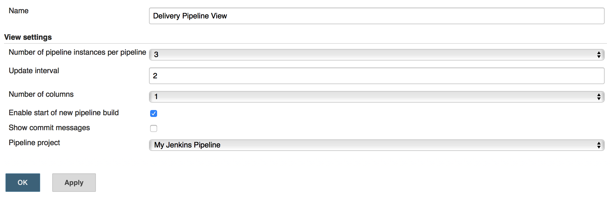

Now your view has been created!

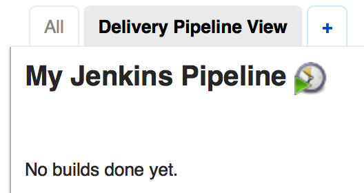

If you selected the option to “Enable start of new pipeline build”, you can trigger a new pipeline run by clicking the build button to the right of the pipeline name. Otherwise you can navigate to your pipeline and start it from there. Now you will see how the Delivery Pipeline plugin renders your pipeline run! Since the view is not able to evaluate the pipeline in advance, the pipeline will be rendered according to the progress of the current run.
Jenkins pipeline run in the Delivery Pipeline view.

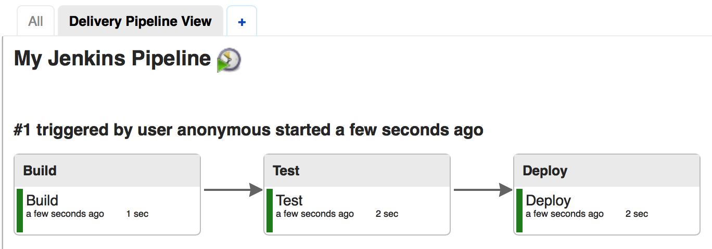

If you prefer to model each stage in a more fine grained fashion you can specify tasks for each stage. Example:

```
node {
  stage 'Build'
  task 'Compile'
  echo 'Compiling'
  sleep 1

  task 'Unit test'
  sleep 1

  stage 'Test'
  task 'Component tests'
  echo 'Running component tests'
  sleep 1

  task 'Integration tests'
  echo 'Running component tests'
  sleep 1

  stage 'Deploy'
  task 'Deploy to UAT'
  echo 'Deploy to UAT environment'
  sleep 1

  task 'Deploy to production'
  echo 'Deploy to production'
  sleep 1
}
```

Which will render the following pipeline view:

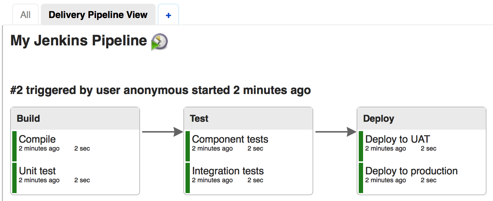

The pipeline view also supports a full screen view, optimized for visualization on information radiators:

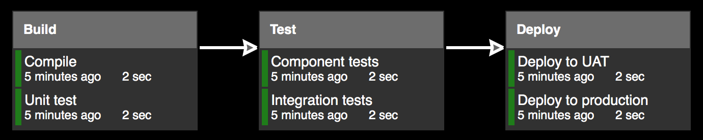

That’s it!

If you are making use of Jenkins pipelines, we hope that you will give the Delivery Pipeline plugin a spin!

To continue to drive adoption and development of the Delivery Pipeline plugin, we rely on feedback and contributions from our users. For more information about the project and how to contribute, please visit the project page on GitHub: https://github.com/Diabol/delivery-pipeline-plugin

We use the official Jenkins JIRA to track issues, using the component label “delivery-pipeline-plugin”: https://issues.jenkins-ci.org/browse/JENKINS

Enjoy!

[@tommysdk](http://www.diabol.se/)

http://www.diabol.se

**Tags: CONTINUOUS DELIVERY, DELIVERY PIPELINE PLUGIN, JENKINS**


# ANNOUNCING DELIVERY PIPELINE PLUGIN 1.0.0 WITH SUPPORT FOR JENKINS PIPELINES
**2017-04-11 TOMMY TYNJÄ**

**CONTINUOUS DELIVERY, JENKINS, PIPELINES**

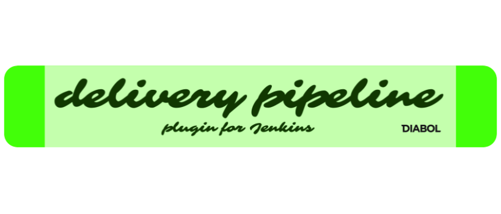

We are pleased to announce the first version of the Delivery Pipeline Plugin for Jenkins (1.0.0) which includes support for Jenkins pipelines! Even though Jenkins pipelines has been around for a few years (formerly known as the Workflow plugin), it is during the last year that the Pipeline plugin has started to gain momentum in the community.

The Delivery Pipeline plugin is a mature project that was primarily developed with one purpose in mind. To allow visualization of Continuous Delivery pipelines, suitable for visualization on information radiators. We believe that a pipeline view should be easy to understand, yet contain all necessary information to be able to follow a certain code change passing through the pipeline, without the need to click through a UI. Although there are alternatives to the Delivery Pipeline plugin, there is yet a plugin that suits as good for delivery pipeline visualizations on big screens as the Delivery Pipeline plugin.

.

Delivery Pipeline plugin has a solid user base and a great community that helps us to drive the project forward, giving feedback, feature suggestions and code contributions. Until now, the project has supported the creation of pipelines using traditional Jenkins jobs with downstream/upstream dependencies with support for more complex pipelines using e.g. forks and joins.

Now, we are pleased to release a first version of the Delivery Pipeline plugin that has basic support for Jenkins pipelines. This feature has been developed and tested together with a handful of community contributors. We couldn’t have done it without you! The Jenkins pipeline support has some known limitations still, but we felt that the time was right to release a first version that could get traction and usage out in the community. To continue to drive adoption and development we rely on feedback and contributions from the community. So if you are already using Jenkins pipelines, please give the new Delivery Pipeline a try. It gives your pipelines the same look and feel as you have grown accustomed to if you are used to the look and feel of the Delivery Pipeline plugin. We welcome all feedback and contributions!

Other big features in the 1.0.0 version includes the ability to show which upstream project that triggered a given pipeline (issue [JENKINS-22283](https://issues.jenkins-ci.org/browse/JENKINS-22283)), updated style sheets and a requirement on Java 7 and Jenkins 1.642.3 as the minimum supported core version.

For more information about the project and how to contribute, please visit the project page on GitHub: https://github.com/Diabol/delivery-pipeline-plugin

[@tommysdk](https://twitter.com/tommysdk)

http://www.diabol.se

**Tags: CONTINUOUS DELIVERYDELIVERY PIPELINE PLUGINJENKINS**


# AMAZON CLOUD CERTIFICATION
**2017-03-10 PETER BENGTSON**

**ARCHITECTURE, AWS, CLOUD, CONTINUOUS DELIVERY, CONTINUOUS INTEGRATION, DEVOPS**

AWS is extremely hot right now — according to Ryan Kroonenburg from [A Cloud Guru](https://acloud.guru/), it is estimated there is a skills shortage of approximately 1.7 million certified AWS professionals worldwide. The cloud is now the uncontested default for startups and for reorganisations of IT infrastructure in general.

Up until quite recently, there used to be five AWS certifications:

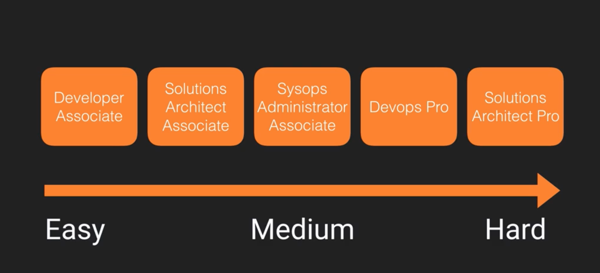

The Associate ones can be approached in any order, but it’s considered a good idea to start with the Solutions Architect Associate as it lays the foundations for almost everything else, then the Developer Associate, and finally the Sysops Administrator Associate certification.

The two Professional ones are considered difficult, the AWS Solution Architect Professional in particular: some people say it’s one of the toughest IT certifications in the field. Both require extensive preparation; practical experience with AWS is of course invaluable.

To progress to the Professional certifications, Associate level certifications are required:

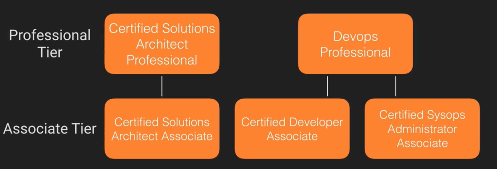

To qualify for the Architect Professional, you must be certified as an Architect Associate. The Devops certification requires you have either the Developer Associate or the Sysops Associate.

After working every day in the Amazon cloud since 2012, I thought it might be a good idea to get certification for the kind of work I’ve already been doing. Even more so since many of my colleagues at Diabol AB already have AWS certifications and have worked in the cloud for years. 

So, a few days ago I passed the AWS Solution Architect Associate certification.


My end goal is to take all five. In addition to the Architect Professional, the Devops Professional certification is particularly interesting given that Diabol AB specialises in Continuous Delivery and has deep expertise in Devops and Lean/Agile methodologies.

So, to prepare for the Pro ones, I’m taking all three Associate certifications. Since their contents overlap to a large extent — I’d say they are 70% similar — it makes sense to study them together. If all goes well, I’ll have all three before the end of this month.

After that, I need to concentrate on a few AWS technologies and services which I haven’t used yet — AWS is such a rich environment now that nobody knows the entire platform: you have to specialise — before I go for the DevOps Professional. I don’t know exactly when I’ll sit for that. And finally, after some further preparation, the AWS Solution Architect Professional.

And to anyone who has one of the Associate level certifications, I’d say: get the two other ones. It’s not that much work.

In the coming weeks, I’ll be posting updates covering the various certifications, including thoughts and reflections on the contents and relative difficulties of the respective exams, and also a little on how I’ve studied for them.


# EXPERIENCES FROM A HIGHLY PRODUCTIVE DEVELOPMENT TEAM
**2017-02-09 TOMMY TYNJÄ**

**DEVOPS, LEAN**

During the past year I’ve been working in a development team which arguable is the most productive team I’ve been around in my ten year career in software development. During the year, we have been able to achieve great things. We have been taking new systems and services live, delivering new features to both internal and external customers and decommissioning old services which have served their purpose in a fast pace. This article aims to address some of the key aspects that I have been observing, which makes this team so productive and efficient in how they work.

We seldom, if ever, perform work on our own. We have been exercising so called mob programming for a year now, which means the whole team works on the same problem, in front of a big shared monitor, with one keyboard and mouse being passed around the participants. This was something that the team just decided to try after attending a conference which had a presentation on mob programming, which then evolved into a standard way of working within the team. The team’s manager do not care how we work, as long as we deliver. Every morning we finish our daily scrum/standup meeting by deciding on the team formation. Sometimes a small task needs to be performed that might not be suitable for the mob. In that case we exercise pair programming while the mob continues. The benefits of everyone working together are e.g. knowledge sharing, that everyone knows what’s happening, architecture decisions can be made as we go etc. We also prefer constant pre-commit code review because at that point in time everybody is familiar with the code changes, the intent of the changes and what possible solutions were discarded, something that is not as clear with a separate post-commit review which also adds unnecessary overhead. A team moves quicker than an individual and the shared knowledge of the team is greater than of particular individuals. These effects were more or less immediate when we started with mob programming.

Continuous Delivery. We have a streamlined process where the whole delivery process is automated. For each code change that is pushed to a source code repository, a new build of the software is triggered. For each build we run unit, subsystem and regression tests in a fully automated fashion. This is our safety net and if all tests pass, we automatically continue deploying the code to our different environments. In roughly 30 minutes, the new code change has been deployed to production if it has passed all the gatekeeping. No manual interventions needed. This allows us to go fast and get quick feedback on whether a given code change is fit for purpose. A benefit of being able to ship new code changes as soon as possible is that you do not create an inventory of code changes. If a problem would arise, the developers would be up to speed and have the context of the particular code in mind if they would need to make any additional changes. Even though we tag our deployments automatically for traceability, it is also very easy to know what code is actually deployed in production.

*Code that is in production brings value, code that isn’t, doesn’t.*

Teams with end-to-end responsibility. The Amazon CTO Werner Vogels have been quoted saying: “You build it, you run it”. This aspect is really important for a development team to be able to take responsibility and accountability for the code they write. If you are on-call for the code you’ve written, you will pay attention to quality since you do not want to be woken up in the middle of the night due to technical issues. And if problems arise, you will be sure to solve them for good once they occur. Having to think about the operational aspects of software on a daily basis has made me a better developer. Not only do I write code that is easy to test (an effect of test-driven development), but I also keep in mind how the code is going to be deployed and run.

A team dedicated product owner (PO) is key. A year ago we had a PO that was split between our and another team. When that person was dedicated for our team only a few months later we noticed great effects. The PO was much more available for the needs of the development team. The PO was able answer questions and take decisions which shortened the feedback loop for the developers substantially. These days the PO even joins the programming mob to both gain an understanding of how particular problems are solved but also to bring domain specific expertise to the team.

Automate everything. Not everything is worth automating at first, but if it is obvious that a task is repetitive and thus error prone it will be worth automating. Automate the tedious task together in the team and everyone will understand the benefits of it and know the operating procedure. Time is a valuable asset and we only have so much of it. We need to use it wisely to be able to bring as much value for the company and our customers.

*Don’t let a human do a scripts job.*

The willingness to experiment and try out new things is of utmost importance. Not all experiments will bring the desired effect and some might even bring negative effect. But the culture should embrace continuous improvement and experimentation. It should be easy to discard an experiment and rollback.

You should never stop improving. No matter how good you feel about yourself, which processes you have in place, how fast you are able to deliver new features to your customers, you must not stop improving. The journey has no end. If you stop improving, someone of your competitors will eventually outplay you. Why has Usain Bolt been the best sprinter for such a long period of time? He probably works out harder than any of his competitors to stay on top of the game. You should too.

[@tommysdk]()

[LinkedIn profile]()

http://www.diabol.se

**Tags: DEVOPS, MOB PROGRAMMING, PRODUCTIVITY, TEAMWORK**


# DELIVERY PIPELINES WITH GOCD
**2016-11-28 DENNIS GRANATH**

**CONTINUOUS DELIVERY, GOCD, PIPELINES**

At my most recent assignment, one of my missions was to set up delivery pipelines for a bunch of services built in Java and some front-end apps. When I started they already had some rudimentary automated builds using Hudson, but we really wanted to start from scratch. We decided to give GoCD a chance because it pretty much satisfied our demands. We wanted something that could:

* orchestrate a deployment pipeline (Build -> CI -> QA -> Prod)
* run on-premise
* deploy to production in a secure way
* show a pipeline dashboard
* handle user authentication and authorization
* support fan-in

GoCD is the open source “continuous delivery server” backed up by Thoughtworks (also famous for selenium)

## GoCD key concepts

A pipeline in GoCD consists of stages which are executed in sequence. A stage contains jobs which are executed in parallel. A job contains tasks which are executed in sequence. The smallest schedulable unit are jobs which are executed by agents. An agent is a Java process that normally runs on its own separate machine. An idling agent fetches jobs from the GoCD server and executes its tasks. A pipeline is triggered by a “material” which can be any of the following the following version control systems:

* Git
* Subversion
* Mercurial
* Team Foundation Server
* Perforce

A pipeline can also be triggered by a dependency material, i.e. an upstreams pipeline. A pipeline can have more than one material.

Technically you can put the whole delivery pipeline (CI->QA->PROD) inside a pipeline as stages but there are several reasons why you would want to split it in separate chained pipelines. The most obvious reason for doing so is the GoCD concept of environments. A pipeline is the smallest entity that you could place inside an environment. The concepts of environments are explained more in detailed in the security section below.

You can logically group pipelines in ”pipelines groups” so in the typical setup for a micro-service you might have a pipeline group containing following pipelines:

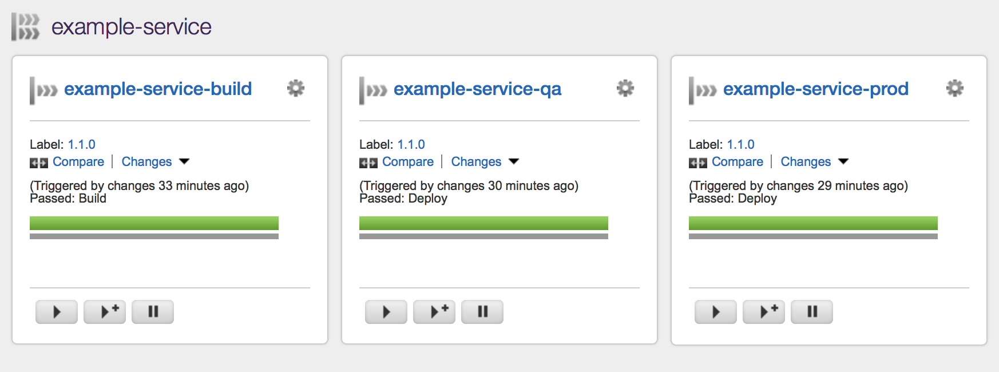

A pipeline group can be used as a view and a place holder for access rights. You can give a specific user or role view, execution or admin rights to all pipelines within a pipeline group.

For the convenience of not repeating yourself, GoCD offers the possibility to create templates which are parameterized workflows that can be reused. Typically you could have templates for:

* building (maven, static code analysis)
* deploying to a test environment
* deploying to a production environment

For more details on concepts in GoCD, see: https://docs.go.cd/current/introduction/concepts_in_go.html

## Administration

### Installation

The GoCD server and agents are bundled as rpm, deb, windows and OSX install packages. We decided to install it using puppet https://forge.puppet.com/unibet/go since we already had puppet in place. One nice feature is that agents auto-upgrades when the GoCD server is upgraded, so in the normal case you only need to care about GoCD server upgrades.

### User management
We use the LDAP integration to authenticate users in GoCD. When a user defined in LDAP is logging in for the for the first time it’s automatically registered as a new user in GoCD. If you use role based authorization then an admin user needs to assign roles to the new user.

### Disk space management
All artifacts created by pipelines are stored on the GoCD server and you will sooner or later face the fact that disks are getting full. We have used the tool “GoCD janitor” that analyses the value stream (the collection of chained upstreams and downstream pipelines) and automatically removes artifacts that won’t make it to production.

## Security
One of the major concerns when deploying to production is the handling of deployment secrets such as ssh keys. At my client they extensively use Ansible as a deployment tool so we need the ability to handle ssh keys on the agents in a secure way. It’s quite obvious that you don’t want to use the same ssh keys in test and production so in GoCD they have a feature called environments for this purpose. You can place an agent and a pipeline in an environment (ci, qa, production) so that anytime a production pipeline is triggered it will run on an agent in the production environment.

There is also a possibility to store encrypted secrets within a pipeline configuration using so called secure variables. A secure variable can be used within a pipeline like an environment variable with the only difference that it’s encrypted with a shared secret stored on the GoCD server. We have not used this feature that much since we solved this issue in other ways. You can also define secure variables on the environment level so that a pipeline running in a specific environment will inherit all secure variables defined in that specific environment.

## Pipelines as code

This was one of the features GoCD were lacking at the very beginning, but at the same there were API endpoints for creating and managing pipelines. Since GoCD version 16.7.0 there is support for “pipelines as code” via the yaml-plugin or the json-plugin. Unfortunately templates are not supported which can lead to duplicated code in your pipeline configuration repo(s).

For further reading please refer to: https://docs.go.cd/current/advanced_usage/pipelines_as_code.html

## Example
Let’s wrap it up with a fully working example where the key concepts explained above are used. In this example we will set up a deployment pipeline (BUILD -> QA -> PROD ) for a dropwizard application. It will also setup an basic example where fan-in is used. In that example you will notice that downstreams pipeline “prod” won’t be trigger unless both “test” and “perf-test” are finished. We use the concept of  “pipelines as code” to configure the deployment pipeline using “gocd-plumber”. GoCD-plumber is a tool written in golang (by me btw), which uses the GoCD API to create pipelines from yaml code. In contrast to the yaml-plugin and json-plugin it does support templates by the act of merging a pipeline hash over a template hash.

### Preparations
This example requires Docker, so if you don’t have it installed, please install it first.

1. ```git clone https://github.com/dennisgranath/gocd-docker.git```
2. ```cd gocd-docker```
3. ```docker-compose up```
4. ```go to http://127.0.0.1:8153 and login as ‘admin’ with password ‘badger’```
5. Press play button on the “create-pipelines” pipeline
6. Press pause button to “unpause” pipelines
 
**Tags: CONTINUOUS DELIVERY, DELIVERY PIPELINE, GOCD**


# REASONS WHY CODE FREEZES DON’T WORK
**2016-11-11 TOMMY TYNJÄ**

**AGILE, CONTINUOUS DELIVERY, DEVOPS, LEAN, RELEASE MANAGEMENT**

This article is a continuation on my previous article on how to release software with quality and confidence.

When the big e-commerce holidays such as Black Friday, Cyber Monday and Christmas are looming around the corner, many companies are gearing up to make sure their systems are stable and able to handle the expected increase in traffic.

What many organizations do is introducing a full code freeze for the holiday season, where no new code changes or features are allowed to be released to the production systems during this period of the year. Another approach is to only allow updates to the production environment during a few hours during office hours. These approaches might sound logical but are in reality anti-patterns that neither reduces risk nor ensures stability.

What you’re doing when you stop deploying software is interrupting the pace of the development teams. The team’s feedback loop breaks and the ways of workings are forced to deviate from the standard process, which leads to decreased productivity.

When your normal process allows deploying software on a regular basis in an automated and streamlined fashion, it becomes just as natural as breathing. When you stop deploying your software, it’s like holding your breath. This is what happens to your development process. When you finally turn on the floodgates after the holiday season, the risk for bugs and deployment failures are much more likely to occur. As more changes are stacked up, the bigger the risk of unwanted consequences for each deployment. Changes might also be rushed, with less quality to be able to make it into production in time before a freeze. Keeping track of what changes are pending release becomes more challenging.

Keeping your systems stable with exceptional uptime should be a priority throughout the whole year, not only during holiday season. The ways of working for the development teams and IT organization should embrace this mindset and expectations of quality. Proper planning can go a long way to reduce risk. It might not make sense to push through a big refactoring of the source code during the busiest time of the year.

A key component for allowing a continuous flow of evolving software throughout the entire year is organizational maturity regarding monitoring, logging and planning. It should be possible to monitor, preferably visualised on big screens in the office, how the systems are behaving and functioning in real-time. Both technical and business metrics should be metered and alarm thresholds configured accordingly based on these metrics.

Deployment strategies are also of importance. When deploying a new version of a system, it should always be cheap to rollback to a previous version. This should be automated and possible to do by clicking just one button. Then, if there is a concern after deploying a new version, discovered by closely monitoring the available metrics, it is easy to revert to a previously known good version. Canary releasing is also a strategy where possible issues can be discovered before rolling out new code changes for all users. Canary releasing allows you to route a specific amount of traffic to specific version of the software and thus being able to compare metrics, outcomes and possible errors between the different versions.

When the holiday season begins, keep calm and keep breathing.


[@tommysdk]()

[LinkedIn profile]()

http://www.diabol.se

**Tags: CONTINUOUS DELIVERY, DEVOPS, RELEASE MANAGEMENT, RISK**


# SUMMARY OF EUROSTAR 2016
**2016-11-07 SVANTE LIDMAN**

**AGILE, CONTINUOUS DELIVERY, DEVOPS, TEST**

## About Eurostar

Eurostar is Europe’s largest conference that is focused on testing and this year the conference was held in Stockholm October 31 – November 3. Since I have been working with test automation lately it seemed like a good opportunity to go my first test conference (I was there for two days). The conference had the usual mix of tutorials, presentations and expo, very much a traditional conference setup unlike the community driven style.

## Key take away

Continuous delivery and DevOps changes much of the conventional thinking around test. The change is not primarily related to that you should automate everything related to test but that, in the same way as you drive user experience testing with things like A/B testing, a key enabler of quality is monitoring in production and the ability to quickly respond to problems. This does not mean that all automated testing is useless. But it calls for a very different mindset compared to conventional quality wisdom where the focus has been on finding problems as early as possible (in terms of phases of development). Instead there is increased focus on deploying changes fast in a gradual and controlled way with a high degree of monitoring and diagnostics, thereby being able to diagnose and remedy any issues quickly.

## Presentations

Roughly in order of how much I liked the sessions, here is what I participated in:

### Sally Goble et. al. – How we learned to love quality and stop testing

This was both well presented and thought provoking. They described the journey at Guardian from having a long (two weeks) development cycle with a considerable amount of testing to the current situation where they deploy continuously. The core of the story was how the focus had been changed from test to quality with a DevOps setup. When they first started their journey in automation they took the approach of creating Selenium tests for their full manual regression test suite. This is pretty much scrapped now and they rely primarily on the ability to quickly detect problems in production and do fixes. Canary releases and good use of monitoring / APM, and investments in improved logging were the key enablers here.

Automated tests are still done on a unit, api and integration test level but as noted above really not much automation of front end tests.

### Declan O´Riordan – Application security testing: A new approach

Declan is an independent consultant and started his talk claiming that the number of security related incidents continue to increase and that there is a long list of potential security breaches that one need to be aware of. He also talked about how continuous delivery has shrunk the time frame available for security testing to almost nothing. I.e., it is not getting any easier to secure your applications. Then he went on claiming that there has been a breakthrough in terms of what tools can with regard to security testing in the last 1-2 years. These new tools are categorised as IAST (Interactive Analysis Security Testing) and RASP (Runtime Application Self-Protection). While traditional automated security testing tools find 20-30% of the security issues in an application, IAST-tools find as much as 99% of the issues automatically. He gave a demo and it was impressive. He used the toolset from Contrast but there are other supplier with similar tools and many hustling to catch up. It seems to me that an IAST tool should be part of your pipeline before going to production and a RASP solution should be part of your production monitoring/setup. Overall an interesting talk and lots to evaluate, follow up on, and possibly apply.

### Jan van Moll – Root cause analysis for testers

This was both entertaining and well presented. Jan is head of quality at Philips Healthcare but he is also an independent investigator / software expert that is called in when things go awfully wrong or when there are close escapes/near misses, like when a plane crashes.

No clear takeaway for me from the talk that can immediately be put to use but a list of references to different root cause analysis techniques that I hope to get the time to look into at some point. It would have been interesting to hear more as this talk only scratched the surface of the subject.

### Julian Harty – Automated testing of mobile apps

This was interesting but it is not a space that I am directly involved in so I am not sure that there will be anything that is immediately useful for me. Things that were talked about include:

* Monkey testing, there is apparently some tooling included in the Android SDK that is quite useful for this.
* An analysis that Microsoft research has done on 30 000 app crash dumps indicates that over 90% of all crashes are caused by 10 common implementation mistakes. Failing to check http status codes and always expecting a 200 comes to mind as one of the top ones.
* appdiff.com a free and robot-based approach to automated testing where the robots apply machine learned heuristics. Simple and free to try and if you are doing mobile and not already using it you should probably have a look.

### Ben Simo – Stories from testing healthcare.gov
The presenter rose to fame at the launch of the Obamacare website about a year ago. As you remember there were lots of problems the weeks/months after the launch. Ben approached this as a user from the beginning but after a while when things worked so poorly he started to look at things from a tester point of view. He then uncovered a number of issues related to security, usability, performance, etc. He started to share his experience on social media, mostly to help others trying to use the site, but also rose to fame in mainstream media. The presentation was fun and entertaining but I am not sure there was so much to learn as it mostly was a run-through of all of the problems he found and how poorly the project/launch had been handled. So it was entertaining and interesting but did not offer so much in terms of insight or learning.

### Jay Sehti – What happened when we switched our data center off?

The background was that a couple of years ago Financial Times had a major outage in one of their data centres and the talk was about what went down in relation to that. I think the most interesting lesson was that they had built a dashboard in Dashing showing service health across their key services/applications that each are made up of a number of micro services. But when they went to the dashboard to see what was still was working and where there were problems they realised that the dashboard had a single point of failure related to the data centre that was down. Darn. Lesson learned: secure your monitoring in the same way or better as your applications.

In addition to that specific lesson I think the most interesting part of this presentation was what kind of journey they had gone through going to continuous delivery and micro services. In many ways this was similar to the Guardian story in that they now relied more on monitoring and being able to quickly respond to problems rather than having extensive automated (front end) tests. He mentioned for example they still had some Selenium tests but that coverage was probably around 20% now compared to 80% before.

Similar to Guardian they had plenty of test automation at Unit/API levels but less automation of front end tests.

### Tutorial – Test automation management patterns

This was mostly a walk-through of the website/wiki testautomationpatterns.wikispaces.com and how to use it. The content on the wiki is not bad as such but it is quite high-level and common-sense oriented. It is probably useful to browse through the Issues and Automation Patterns if you are involved in test automation and have a difficult time to get traction. The diagnostics tool did not appear that useful to me.

No big revelations for me during this tutorial if anything it was more of a confirmation of that the approach we have taken at my current customer around testing of backend systems is sound.

### Liz Keogh – How to test the inside of your head

Liz, an independent consultant of BDD-fame, talked among other things about Cynefin and how it is applicable in a testing context. Kind of interesting but it did not create much new insight for me (refreshed some old and that is ok too).

### Bryan Bakker – Software reliability: Measuring to know

In this presentation Bryan presented an approach (process) to reliability engineering that he has developed together with a couple of colleagues/friends. The talk was a bit dry and academic and quite heavily geared towards embedded software. Surveillance cameras were the primary example that was used. Some interesting stuff here in particular in terms of how to quantify reliability.

### Adam Carmi – Transforming your automated tests with visual testing

Adam is CTO of an Israeli tools company called Applitools and the talk was close to a marketing pitch for their tool. Visual Testing is distinct from functional testing in that is only concerned with visuals, i.e., what the human eye can see. It seems to me that if your are doing a lot of cross-device, cross-browser testing this kind of automated test might be of merit.

### Harry Collins – The critique of AI in the age of the net

Harry is a professor in sociology at Cardiff University. This could have been an interesting talk about scientific theory / sociology / AI / philosophy / theory of mind and a bunch of other things. I am sure the presenter has the knowledge to make a great presentation on any of these subjects but this was ill-prepared, incoherent, pretty much without point, and not very well-presented. More of a late-night rant in a bar than a keynote.

## Summary

As with most conferences there was a mix of good and not quite so good content but overall I felt that it was more than worthwhile to be there as I learned a bunch of things and maybe even had an insight or two. Hopefully there will be opportunity to apply some of the things I learned at the customers I am working with.

[@svante_lidman](https://twitter.com/svante_lidman)

[LinkedIn profile](https://se.linkedin.com/in/svante-lidman-41625)

http://www.diabol.se

**Tags: AGILE, CONFERENCE, CONTINUOUS DELIVERY, DEVOPS, TEST DATA**


# HOW TO RELEASE SOFTWARE FREQUENTLY WITH QUALITY AND CONFIDENCE
**2016-10-28 TOMMY TYNJÄ**

**AGILE, CONTINUOUS DELIVERY, LEAN**

Continuous Delivery is a way of working for reducing cost, time and risk of releasing software. The idea is that small and frequent code changes impose less risk for bugs and disturbances. Key aspects in Continuous Delivery is to always have your source code in a releasable state and that your software delivery process is fully automated. These automated processes are typically called delivery pipelines.

In many companies, releasing software is a painful process. A process that is not done on a frequent basis. Many companies are not even able to release software once a month during a given year. In order to make something less painful you have to practice it. If you’re about to run a marathon for the first time, it might seem painful. But you won’t get better at running if you don’t do it frequent enough. It will still hurt.

As humans, we tend to be bad at repetitive work. It is therefore both time consuming and error prone to involve manual steps in the process of deploying software. That is reason enough to automate the whole process. Automation ensures that the process is fast, repeatable and provides traceability.

*Never let a human do a scripts job.*

With automation in place you can start building confidence in your release process and start practicing it more frequently. Releasing software should be practiced as often as possible so that you don’t even think about it happening.

*Releasing new code changes should be so natural that you don’t need to think about it. It should be like breathing. Not something painful as giving birth.*

A prerequisite for successfully practicing Continuous Delivery is test automation. Without test automation in place, testing becomes the bottleneck in your delivery process. It is therefore crucial that quality is built into the software. Writing automated tests, both unit, integration and acceptance tests should be a natural part of the development process. You cannot ship a piece of code that has no proper test coverage. If you are not testing the code you’re developing, you cannot be certain that it work as intended. If there is a need for regression tests, automate them and make them cheap to run so that they can be run repeatedly for every code change.

With Continuous Delivery it becomes evident that a release and a deployment are not the same things. A deployment is an exercise that happens all the time, for each new code change. A release is however a business or marketing decision on when to launch a new feature to your end users.

Tommy Tynjä
[@tommysdk](https://twitter.com/tommysdk)

[LinkedIn profile](https://se.linkedin.com/in/tynja)

http://www.diabol.se

**Tags: CONTINUOUS DELIVERY, RELEASE MANAGEMENT


# JAVAONE LATIN AMERICA SUMMARY
**2016-07-06 TOMMY TYNJÄ**

**CONFERENCE, CONTINUOUS DELIVERY, DEVOPS, JAVA**

Last week I attended the JavaOne Latin America software development conference in São Paulo, Brazil. This was a joint event with Oracle Open World, a conference with focus on Oracle solutions. I was accepted as a speaker for the Java, DevOps and Methodologies track at JavaOne. This article intends to give a summary of my main takeaways from the event.

The main points Oracle made during the opening keynote of Oracle Open World was their commitment to cloud technology. Oracle CEO Mark Hurd made the prediction that in 10 years, most production workloads will be running in the cloud. Oracle currently engineers all of their solutions for the cloud, which is something that also their on-premise solutions can leverage from. Security is a very important aspect in all of their solutions. Quite a few sessions during JavaOne showcased Java applications running on Oracles cloud platform.

The JavaOne opening keynote demonstrated the Java flight recorder, which enables you to profile your applications with near zero overhead. The aim of the flight recorder is to have as minimal overhead as possible so it can be enabled in production systems by default. It has a user interface which provides valuable data in case you want to get an understanding of how your Java applications perform.

The next version of Java, Java 9, will feature long awaited modularity through project Jigsaw. Today, all of your public APIs in your source code packages are exposed and can be used by anyone who has access to the classes. With Jigsaw, you as a developer can decide which classes are exported and exposed. This gives you as a developer more control over what are internal APIs and what are intended for use. This was quickly demonstrated on stage. You will also have the possibility to decide what your application dependencies are within the JDK. For instance it is quite unlikely that you need e.g. UI related libraries such as Swing or audio if you develop back-end software. I once tried to dissect the Java rt.jar for this particular purpose (just for fun), so it is nice to finally see this becoming a reality. The keynote also mentioned project Valhalla (e.g. value types for classes) and project Panama but at this date it is still uncertain if they will be included in Java 9.

Mark Heckler from Pivotal had an interesting session on the Spring framework and their Spring cloud projects. Pivotal works closely with Netflix, which is a known open source contributor and one of the industry leaders when it comes to developing and using new technologies. However, since Netflix is committed to run their applications on AWS, Spring cloud aims to make use of Netflix work to create portable solutions for a wider community by introducing appropriate abstraction layers. This enables Spring cloud users to avoid changing their code if there is a need to change the underlying technology. Spring cloud has support for Netflix tools such as Eureka, Ribbon, Zuul, Hystrix among others.

Arquillian, by many considered the best integration testing framework for Java EE projects, was dedicated a full one hour session at the event. As a long time contributor to project, it was nice to see a presentation about it and how its Cube extension can make use of Docker containers to execute your tests against.

One interesting session was a non-technical one, also given by Mark Heckler, which focused on financial equations and what factors drives business decisions. The purpose was to give an understanding of how businesses calculate paybacks and return on investments and when and why it makes sense for a company to invest in new technology. For instance the payback period for an initiative should be as short as possible, preferably less than a year. The presentation also covered net present values and quantification’s. Transforming a monolithic architecture to a microservice style approach was the example used for the calculations. The average cadence for releases of key monolithic applications in our industry is just one release per year. Which in many cases is even optimistic! Compare these numbers with Amazon, who have developed their applications with a microservice architecture since 2011. Their average release cadence is 7448 times a day, which means that they perform a production release once every 11.6s! This presentation certainly laid a good foundation for my own session on continuous delivery.

Then it was finally time for my presentation! When I arrived 10 minutes before the talk there was already a long line outside of the room and it filled up nicely. In my presentation, The Road to Continuous Delivery, I talked about how a Swedish company revamped its organization to implement a completely new distributed system running on the Java platform and using continuous delivery ways of working. I started with a quick poll of how many in the room were able to perform production releases every day and I was apparently the only one. So I’m glad that there was a lot of interest for this topic at the conference! If you are interested in having me presenting this or another talk on the topic at your company or at an event, please contact me! It was great fun to give this presentation and I got some good questions and interesting discussions afterwards. You can find the slides for my presentation [here](http://www.slideshare.net/tommysdk/the-road-to-continuous-delivery/).

Java Virtual Machine (JVM) architect Mikael Vidstedt had an interesting presentation about JVM insights. It is apparently not uncommon that the vast majority of the Java heap footprint is taken up by String objects (25-50% not uncommon) and many of them have the same value. JDK 8 however introduced an important JVM improvement to address this memory footprint concern (through string deduplication) in their G1 garbage collector improvement effort.

I was positively surprised that many sessions where quite non-technical. A few sessions talked about possibilities with the Raspberry Pi embedded device, but there was also a couple of presentations that touched on software development in a broader sense. I think it is good and important for conferences of this size to have such a good balance in content.

All in all I thought it was a good event. Both JavaOne and Oracle Open World combined for around 1300 attendees and a big exhibition hall. JavaOne was multi-track, but most sessions were in Portuguese. However, there was usually one track dedicated to English speaking sessions but it obviously limited the available content somewhat for non-Portuguese speaking attendees. An interesting feature was that the sessions held in English were live translated to Portuguese to those who lent headphones for that purpose.

The best part of the conference was that I got to meet a lot of people from many different countries. It is great fun to meet colleagues from all around the world that shares my enthusiasm and passion for software development. The strive for making this industry better continues!

[@tommysdk](https://twitter.com/tommysdk) 

[LinkedIn profile](https://se.linkedin.com/in/tynja) 

http://www.diabol.se

**Tags: CONFERENCE CONTINUOUS DELIVERY, DEVOPS, JAVA, JAVAONE**


# AWS SUMMIT RECAP
**2016-05-06 TOMMY TYNJÄ**

**ARCHITECTURE, AWS, CLOUD, CONFERENCE, DEVOPS, INFRASTRUCTURE**

This week, the annual AWS Summit took place in sunny Stockholm. This article aims to provide a recap of my impressions from the event.

It was evident that the event had grown from last year, with approximately 2000 people attending this year’s one day event at Waterfront Congress Centre. Only a few session were technical as most of the presentations just gave an overview of the different services and various use cases. I really appreciated the talks from different AWS customers who spoke about their use of AWS technologies and what problems they solved and how. I found it valuable to hear from different companies on how they leverage certain products in their production environments.

The opening keynote was long (2 hours!) and included a lot of sales talk. The main keynote speaker mentioned that 20 percent of the audience had never used any AWS services at all, which explains the thorough walkthrough of the different AWS products. One product which stood out was Amazon Inspector, which can detect and remediate security issues early in your AWS environment. It is not yet available in all regions, but is available in e.g. eu-west-1 (Ireland). It was also interesting to hear about migration of large amounts of data using Snowball, a physical device shipped to your datacenter, which allows you to move your data faster than over the Internet (except for the physical delivery of the device to and from your own datacenter).

It is undeniable that Internet of Things (IoT) is gaining traction and that the amount of connected devices around has grown exponentially the past few years. AWS provides several services for developing and running IoT services. With AWS IoT, your devices can securely communicate with your backend servers. What I found most interesting was the concept of device shadows. A shadow is an interface which allows you to communicate with a device even though it would be offline at the moment. In your application, you can communicate with the shadow without the need to care about whether the device is online or not. If you want to change the state of a device currently offline, you will update the shadow and when the device connects again, it will get the new desired state from the shadow.

At the startup track, we got to hear how Mojang leverages AWS for their Minecraft Realm concept. Instead of letting external parties host their game servers, they decided to go with AWS for Minecraft Realm, to allow for a more flexible infrastructure. An interesting aspect is that they had to develop their own algorithm for scaling out quickly, as in a gaming environment it is not acceptable to wait for five minutes for an auto scaling group to spin up new machines to meet the current demand from users. Instead, they have to use quite large instance types and have new servers on standby to be able to take on new traffic as it arrives. It is not trivial either to terminate instances where there is people playing, even though only a few, that wouldn’t provide a good user experience. Instead, they kindly inform the user that the server will terminate in five minutes and that usually makes the users change server. Not ideal but live migration is too far away at the moment. They still use old EC2 classic instances and they will have to do some heavy lifting to modernise their stack on AWS.

There was also a presentation from QuizUp on how they use infrastructure as code with Terraform to manage their AWS resources. A benefit they get from using Terraform instead of Cloudformation is to get an execution plan before actually applying changes. The drawback is that it is not possible to query Terraform for the current resources and their state directly from AWS.

In the world of relational databases in AWS (RDS), Aurora is an AWS developed database to maximise reliability, scalability and cost-effectiveness. It delivers up to five times the throughput of a standard MySQL running on the same hardware. It is designed to scale and to handle failures. It even provides an SQL extension to simulate failures:

```SQL
ALTER SYSTEM CRASH [INSTANCE | DISPATCHER | NODE ];
ALTER SYSTEM SIMULATE percentage_of_failure PERCENT
* READ REPLICA FAILURE
* DISK FAILURE
* DISK CONGESTION
FOR INTERVAL quantity [ YEAR | QUARTER | MONTH | WEEK | DAY | HOUR | MINUTE | SECOND ]
```

Probably the most interesting session of the day was about serverless architecture using AWS Lambda. Lambda allows you to upload snippets of code, functions to AWS which runs them for you. No need to provision servers or think about scalability, AWS does that for you and you only pay for the time your code executes in units of 100 ms. The best thing about this talk was the peek under the hood. AWS leverages Linux containers (not Docker) to isolate the resources of the uploaded functions and to be able to run and scale these quickly. It also offers predictive capacity planning. An interesting part is that you can upload libraries which your code depends on as part of your function, so you could basically run a small microservice just by using Lambda. To deploy your function, you package it in a zip archive and use Cloudformation (specified as type AWS::Lambda::Function). You’re able to run your function inside of your VPC and thus leverage other resources available within your VPC.

All in all I thought this was a great event. If you didn’t attend I really recommend attending the next one – especially if you’re already using AWS.

As we at Diabol are standard partners with Amazon, not only can we assist you with your cloud platform strategies but also to tie that together with the full view of your systems development process. Don’t hesitate to [contact us](mailto:info@diabol.se)!

You can read more about us at [diabol.se](http://www.diabol.se/).

[@tommysdk](https://twitter.com/tommysdk)

**Tags: AWS, CLOUD, CONFERENCE, DEVOPS**


# THE POWER OF JENKINS JOBDSL
**2016-04-15 TOMMY TYNJÄ**

**CONFIGURATION MANAGEMENT, CONTINUOUS INTEGRATION, DEVOPS, JENKINS, PIPELINES**

At my current client we define all of our Jenkins jobs with [Jenkins Job Builder](http://docs.openstack.org/infra/jenkins-job-builder/) so that we can have all of our job configurations version controlled. Every push to the version control repository which hosts the configuration files will trigger an update of the jobs in Jenkins so that we can make sure that the state in version control is always reflected in our Jenkins setup.

We have six jobs that are essentially the same for each of our projects but with only a slight change of the input parameters to each job. These jobs are responsible for deploying the application binaries to different environments.

Jenkins Job Builder supports templating, but our experience is that those templates usually will be quite hard to maintain in the long run. And since it is just YAML files, you’re quite restricted to what you’re able to do. [JobDSL Jenkins job configurations](https://github.com/jenkinsci/job-dsl-plugin) on the other hand are built using [Groovy](http://www.groovy-lang.org/). It allows you to insert actual code execution in your job configurations scripts which can be very powerful.

In our case, with JobDSL we can easily just create one common job configuration which we then just iterate over with the job specific parameters to create the necessary jobs for each environment. We also can use some utility methods written in Groovy which we can invoke in our job configurations. So instead of having to maintain similar Jenkins Job Builder configurations in YAML, we can do it much more consise with JobDSL.

Below, an example of a JobDSL configuration file (Groovy code), which generates six jobs according to the parameterized job template:

```java
class Utils {
    static String environment(String qualifier) { qualifier.substring(0, qualifier.indexOf('-')).toUpperCase() }
    static String environmentType(String qualifier) { qualifier.substring(qualifier.indexOf('-') + 1)}
}
 
[
    [qualifier: "us-staging"],
    [qualifier: "eu-staging"],
    [qualifier: "us-uat"],
    [qualifier: "eu-uat"],
    [qualifier: "us-live"],
    [qualifier: "eu-live"]
].each { Map environment ->
 
    job("myproject-deploy-${environment.qualifier}") {
        description "Deploy my project to ${environment.qualifier}"
        parameters {
            stringParam('GIT_SHA', null, null)
        }
        scm {
            git {
                remote {
                    url('ssh://git@my_git_repo/myproject.git')
                    credentials('jenkins-credentials')
                }
                branch('$GIT_SHA')
            }
        }
        deliveryPipelineConfiguration("Deploy to " + Utils.environmentType("${environment.qualifier}"),
                Utils.environment("${environment.qualifier}") + " environment")
        logRotator(-1, 30, -1, -1)
        steps {
            shell("""deployment/azure/deploy.sh ${environment.qualifier}""")
        }
    }
}
```

If you need help getting your Jenkins configuration into good shape, just [contact us](mailto:info@diabol.se) and we will be happy to help you! You can read more about us at [diabol.se](http://www.diabol.se/).

[@tommysdk](https://twitter.com/tommysdk)


# CHOOSING ATLASSIAN CLOUD OR ON-PREMISE, THINGS TO CONSIDER
**2016-04-14 NELSON ALVARADO**

**ATLASSIAN**

Many companies are considering moving off from Atlassian cloud instance to a self hosted (on-premise), or hiring a third party hosting service.  Here are some pros and cons (for and against) that you and your company should consider:

Pros (on-premise):
* Customization in the source code
* Access to the entire Atlassian Plugins management library
* Don’t need to force the application upgrade
* Access to the log files
* Access to the DB
* Potential cost savings from the licensing fees
* Restrict the network access (e.g: host JIRA in a server only accessible to your company using a VPN)
* Commercial and Academic licenses give you another developer license where you can use in a second instance (Usually for non-production where you can replicate your production instance and run some tests related to new features, plugins, upgrade…)
* Use your domain name
* No storage limit
* LDAP

Cons:
* Concern about a self- or CA signed certificate (probably you want to enforce SSL)
* Server administration (Including the allocated resources)
* Upgrade plan
* Maintaining your own infrastructure
* Reliability (If your production instance goes down?)

However, as a best solution in order to you figure out what would better fit your company needs, I’d advise you to generate an evaluation license (my.atlassian.com) and give a try in a test server (Importing your Cloud data) to see if it will better fulfill your final goal. Instruction to do that can be found [here](https://confluence.atlassian.com/jira/migrating-from-jira-cloud-to-jira-server-299569790.html).

Being an Atlassian Experts in Sweden, Diabol can help you the tools improve your Atlassian usage. Just [contact us](mailto:info@diabol.se). You can read more about us at [diabol.se](http://www.diabol.se/).


# DIABOL HJÄLPER KLARNA UTVECKLA EN NY PLATTFORM OCH ATT BLI EXPERTER PÅ CONTINUOUS DELIVERY
**2016-03-11 RICKARD VON ESSEN**

**AWS, CLOUD, CONTINUOUS DELIVERY, DEVOPS, INFRASTRUCTURE, NEWS**

Klarna har sedan starten 2005 haft en kraftig tillväxt och på mycket kort tid växt till ett företag med över 1000 anställda. För att möta den globala marknadens behov av sina betalningstjänster behövde Klarna göra stora förändringar i både teknik, organisation och processer. Klarna anlitade konsulter från Diabol för att nå sina högt satta mål med utveckling av en ny tjänsteplattform och bli ledande inom DevOps och Continuous Delivery.

## Utmaning

Efter stora framgångar på den nordiska marknaden och flera år av stark tillväxt behövde Klarna utveckla en ny plattform för sina betalningstjänster för att kunna möta den globala marknaden. Den nya plattformen skulle hantera miljontals transaktioner dagligen och vara robust, skalbar och samtidigt stödja ett agilt arbetssätt med snabba förändringar i en växande organisation. Tidplanen var mycket utmanande och förutom utveckling av alla tjänster behövde man förändra både arbetssätt och infrastruktur för att möta utmaningarna med stor skalbarhet och korta ledtider.

## Lösning

Diabols erfarna konsulter med expertkompetens inom Java, DevOps och Continuous Delivery fick förtroendet att stärka upp utvecklingsteamen för att ta fram den nya plattformen och samtidigt automatisera releaseprocessen med bl.a. molnteknik från Amazon AWS. Kompetens kring automatisering och verktyg byggdes även upp i ett internt supportteam med syfte att stödja utvecklingsteamen med verktyg och processer för att snabbt, säkert och automatiserat kunna leverera sina tjänster oberoende av varandra. Diabol hade en central roll i detta team och agerade som coach för Continuous Delivery och DevOps brett i utvecklings- och driftorganisationen.

## Resultat

Klarna kunde på rekordtid gå live med den nya plattformen och öppna upp på flera stora internationella marknader. Autonoma utvecklingsteam med stort leveransfokus kan idag på egen hand leverera förändringar och ny funktionalitet till produktion helt automatiskt vilket vid behov kan vara flera gånger om dagen.

Uttömmande automatiserade tester körs kontinuerligt vid varje kodförändring och uppsättning av testmiljöer i AWS sker också helt automatiserat. En del team praktiserar även s.k. “continuous deployment” och levererar kodändringar till sina produktionsmiljöer utan någon som helst manuell handpåläggning.

“Diabol har varit en nyckelspelare för att uppnå våra högt ställda mål inom DevOps och Continuous Delivery.”

– Tobias Palmborg, Manager Engineering Support, Klarna

**Tags: AWS, CLOUD, CONTINUOUS DELIVERY, DELIVERY PIPELINE, DEVOPS**


# DIABOL MIGRERAR ABDONA TILL AWS OCH INFÖR EN AUTOMATISERAD LEVERANSPROCESS
**2016-03-11 RICKARD VON ESSEN**

**AWS, CLOUD, CONTINUOUS DELIVERY, NEWS**

Abdona tillhandahåller tjänster för affärsresehantering till ett flertal organisationer i offentlig sektor. I samband med en större utvecklingsinsats vill man också se över infrastrukturen för drift och testmiljöer för att minska kostnader och på ett säkert sätt kunna garantera hög kvalité och korta leveranstider. Diabol anlitades för ett helhetsåtagande att modernisera infrastruktur, utvecklingsmiljö, test- och leveransprocess.

## Utmaning

Abdonas system består av en klassisk 3-lagersarkitektur i Java Enterprise och sedan lanseringen för 7 år sedan har endast mindre uppdateringar skett. Teknik och infrastruktur har inte uppdaterats och har med tiden blivit förlegade och svårhanterliga. Manuellt konfigurerade servrar, undermålig dokumentation och spårbarhet, knapphändig versionshantering, ingen kontinuerlig integration eller stabil byggmiljö, manuell test och deployment. Förutom dessa strukturella problem var kostnaden för hårdvara som satts upp manuellt för både test- och driftmiljö var omotiverad dyr jämfört med dagens molnbaserade alternativ.

## Lösning

Diabol började med att kartlägga problemen och först och främst ta kontroll över kodbasen som var utspridd över flera versionshanteringssytem. All kod flyttades till Atlassian Bitbucket och en byggserver med Jenkins sattes upp för att på ett repeterbart sätt bygga och testa systemet. Vidare så valdes Nexus för att hantera beroenden och arkivera de artifakter som produceras av byggservern. Infrastruktur migrerades till Amazon AWS av både kostnadsmässiga skäl, men också för att kunna utnyttja moderna verktyg för automatisering och möjligheterna med dynamisk infrastruktur. Applikationslager flyttades till EC2 och databasen till RDS. Terraform valdes för att automatisera uppsättningen av resurser i AWS och Puppet introducerades för automatisk konfigurationshantering av servrar. En fullständig leveranspipeline med automatiskt deployment implementerades i Jenkins.

## Resultat

Migrering till Amazon AWS har lett till drastiskt minskade driftkostnader för Abdona. Därtill har man nu en skalbar modern infrastruktur, fullständig spårbarhet och en automatisk leveranskedja som garanterar hög kvalitet och korta ledtider. Systemet är helt och hållet rekonstruerbart från kodbasen och testmiljöer kan skapas helt automatiskt vid behov.

**Tags: AWS, CLOUD, CONTINUOUS DELIVERY, DELIVERY PIPELINE**


# PUPPET RESOURCE COMMAND
**2016-01-20 MARCUS PHILIP**

**CONFIGURATION MANAGEMENT, INFRASTRUCTURE**

I have used puppet for several years but had overlooked the [puppet resource](https://docs.puppetlabs.com/references/stable/man/resource.html) command until now. This command uses the Puppet RAL (Resource Abstraction Layer, i.e. Puppet DSL) to directly interact with the system. What that means in plain language is that you can easily reverse engineer a system and get information about it directly in puppet format on the command line.

The basic syntax is: puppet resource type [name]

Some examples from my Mac will make it more clear:

## Get info about a given resource: me
```bash
$ puppet resource user marcus
user { 'marcus':
 ensure => 'present',
 comment => 'Marcus Philip',
 gid => '20',
 groups => ['_appserveradm', '_appserverusr', '_lpadmin', 'admin'],
 home => '/Users/marcus',
 password => '*',
 shell => '/bin/bash',
 uid => '501',
}
```

## Get info about all resources of a given type: users
```bash
$ puppet resource user
user { '_amavisd':
 ensure => 'present',
 comment => 'AMaViS Daemon',
 gid => '83',
 home => '/var/virusmails',
 password => '*',
 shell => '/usr/bin/false',
 uid => '83',
}
user { '_appleevents':
 ensure => 'present',
 comment => 'AppleEvents Daemon',
 gid => '55',
 home => '/var/empty',
 password => '*',
 shell => '/usr/bin/false',
 uid => '55',
}
...
user { 'root': ensure => 'present',
 comment => 'System Administrator',
 gid => '0',
 groups => ['admin', 'certusers', 'daemon', 'kmem', 'operator', 'procmod', 'procview', 'staff', 'sys', 'tty', 'wheel'],
 home => '/var/root',
 password => '*',
 shell => '/bin/sh',
 uid => '0',
}
```

One use case for this command could perhaps be to extract into version controlled code the state of a an existing server that I want to put under puppet management.

With the --edit flag the output is sent to a buffer that can be edited and then applied. And with attribute=value you can set attributes directly from command line.

However, I think I will only use this command for read operations. The reason for this is that I think that the main benefit of puppet and other tools of the same ilk is not the abstractions it provides in itself, but rather the capability to treat the infrastructure as code, i.e. under version control and testable.

The reason I have overlooked this command is probably because I’ve mainly been applying puppet to new, ‘greenfield’ servers, and because, as a software developer, I’m used to work from the model side rather than tinkering directly with the system on the command line. Anyway, now I have another tool in the belt. Always feel good.

[@marcus_phi](https://twitter.com/marcus_phi)

**Tags: PUPPET**


# CONTINUOUS DELIVERY FOR US ALL
**2016-01-20 TONNI HULT**

**CONTINUOUS DELIVERY, DEVOPS**

During the last years I have taken a great interest in Continuous Delivery, or CD, and DevOps because the possibilities they give are very tempting, like:

* releasing tested and tracable code to production for example an hour after check-in, all without any drama or escalation involved
* giving the business side the control over when a function is installed or activated in production
* bringing down organizational boundries, working more collaboratively and letting the teams get more responsibility and control over their systems and their situation
* decreasing the amount of meetings and manual work that is being done

My CD interest grew to the point that I wanted to work more focused with this area so I started looking for a new job but when scanning the market I ran into a problem. If you do a search for work in Sweden within CD, and look at the knowledge requested, it is often not C#, MSBuild, TFS and Windows Server they are looking for and most of my background, knowledge and work experience is within that stack. This also concurred with my former experience because looking at other companies that are considered in the forefront as Google, Netflix, Amazon and Spotify they do not have their base in Microsoft technology.

At my former workplace, where we mainly used Microsoft products, we were a few driving forces who promoted and educated people in CD and also tried to implement it via a pilot project. Working with this project we never felt that Microsoft technology made it impossible (or even hard) to implement a CD way of working as it works regardless of your underlying technology. So why are Microsoft users not so good at being in the front, or at least not showing it, because CD is there and is possible to achieve with some hard work. My reflection over why is that Microsoft users (generally)

* are more accustomed to using Microsoft technology and do not look around for what can complete or improve their situation. Linux and Java users are for example more used to finding and using products that solve more specific problems
* don’t think that other products can be added in a smooth way to their environment and way of working
* don’t have the same drive around technology as for example Linux and Java users, a drive they also are eager to show
* can be a little content and don’t question their situation, or they see the problems but neglect to respond to them

This is something I want to change so more Microsoft based companies are shown in the “forefront” because all companies with IT, regardless of their choice of technology, have great benefits to gain from CD. Puppet Labs yearly conduct a “State Of DevOps” survey* to see how DevOps and CD is accepted in the world of it** and what difference, if any, that this makes. If you look at the result from the survey the results are very clear (https://puppetlabs.com/sites/default/files/2015-state-of-devops-report.pdf):

* High performing IT organizations release code 30 times more frequent with 200 times shorter leadtime. They also have 60 times less “failures” and recover 168 times faster
* Lean management and continuous delivery practices create the conditions for delivering value faster, sustainably
* An environment with freedom and responsibility where it invests in the people and for example automation of releases give a lot not only to the employees but also to the organization
* Being high performing is (under some conditions) achievable whether you work with greenfield, brownfield or legacy systems. If you don’t have the conditions right now that is something to work towards
* To help you on your journey towards an effective, reliable and frequent delivery Diabol has developed a CD Maturity Model (http://www.infoq.com/articles/Continuous-Delivery-Maturity-Model) and this you can use to evaluate your current situation and see what abilities you need to evolve in order to be a high performing it-organization. And to be called high performing you need to be in at least an Advanced level in all dimensions, with a few exceptions that are motivated by your organizations circumstances. But remember that for every step on the model that you take you have great benefits and improvements to gain.

So if you work at a company which releases every 1, 3 or 6 months where every release is a minor or major project, how would it feel if you instead could release the code after every sprint, every week or even every hour without so much as a raised eyebrow? How would it be to know exactly what code is installed in each environment and have new code installed right after check-in? How about knowing how an environment is configured and also know the last time it was changed and why? This is all possible so let us at Diabol help you get there and you are of course welcome regardless of your choice in technology.

*If you would like to know more about the report from Puppet Labs and how it is made I can recommend reading http://itrevolution.com/the-science-behind-the-2013-puppet-labs-devops-survey-of-practice/

**I don’t mean that CD and DevOps are the same but this can be the topic of another blog post. They though have a lot in common and both are mentioned by Puppet Labs

**Tags: CONTINUOUS DELIVERY, DEVOPS, LEAN, MICROSOFT**


# FOUNDATIONS OF SELF-ORGANIZATION
**2016-01-08 MARCUS PHILIP**

**AGILE**

In the just published InfoQ article [Foundations of Self-Organization](http://www.infoq.com/articles/foundations-self-organization)
our [Svante Lidman](https://www.linkedin.com/in/svante-lidman-41625) presents a model for healthy self-organization in the context of agile software development.

[@marcus_phi](https://twitter.com/marcus_phi)


# SLOW JENKINS START UP – THINK TWICE BEFORE UPDATING FILES IN A LOOP
**2015-12-01 MARCUS PHILIP**

**JENKINS, PERFORMANCE**

Some time ago I spent a day trying to figure out why our Jenkins Master is so slow (~30min) to start up. We have around 1000 jobs and about 100 plugins. The large amount of jobs makes us hit some performance issues that never is an issue in smaller installations. The number of plugins, makes the list of possible culprits long. Furthermore, it might be a combination of plugins causing the problem. And we may in fact have several separate issues.

## Template Project + Job Config History = @#*$%*!?!

One issue that we have found is the combination of Template Project and Job Config History plugins. The Template Project implements ItemListener.onLoaded() and in a loop updates (twice) all projects using it (and we use it a lot). However, this seems to be some workaround that never(?) actually does any real work. Since the job is updated, this will trigger the Job Config History plugin (and maybe others listening to this). Which of course the Template plugin didn’t account for.

The Job Config History is potentially writing several times to disk for each job when triggered. Disk I/O is, as every programmer should know, relatively slow, but one write operation per job would be acceptable at startup if there is no other way. HOWEVER, there is a sleep 500 ms statement to avoid some clashing when writing to disk. 500 ms is an eon in computer world! Disk operations are normally a lot faster than that. 50 ms would be more reasonable value, provided that you can’t avoid a sleep call completely.

1000 jobs x 2 calls/job x 500 ms = 1000 s ? 17 minutes !

Oops! Well, that explains a large part of our slow startup time. The funny thing is that load, disk I/O, cpu and memory is low, we’re mostly just waiting. I had to do thread analysis to find this problem.

I reported [JENKINS-24915](https://issues.jenkins-ci.org/browse/JENKINS-24915). It is still reported unresolved, but may of course be resolved anyway. I haven’t tested recently since we choose to uninstall the job config history plugin, even though we like it and you could argue that it’s the template plugin that is

## Summary
Jenkins loads all jobs on startup, which is reasonable. But if, for a large number of  jobs, this triggers a slow operation, then all hell can break loose.

In general, you should think twice before you implement remote or disk calls in a loop. Specifically for Jenkins, doing it in an event method that potentially is called for all jobs is not a good idea.

[@marcus_phi](https://twitter.com/marcus_phi)

**Tags: JENKINS**


# HOW HARD IS CONTINUOUS DELIVERY FOR THE DATABASE?
**2015-11-29 MARCUS PHILIP**

**CONTINUOUS DELIVERY, DATABASE, DEVOPS**

The CTO of DBmaestro recently blogged http://www.dbmaestro.com/2015/11/why-do-we-talk-about-devops-like-its-a-new-concept/ where he argues that despite  devops being a several years old idea (and agile a lot older) “major companies are still not getting it right when it comes to DevOps and Agile, for that reason, they ARE relatively new concepts“. Furthermore, he concludes that “We need to bring the same processes for source code continuous delivery to DevOps for the Database“.

I definitely agree with this. Continuous delivery is necessary also for the DB layer. But further on he states that “ensuring safe continuous delivery of databases is not so simple“, and “database deployment automation is not a simple process“. Here our opinions may diverge slightly – I don’t think we need to emphasize the difficulties of bringing CD to the DB. Of course, no change in a software development process that impacts several people is ever very simple. But it’s not necessarily harder than continuous delivery of applications – even with only using free open source tools, or maybe precisely when using free open source tools. However, the challenges typically lies in the people part. If the team acknowledges that the current practices are a problem and is given the mandate to change, it is pretty straightforward.

Finally I must add that often the DB problem should be solved by simplifying things instead of building elaborate tooling to be able to continue with sub-optimal practices. This is also a largely a people problem.

[@marcus_phi](https://twitter.com/marcus_phi)


# TOP CLASS CONTINUOUS DELIVERY IN AWS
**2015-10-19 ANDREAS REHN**

**AWS, CLOUD, CONTINUOUS DELIVERY, INFRASTRUCTURE, PIPELINES**

Last week Diabol arranged a workshop in Stockholm where we invited Amazon together with Klarna and Volvo Group Telematics that both practise advanced Continuous Delivery in AWS. These companies are in many ways pioneers in this area as there is little in terms of established practices. We want to encourage and facilitate cross company knowledge sharing and take Continuous Delivery to the next level. The participants have very different businesses, processes and architectures but still struggle with similar challenges when building delivery pipelines for AWS. Below follows a short summary of some of the topics covered in the workshop.

## Centralization and standardization vs. fully autonomous teams

One of the most interesting discussions among the participants wasn’t even technical but covered the differences in how they are organized and how that affects the work with Continuous Delivery and AWS. Some come from a traditional functional organisation and have placed their delivery teams somewhere in between development teams and the operations team. The advantages being that they have been able to standardize the delivery platform to a large extent and have a very high level of reuse. They have built custom tools and standardized services that all teams are more or less forced to use This approach depends on being able to keep at least one step ahead of the dev teams and being able to scale out to many dev teams without increasing headcount. One problem with this approach is that it is hard to build deep AWS knowledge out in the dev teams since they feel detached from the technical implementation. Others have a very explicit strategy of team autonomy where each team basically is in charge of their complete process all the way to production. In this case each team must have a quite deep competence both about AWS and the delivery pipelines and how they are set up. The production awareness is extremely high and you can e.g. visualize each team’s cost of AWS resources. One problem with this approach is a lower level of reusability and difficulties in sharing knowledge and implementation between teams.

Both of these approaches have pros and cons but in the end I think less silos and more team empowerment wins. If you can manage that and still build a common delivery infrastructure that scales, you are in a very good position.

## Infrastructure as code

Another topic that was thoroughly covered was different ways to deploy both applications and infrastructure to AWS. CloudFormation is popular and very powerful but has its shortcomings in some scenarios. One participant felt that CF is too verbose and noisy and have built their own YAML configuration language on top of CF. They have been able to do this since they have a strong standardization of their micro-service architecture and the deployment structure that follows. Other participants felt the same problem with CF being too noisy and have broken out a large portion of configuration from the stack templates to Ansible, leaving just the core infrastructure resources in CF. This also allows them to apply different deployment patterns and more advanced orchestration. We also briefly discussed 3:rd part tools, e.g. Terraform, but the general opinion was that they all have a hard time keeping up with features in AWS. On the other hand, if you have infrastructure outside AWS that needs to be managed in conjunction with what you have in AWS, Terraform might be a compelling option. Both participants expressed that they would like to see some kind of execution plan / dry-run feature in CF much like Terraform have.

## Docker on AWS

Use of Docker is growing quickly right now and was not surprisingly a hot topic at the workshop. One participant described how they deploy their micro-services in Docker containers with the obvious advantage of being portable and lightweight (compared to baking AMI’s). This is however done with stand-alone EC2-instances using a shared common base AMI and not on ECS, an approach that adds redundant infrastructure layers to the stack. They have just started exploring ECS and it looks promising but questions around how to manage centralized logging, monitoring, disk encryption etc are still not clear. Docker is a very compelling deployment alternative but both Docker itself and the surrounding infrastructure need to mature a bit more, e.g. docker push takes an unreasonable long time and easily becomes a bottleneck in your delivery pipelines. Another pain is the need for a private Docker registry that on this level of continuous delivery needs to be highly available and secure.

## What’s missing?

The discussions also identified some feature requests for Amazon to bring home. E.g. we discussed security quite a lot and got into the technicalities of AIM-roles, accounts, security groups etc. It was expressed that there might be a need for explicit compliance checks and controls as a complement to the more crude ways with e.g. PEN-testing. You can certainly do this by extracting information from the API’s and process it according to your specific compliance rules, but it would be nice if there was a higher level of support for this from AWS.

We also discussed canarie releasing and A/B testing. Since this is becoming more of a common practice it would be nice if Amazon could provide more services to support this, e.g. content based routing and more sophisticated analytic tools.

## Next step
All-in-all I think the workshop was very successful and the discussions and experience sharing was valuable to all participants. Diabol will continue to push Continuous Delivery maturity in the industry by arranging meetups and workshops and involve more companies that can contribute and benefit from this collaboration.  

 [@andreasrehn](https://twitter.com/andreasrehn)

**Tags: ANSIBLE, AWS, CLOUDFORMATION, CONTINUOUS DELIVERY, DELIVERY PIPELINE, DEVOPS, DOCKER**


# A KIND OF SCRUM
**2015-10-12 PONTUS BERGÖÖ**

**AGILE, LEAN, UNCATEGORIZED**

When I talk to different companies in the software industry about how they work I often hear the expression that we use “a sort of scrum” or “we have our own version of scrum”. I hear a warning bell from those kind of statements. Agile and Scrum are buzzwords that most companies like to boast that they use, especially since many system developers prefer to work that way. But how much can you tweak Scrum and still get the benefit out of it that we proponents promise?

It is true that “agile” means easy to change and that agile development is based largely on changing the approach from the feedback you receive. In all agile methods, the aim is to have frequent and short feedback loops. But it is a common misunderstanding that Agile is so lightweight that you easily can change the methods as you like. It is not the frameworks that are agile, they make you agile if applied properly.

It is easy to introduce scrum meetings each morning. It’s easy to have planning and retrospective meetings. It is easy to put up a Scrum board for all to see. But it’s hard to get all the pieces to work together as a whole, and to get the entire organization to be permeated by the agile values:
* Deliver often
* Respect people
* Responding quickly to changes
* Scrum is often implemented in isolation in a development department and the change is often driven by the developers on the floor. It is perhaps not surprising because the movement has been built by developers and there is an inherent power shift from traditional managers downward in the organization to the developers.

Such initiatives from below often encounter obstacles and resistance when trying to fit the agile way of working into an organization that is not prepared for it. That’s when you easily begin to stretch the agile values and create ”our own variant of scrum”. What happens is that the transparency of scrum exposes dysfunctions in the organization, but instead of resolving the root causes, you change the process and make workarounds and thus continues to hide the root causes. This pattern is so common that it has a name, [scrumbut](https://www.scrum.org/ScrumBut) and the effect is often that the team doesn’t deliver a “potentially deliverable product” each sprint.

To less mature organizations, the best advice is to adhere strictly to a methodology such as Scrum to have something to hold on to and the result can be relatively good anyway. Scrum as it is described in [The Scrum Guide](http://www.scrumguides.org/) is a very mature approach that has evolved and adapted over two decades. More mature organizations knows what effects changes to the processes will cause and therefore will have more freedom to stretch the methods to their own advantage.

Change can be costly, not least in the form of altered balance of power, but there is a lot to gain by getting everybody involved and pull together. A good agile organization is like a Formula 1 car driving fast and responds to the slightest input pulse from the driver, but also has a trimmed team in the pits that are willing to fix anything that might happen during a race.

If you intend to introduce Scrum in your organization and unless you’re really mature, you would do well to stick to Scrum by the book and be responsive to all the temptations of deviation. Take them as a signal that there are some things in the organization that are not working optimally and try to fix the root causes. We are all children at the beginning and to mimic can be an effective way at the beginning of a change.


# CONFERENCE RETROSPECTIVES
**2015-06-18 TOMMY TYNJÄ**

**AGILE, CONFERENCE, CONTINUOUS DELIVERY, DEVOPS, LEAN**

The first week of June was a busy one for us with representation on a couple of conferences taking place in Stockholm, the inaugural [CoDe Continuous Delivery & DevOps conference](http://www.code-conf.com/sthlm15/) on June 2nd and [Agila Sverige (Agile Sweden)](http://agilasverige.se/) on June 3rd and 4th. Here’s a small retrospective on both of those events.

The CoDe conference was quite small (a bit less than 200 people) but had a very good vibe to it. We were silver sponsors of the event and we had our [Jenkins Delivery Pipeline Plugin](https://wiki.jenkins-ci.org/display/JENKINS/Delivery+Pipeline+Plugin) on display in our booth which gained a lot of interest from attendees. It led to many interesting discussions on CI/CD servers, automation, capabilities and visualization. Our feeling was that the attendees had a lot of genuine interest, knowledge and awareness about Continuous Delivery which fueled these interesting discussions.

Our [Marcus Philip](https://twitter.com/marcus_phi) presented “Continuous Delivery for Databases” at the CoDe conference, where he talked about how to transition a legacy database application with a lot of PL/SQL code into a streamlined process where all changes are version controlled, traceable and automatically deployed. The talk covered the whole spectrum of the problem, starting with why they weren’t doing Continuous Delivery, why they should do it, thoughts on different solutions to the problem and how they did the actual implementation and how it panned out. Many attendees enjoyed the presentation and Marcus also got the opportunity to present the talk again at the [Oracle Stockholm Meetup on June 16th](http://www.meetup.com/Stockholm-Oracle/events/222550013/). Cool!

Slides from the talk can be found here: https://speakerdeck.com/marcusphi/continuous-delivery-for-databases.

Agila Sverige is a conference which strongly encourages discussions among the conference attendees. All talks on the conference are lightning talks and there is plenty of time allocated for open space discussions and breaks, allowing you to network and share experiences with others. The conference is in Swedish but is probably one of the best when it comes to agile software development practices. Two or three years ago many talks and discussions on this conference focused on “why to practice agile development practices”. This year it was apparent that the industry has matured on all levels since the majority of talks and open space sessions rather focused on “how to practice agile development practices”.

[Tommy Tynjä](https://twitter.com/tommysdk) presented a visionary talk on how tomorrow’s software can be structured and delivered in his presentation “Next Generation Continuous Delivery”. The talk gained a lot of interest, the room was packed for the presentation and Tommy had some interesting discussions on the topic afterwards.

Slides from his talk can be found here: http://www.slideshare.net/tommysdk/next-generation-continuous-delivery
There is also a video recording available at: https://agilasverige.solidtango.com/video/next-generation-continuous-delivery.

We give our thumbs up for both of these conferences and we hope to see you on any of these events next year as well! We always look forward to meet people to discuss thoughts, experiences, problems and visions regarding Continuous Delivery, DevOps and agile software development methodologies. But if you don’t want to wait until next year, don’t hesitate to contact us!

[@tommysdk](https://twitter.com/tommysdk)

**Tags: AGILE, CONFERENCE, CONTINUOUS DELIVERY, DEVOPS**


# NEXT WEEK IS CONFERENCE WEEK!
**2015-05-26 TOMMY TYNJÄ**

**CONTINUOUS DELIVERY, DEVOPS**

Next week will be a conference heavy one in Stockholm! The inaugural CoDe Continuous Delivery & DevOps conference takes place on June 2nd while Agila Sverige (Agile Sweden) occupies June 3rd and 4th. Both conferences target agile software development practices and Diabol is very well represented on these events. We will have one speaker on each conference presenting talks related to Continuous Delivery.

[Marcus Philip](https://twitter.com/marcus_phi) will present “Continuous Delivery for databases” on the CoDe conference while [Tommy Tynjä](https://twitter.com/tommysdk) will give his talk “Next Generation Continuous Delivery” on Agila Sverige where he takes a look on the software of tomorrow can be built and delivered.

So if you’re interested in learning more about Continuous Delivery and what we do, don’t hesitate to come by!

See you on a conference very soon!

[@tommysdk](https://twitter.com/tommysdk)

**Tags: CONFERENCE, CONTINUOUS DELIVERY**


# DIABOL SPONSORS AND SPEAKS AT CODESTHLM
**2015-05-22 MARCUS PHILIP**

**UNCATEGORIZED**

Diabol is a proud sponsor and speaker of [CoDeSthlm](http://www.code-conf.com/sthlm15/),  the Continuous Delivery & DevOps one-day conference June 2 in Stockholm.

Our [Marcus Philip](https://www.linkedin.com/in/marcusphilip) will hold the presentation [Continuous Delivery for Databases](http://www.code-conf.com/sthlm15/program/#databases) talking about why databases are lagging in the move towards CD, why this is a problem and what we can do about it.

Also note that the new meetup group for CD lovers, [Continuous-Delivery-Stockholm](http://www.meetup.com/Continuous-Delivery-Stockholm/), has received a discount offer from the conference organizers available for all meetup members, see [this post](http://www.meetup.com/Continuous-Delivery-Stockholm/messages/boards/thread/48972920#128077438).

[@marcus_phi](https://twitter.com/marcus_phi)


# AWS CLOUDFORMATION INTRODUCTION
**2015-03-25 TOMMY TYNJÄ**

**CLOUD, CONTINUOUS DELIVERY, DEVOPS, INFRASTRUCTURE**

AWS Cloudformation is a concept for modelling and setting up your Amazon Web Services resources in an automatic and unified way. You create templates that describe your AWS resoruces, e.g. EC2 instances, EBS volumes, load balancers etc. and Cloudformation takes care of all provisioning and configuration of those resources. When Cloudformation provisiones resources, they are grouped into something called a stack. A stack is typically represented by one template.

The templates are specified in json, which allows you to easily version control your templates describing your AWS infrastrucutre along side your application code.

Cloudformation fits perfectly in Continuous Delivery ways of working, where the whole AWS infrastructure can be automatically setup and maintained by a delivery pipeline. There is no need for a human to provision instances, setting up security groups, DNS record sets etc, as long as the Cloudformation templates are developed and maintained properly.

You use the AWS CLI to execute the Cloudformation operations, e.g. to create or delete a stack. What we’ve done at my current client is to put the AWS CLI calls into certain bash scripts, which are version controlled along side the templates. This allows us to not having to remember all the options and arguments necessary to perform the Cloudformation operations. We can also use those scripts both on developer workstations and in the delivery pipeline.

A drawback of Cloudformation is that not all features of AWS are available through that interface, which might force you to create workarounds depending on your needs. For instance Cloudformation does not currently support the creation of private DNS hosted zones within a Virtual Private Cloud. We solved this by using the AWS CLI to create that private DNS hosted zone in the bash script responsible for setting up our DNS configuration, prior to performing the actual Cloudformation operation which makes use of that private DNS hosted zone.

As Cloudformation is a superb way for setting up resources in AWS, in contrast of managing those resources manually e.g. through the web UI, you can actually enforce restrictions on your account so that resources only can be created through Cloudformation. This is something that we currently use at my current client for our production environment setup to assure that the proper ways of workings are followed.

I’ve created a basic Cloudformation template example which can be found [here](https://github.com/tommysdk/showcase/tree/master/aws/cloudformation).

[@tommysdk](https://twitter.com/tommysdk)

**Tags: AWS, CLOUD, CLOUDFORMATION, CONTINUOUS DELIVERY, DEVOPS, INFRASTRUCTURE**


# JFOKUS 2015 MAIN TAKEAWAYS
**2015-02-06 TOMMY TYNJÄ**

**JAVA, UNCATEGORIZED**

The biggest Java conference in Sweden, Jfokus, wrapped up a three day conference on Wednesday. This was my fifth consecutive one and I thought it was the best in recent years. In this blog post I’ll summarize my main takeaways.

During the first day, the tutorial day, I truly enjoyed Ken Sipe from Mesosphere and his talk “Docker at Production Scale”. It was supposed to be a tutorial but it wasn’t focused on one subject, which one might expect from the title. The talk was divided in several parts where he first started talking about infrastructure in general, what’s problematic in today’s datacenters regarding resource consumption etc. He then gave a good intro to Docker, where even I who have been using Docker on a day-to-day basis during the last two months learned a couple of new things. The last part of the talk focused on Apache Mesos, which problems it solves and how. He briefly also touched on subjects such as Service Discovery. For me, the main takeaway from this talk is that the way we structure our datacenters and our applications are definitely changing and that there is a lot of exciting technologies taking form in this area at this point of time.

Christian Heilmann held an interesting opening keynote where he talked a lot about mobile apps and their profitability. He pinpointed that many think apps are sure way to make good money, but in reality, that is not the case. Very few apps out of all apps in the marketplace are actually that profitable. Your company will have a greater chance of making money out of apps if targeting the enterprise customers instead of individuals. Enterprises are constantly looking for ways for their employees to be more efficient and certain apps could possible help them achieve that. Individuals are also very conservative now days when it comes to installing new apps. Most people just go with the apps they have and install one or no new app per month. He had some interesting figures backing up those statements.

A great talk was “Thinking fast and slow in software development” by Daniel Bryant. His talk was based on the book [Thinking fast and slow by Daniel Kahneman](http://www.amazon.co.uk/Thinking-Fast-Slow-Daniel-Kahneman/dp/0141033576/ref=sr_1_1?s=books), but applied to software development. One good quote from this talk was “look for actual problems instead of solutions”. As developers we tend to start elaborating solutions instead of trying to understand the actual problem. Are we really understanding what the actual problem is? Or do we just think we know what the problem is when in fact do not? He also mentioned that some of the most common factors for failures in software projects (source IEEE) is poor communication among customers, developers and users, the use of immature technology and sloppy development practices. These are things that we definitely could do better at in our industry! There is no reason why we should accept this happening. We should all care more about software craftsmanship.

Jeremy Deane held an interesting presetnation on concurrent processing techniques using e.g. plain java.util.concurrent techniques and actors. He had a few good tips on how to decouple a web service which under the hood depend on a slow responding third party web service by making the communication in between them asynchronous. All of his examples can be found [in his GitHub repo](https://github.com/jtdeane/demo-spring-orders).

As usual at Jfokus, Arun Gupta presented what’s to come in the next Java EE version, in this case Java EE 8. Focus will be to improve the new features introduced in Java EE 7 to make them more usable. Support for HTTP 2 and HTML 5 will be added to help those technologies gain traction. Servlet 4.0 will be introduced as well as MVC 1.0. JAX-RS, JMS and JSON APIs will also get facelifts. The Batch processing API will not be tied to Java EE only but will in the future be available in conjunction with Java SE as well. Obviously Java EE 8 will contain improvements for the new language features introduced in Java 8, such as functional interfaces etc.

The second day kicked off with a talk by Jez Humble called “21st Century Software Delivery”. He really put emphasis on how important continuous delivery is along with continuous experimentation. As an industry, we are bad at experimenting. We try to build this big thing that we think our customers want (but which we don’t really know). Instead we should try out the thing we’re building in a small scale first, not only as a protype but a fully functional, nice and shiny feature that the customers will appreciate, but with very limited scope. We can then measure how well this experiment turns out by conducting A/B testing and comparing the analytics for this feature. Should we continue to build on top of that experiment or not? You wouldn’t go out to build a very large complex building without building it in small scale first and to assure that techniques and functionality is matching the expections. We should do that in software development as well.

Jez Humbles second talk, on automated acceptance testing was valuable. For me, who am passionated about delivering quality software, there wasn’t much new in his content but it was still refreshing to get reminded on why we actually want to do testing in a certain way, even though you might do it already. Most people have probably encountered flaky tests. Those tests that for one reason or another goes red with or without an apparant reason, just to go green in a build later containing a totally unrelated code change. Flaky tests leads to less confidence and trust for the tests which eventually leads to people ignoring them or not even running them at all. One interesting technique to battle flaky tests is to move known flaky tests to separate suite, which is to be run separately (preferrably after) your actual suite. Then, you can remain confident about your test suite always being reliable. When a flaky test has become stable again, it should move back into the main suite. It is important to remember that test suite shouldn’t be static. Tests should come and go and be moved appropriately alongside the codebase development. Do also not be afraid to actually delete tests that no longer brings value. We are horrible at identifying and actually removing those tests.

In between talks I also enjoyed meeting a lot of people I’ve worked with in various projects throughout my career. Always a real pleasure to catch up with old friends as well as getting to know a few new ones as well. I also got a brief chat with Jez Humble regarding continuous delivery and strategies for balancing between maintenance and development of new features in highly autonomous teams with end-to-end responsibility, a discussion which was very much appreciated. Even though the vast majority of sessions were awesome, I almost wish there would have been some more breaks as well so I could have had the opportunity for even more socializing.

All in all, a great event. Thanks to everyone involved in organizing this event and to all the speakers and attendees. See you in 2016!

[@tommysdk](https://twitter.com/tommysdk)

**Tags: JAVA, JFOKUS**


# AGILE CONFIGURATION MANAGEMENT – INTERMEZZO
**2015-01-12 MARCUS PHILIP**

**ARCHITECTURE, CONFIGURATION MANAGEMENT, INFRASTRUCTURE**

## Why do I need agile configuration management?
The main reason for doing agile configuration management is that it’s a necessary means too achieve agile infrastructure and architecture. When you have an agile architecture it becomes easy to make the correct choice for architecture.

Developers make decisions every day without realizing it. Solving that requirement by adding a little more code to the monolith and a new table in the DB is a choice, even though it may not be perceived as such. When you have an agile architecture, it’s easy to create (and maintain!) a new server or  middleware to adress the requirement in a better way.

[@marcus_phi](https://twitter.com/marcus_phi)

**Tags: AGIL, EDEVOPS**


# DOCKER ON MAC OS X USING COREOS
**2014-12-19 TOMMY TYNJÄ**

**INFRASTRUCTURE**

Docker is on everybodys lips these days. It’s an open-source software project that leverages from Linux kernel resource isolation to allow independent so called containers to run within a single Linux instance, thus avoiding overhead of virtual machines/hypervisors while still offering full container isolation. Docker is therefore a feasible approach for automated and scalable software deployments.

Many developers (including myself) are nowdays developing on Mac OS X, which is not Linux. It is however possible to use Docker on OS X but one should be aware of what this implies. As OS X is not based on Linux and therefore lacks the kernel features which would allow you to run Docker containers natively on your system, you still need to have a Linux host somewhere. Docker provides you with something called boot2docker which essentially is a Linux distribution (based on Tiny Core Linux) built specifically for running Docker containers.

In case you want to use a more general Linux VM, if you want to use it for other tasks than just running Docker containers for instance, an alternative for boot2docker is to use CoreOS as your Docker host VM. CoreOS is quite lightweight (but is obviously bigger than boot2docker) and comes bundled with Docker. Setting up a fresh CoreOS instance to run with Vagrant is easy:

```bash
mkdir ~/coreos
cd ~/coreos
echo 'VAGRANTFILE_API_VERSION = "2"
Vagrant.configure(VAGRANTFILE_API_VERSION) do |config|
config.vm.box = "coreos"
config.vm.box_url = "http://storage.core-os.net/coreos/amd64-generic/dev-channel/coreos_production_vagrant.box"
config.vm.network "private_network",
ip: "192.168.0.100"
end' > Vagrantfile
vagrant up
vagrant ssh
core@localhost ~ $ docker --version
Docker version 0.9.0, build 2b3fdf2
```

Now you have a CoreOS Linux VM available which you can use as your Docker host.

If you want to mount a directory to be shared between OS X and your CoreOS host, just add the following line with the proper existent paths in the Vagrantfile:
```config.vm.synced_folder "/Users/tommy/share", "/home/core/share", id: "core", :nfs => true, :mount_options => ['nolock,vers=3,udp']```

Happy hacking!

[@tommysdk](https://twitter.com/tommysdk)

**Tags: COREOS DOCKER**


# PAST AND UPCOMING EVENTS
**2014-09-30 TOMMY TYNJÄ**

**CONTINUOUS DELIVERY, NEWS**

We have been unusually busy at Diabol during the past few months, speaking at various software conferences on a variety of Continuous Delivery related topics. We enjoy sharing our experiences and to meet new and familiar faces to discuss topics that we’re passionate about, such as Continuous Delivery, DevOps and automation.

We have also arranged a [Continuous Delivery seminar](http://blog.diabol.se/?p=699) of our own, which attracted 20 top IT-management professionals from various well known Swedish enterprises. The seminar was a great success, with interesting presentations and good discussions among the attendees.

The next upcoming event where we will be presenting is the first edition of the [Continuous Delivery Conference](http://www.continuous-delivery-conference.com/) in Bussum, Netherlands on December 4th. [Andreas Rehn](https://twitter.com/andreasrehn) will present “From dinosaur to unicorn in 12 months: how to push continuous delivery maturity to the next level”.

Past events where we have been presenting lately, together with video recording or presentation material:
* Agile CM, by [Marcus Philip](https://twitter.com/marcus_phi) on June 5th at Agile Sweden, Stockholm, Sweden. [Video recording (in swedish)](https://agilasverige.solidtango.com/video/2014-06-05-agila-sverige-tor-04-marcus-phillip).
* Automated Integration Testing in Java using Arquillian, by [Tommy Tynjä](https://twitter.com/tommysdk) on June 19th at Test Automation Day, Rotterdam, Netherlands. [Presentation material](http://www.slideshare.net/tommysdk/automated-integration-testing-in-java-using-arquillian).
* Building a Service Delivery Platform, by [Andreas Rehn](https://twitter.com/andreasrehn) on August 22nd at Jenkins CI User Event, Copenhagen, Denmark. [Presentation material](http://www.slideshare.net/mrfatstrat/jcicph-2014-0822).

If you plan to attend a conference where we’re speaking or just attending, come by and say hi! We look forward talking to you!

[@tommysdk](https://twitter.com/tommysdk)


# A COMMENT ON ‘CONTINUOUS DELIVERY PIPELINES: GOCD VS JENKINS’
**2014-09-28 MARCUS PHILIP**

**CONTINUOUS DELIVERY, JENKINS**

In [Continuous Delivery Pipelines: GoCD vs Jenkins](http://highops.com/insights/continuous-delivery-pipelines-gocd-vs-jenkins/), there are some good points on modeling continuous delivery, but to make his point, that Go is better (at CD) than Jenkins, he chooses to represent Jenkins with the [Build Pipeline Plugin](https://wiki.jenkins-ci.org/display/JENKINS/Build+Pipeline+Plugin) and not [Delivery Pipeline Plugin](https://wiki.jenkins-ci.org/display/JENKINS/Delivery+Pipeline+Plugin) by Diabol with superior visualization. I haven’t used Go and I would like to get the time to have a deeper look at it. As far as I gather, it’s a competent tool, quite possibly better at CD than Jenkins, but I have to say that it is quite possible to do CD and pipelines in Jenkins, I am doing it as I write.

His post brings up some interesting points like, do we need pipelines as first class citizens rather than just ‘visual doodles’ (in my tools)? I am a bit skeptical. Pipelines are indeed central in CD, but my thoughts on what’s lacking from Jenkins goes a bit differently. I think we need a set of tools to do CD and pipelines.

Pipelines should probably be expressed outside of the (build/CI/deploy) tool because they will span several domains and abstractions levels. There will be need for different visualizations of the pipeline state and configuration. In fact what matters in run-time (as opposed to design-time) is not the pipeline itself, but questions like:

* Where is my commit?
    * Example: It’s passed commit phase and has been deployed to the first environment where automated tests are running
* What is the state of this environment?
    * Example: It has version 1.4.123 of app X stemming from commit Y and version 1.3.567 of the VM template stemming from commit Z.

The pipeline will also be subjected to continuous improvements. Then, in design-time (and debug-time), there are questions like:

What are the up-stream dependencies of this job?
Where is this artifact produced?
Your tools should help you answer questions like that, simply and quickly, by good visualization and design.

[@marcus_phi](https://twitter.com/marcus_phi)

## Comments:

### Tommy Tynjä
**2014-09-30 AT 19:41**

Excellent post!


# DIABOL PROUDLY PRESENTS CONTINUOUS DELIVERY SEMINAR
**2014-09-23 TOMMY TYNJÄ**

**CONTINUOUS DELIVERY, NEWS**

Diabol is proud to arrange a seminar completely dedicated to Continuous Delivery, to be kicked off in less than a week on September 30th in Stockholm. This event is an exclusive invite-only event where the top IT-management attendees will learn how Continuous Delivery can help their organization in becoming more efficient in developing and delivering software. Our hand-picked speakers will present how Continuous Delivery and delivery process automation have changed their respective organizations in becoming lean business machines. Instead of dealing with painful manual repetitive tasks which are commonly associated with a traditional release and deploy process, their employees can now focus on innovation and to create business value.

Event speakers:
* Stefan Berg, former CIO at Com Hem will present: “From average to top performer in less than a year!”
* Tomas Riha, Agile Architect at Volvo Group Telematics will present: “From hobby project to Continuous Delivery as a Service for the entire organization”

Make sure you keep visiting this channel for more news on Continuous Delivery!

[@tommysdk](https://twitter.com/tommysdk)


# DIABOL NOW A CLOUDBEES PARTNER
**2014-09-18 MARCUS PHILIP**

**CONTINUOUS DELIVERY, JENKINS, NEWS**

Diabol is now a Jenkins gold service partner to Cloudbees: [Diabol AB partner page Cloudbees.com](http://www.cloudbees.com/partners/services/diabol-ab)

[Cloudbees](http://www.cloudbees.com/company), the ‘Jenkins Enterprise company’, is a continuous delivery (CD) leader. They provides solutions that enable IT organizations to respond rapidly to the software delivery needs of the business. Their offerings are powered by Jenkins CI, the world’s most popular open source continuous integration (CI) server. The CloudBees CD Platform provides a range of solutions for use on-premise and in the cloud that meet the security, scalability and manageability needs of enterprises. Their solutions support many of the world’s largest and most business-critical deployments.

Diabol is proud to collaborate with Cloudbees.

**Tags: CLOUDBEES**

[@marcus_phi](https://twitter.com/marcus_phi)


# AGILE CONFIGURATION MANAGEMENT – PART 1
**2014-08-10 MARCUS PHILIP**

**CONFIGURATION MANAGEMENT, DEVOPS, JENKINS**

On June 5 I held a [lightning talk on Agile Configuration Management](https://agilasverige.solidtango.com/video/2014-06-05-agila-sverige-tor-04-marcus-phillip) at the [Agila Sverige 2014](http://agilasverige.se/) conference. The 10 minute format does not allow for digging very deep. In this series of blog posts I expand on this topic.

The last year I have lead a long journey towards **agile and devopsy automated configuration management for infrastructure** at my client, a medium sized IT department. It’s part of a larger initiative of moving towards mature continuous delivery. We sit in a team that traditionally has had responsibility to maintain the test environments, but as part of the CD initiative we’ve been pushing to transform this to instead providing and maintaining a delivery platform for all environments.

The infrastructure part was initiated when we were to set up a new system and had a lot of machines to configure for that. Here was a golden window of opportunity to introduce modern configuration management (CM) automation tools. Note that nobody asked us to do this, it was just the only decent thing to do. Consequently, nobody told us what tools to use and how to do it.

The requirement was thus to configure the servers up to the point where our delivery pipeline implemented with Jenkins could deploy the applications, and to maintain them. The main challenge was that we need to support a large amount of java web applications with slightly different configuration requirements.

## Goals

So we set out to find tools and build a framework that would support agile and devopsy CM. We’re building something PaaS-like. More specifically the goals we set up were:

1. **Self service model** It’s important to not create a new silo. We want the developers to be able to get their work done without involving us. There is no configuration manager or other command or control function. The developers are already doing application CM, it’s just not acknowledged as CM.
2. **Infrastructure as Code** This means that all configuration for servers are managed and versioned together as code, and the code and only the code can affect the configuration of the infrastructure. When we do this we can apply all the good practices we know well from software development such as unit testing, collaboration, diff, merge, etc.
3. **Short lead times for changes** Short means minutes to hours rather than weeks. Who wants to wait 5 days rather than 5 minutes to see the effect of a change. Speeding up the feedback cycle is the most important factor for being able to experiment, learn and get things done.

## Project phases

Our journey had different phases, each with their special context, goals and challenges.

### 1. Bootstrap

At the outset we address a few systems and use cases. The environments are addressed one after the other. The goal is to build up knowledge and create drafts for frameworks. We evaluate some, but not all tools. Focus is on getting something simple working. We look at Puppet and Ansible but go for the former as Ansible was very new and not yet 1.0. The support systems, such as the puppet master are still manually managed.

We use a centralized development model in this phase. There are few committers. We create a svn repository for the puppet code and the code is all managed together, although we luckily realize already now that it must be structured and modularized, inspired by [Craig Dunns blog post](http://www.craigdunn.org/2012/05/239/).

### 2. Scaling up

We address more systems and the production environment. This leads to the framework expanding to handle more variations in use cases. There are more committers now as some phase one early adopters are starting to contribute. It’s a community development model. The code is still shared between all teams, but as outlined below each team deploy independently.

The framework is a moving target and the best way to not become legacy is to keep moving:

* We increase automation, e.g. the puppet installations are managed with Ansible.
* We migrate from svn to git.
* [Hiera](https://docs.puppetlabs.com/hiera/1/) is introduced to separate code and data for puppet.
* Full pipelines per system are implemented in Jenkins. We use the Puppet [dynamic environments pattern](https://docs.puppetlabs.com/puppet/latest/reference/environments_classic.html#dynamic-environments), have the Puppet agent daemon stopped and use Ansible to trigger a puppet agent run via the Jenkins job to be able to update the systems independently.

## The Pipeline

As continuous delivery consultants we wanted of course to build a pipeline for the infrastructure changes we could be proud of.

### Steps
1. Static checks (Parse, Validate syntax, Compile)
2. Apply to CI  (for all systems)
3. Apply to TEST (for given system)
4. Dry-run (–noop) in PROD (for given system)
5. PROD Release notes/request generation (for given system)
6. Apply in PROD (for given system)

First two steps are automatic and executed for all systems on each commit. Then the pipeline fork and the rest of the steps are triggered manually per system)

## Complexity increases

Were doing well, but the complexity has increased. There is some coupling in that the code base is monolithic and is shared between several teams/systems. There are upsides to this. Everyone benefits from improvements and additions. We early on had to structure the code base and not have a big ball of mud that solves only one use case.

Another form of coupling is that some servers (e.g. load balancers) are shared which forces us to implement blocks in the Jenkins apply jobs so that they do not collide.

There is some unfamiliarity with the development model so there is some uncertainty on the responsibilities – who test and deploy what, when? Most developers including my team are also mainly ignorant on how to test infrastructure.

Looking at our pipeline we could tell that something is not quite all right:

Puppet Complex Pipeline in Jenkins

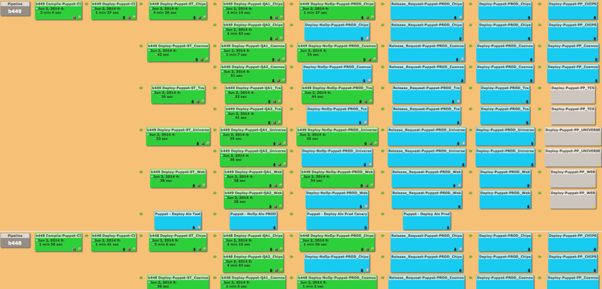

In the next part of this blog series we will see how we addressed these challenges in phase 3: Increase independence and quality.

**Tags: ANSIBLE, PUPPET**

[@marcus_phi](https://twitter.com/marcus_phi)


# FEATURE SWITCHES IN PRACTICE
**2014-07-14 TOMMY TYNJÄ**

**CONTINUOUS DELIVERY, JAVA**

Feature switches (or feature flags, toggles etc) is a programming technique which has gained a lot of attention through the concepts of Trunk Based Development and Continuous Delivery. Feature switches allows you to shield not yet production ready code while still being committed to mainline in version control. This allows you to work on development tasks on mainline and to continuously integrate your code while avoiding the burdens of branching. Another useful benefit is that you can decide which functionality to run in production by switching functionality on/off. The best thing is that this technique is very easy to implement, you basically just need to start doing it! In this blog post I’ll show you how easy it is to do this in Java.

In my current project we are integrating to a third party service which our system depends heavily on. While our system will continue to work if that third party service becomes unavailable, it still means a loss in revenue to the business. Therefore we want to be able to monitor this integration point closely and provide mechanisms to be able to troubleshoot it efficiently. As the communication between these systems are web service based through SOAP, we found it very useful to be able to log the entire payloads sent and received between the two systems. This feature is an ideal candidate for feature switching.

I implemented a feature which allows us to decide in runtime whether we should log every SOAP message sent and received to a file system. This would also happen asynchronously to not affect application throughput too much. This feature would be switched off in production by default, but would allow us to turn it on if we needed to troubleshoot integration failures.

The most basic feature switch to implement would just be a simple if-statement:

```java
boolean xmlLogFeatureIsEnabled = false;
if (xmlLogFeatureIsEnabled) {
    logToFile(xml);
}
```

But instead of hardcoding the feature switch state, we want this to be dynamically evaluated so we can change the behavior on a running system without the need for restarts or too much manual labor. To be able to do this we use a small framework called [Togglz](http://www.togglz.org/), which allows you to very easily create feature switches which you then can manage in runtime.

First, we create a feature definition enumeration which implements ```org.togglz.core.Feature```:

```java
public enum FeatureDefinition implements Feature {
 
    @Label("Log XML to file")
    LOG_XML_TO_FILE;
 
    public boolean isActive() {
        return FeatureContext.getFeatureManager().isActive(this);
    }
}
```

Then, we implement ```org.togglz.core.manager.TogglzConfig``` which will keep track of the feature states:

```java
@ApplicationScoped
public class FeatureConfiguration implements TogglzConfig {
 
    @Resource
    private Datasource datasource;
 
    public Class<? extends Feature> getFeatureClass() {
        return FeatureDefinition.class;
    }
 
    public StateRepository getStateRepository() {
        return new CachingStateRepository(new JDBCStateRepository(datasource), 10, TimeUnit.MINUTES);
    }
 
    public UserProvider getUserProvider() {
        return new NoOpUserProvider();
    }
}
```

We use dependency injection in our project, so this allows us to easily inject a datasource in our feature configuration which Togglz can use to store the feature states in. We then apply a 10 minute cache for the feature state reload so that Togglz won’t have to look up the state in the database for each time a feature state is evaluated. Please note that you might want to implement the configuration a bit more robust than in the example above. When we want to switch a feature on/off it is merely a matter of updating a database column value.

At last, we just change the if-statement encapsulating the feature method call to:

```java
if (FeatureDefinition.LOG_XML_TO_FILE.isActive()) {
    logToFile(xml);
}
```

And that’s it! This is all we need to do to be able to dynamically switch features on/off in a running Java system. This technique is very useful when exercising Continuous Delivery ways of working where each commit is a potential production release. As you can see, feature switches allows you to commit your changes to version control without necessarily expose them to your end users.

To see this in action, feel free to check out my [Togglz example project](https://github.com/tommysdk/showcase/tree/master/test-togglz) which uses a simple servlet to demonstrate the behavior.

[@tommysdk](https://twitter.com/tommysdk)

## Comments:

### Marcus Philip
**2014-08-07 AT 18:43**

Good stuff!. No excuses anymore for not doing this properly. I like that you can have different backends for Togglz.


# SLIMMED DOWN IMMUTABLE INFRASTRUCTURE
**2014-06-16 TOMMY TYNJÄ**

**CONTINUOUS DELIVERY, INFRASTRUCTURE, JAVA**

Last weekend we had a hackathon at Diabol. The topics somehow related to DevOps and Continuous Delivery. My group of four focused on slim microservices with immutable infrastructure. Since we believe in automated delivery pipelines for software development and infrastructure setup, the next natural step would be to merge these two together. Ideally, one would produce a machine image that contains everything needed to run the current application. The servers would be immutable, since we don’t want anyone doing manual changes to a running environment. Rather, the changes should be checked in to version control and a new server would be created based on the automated build pipeline for the infrastructure.

The problem with traditional machine images running on e.g. VMware or Amazon is that they tend to very large in size, a couple of gigabytes is not an unusual size. Images of that size become cumbersome to work with as they take a long time to create and ship over a network. Therefore it is desirable to keep server images as small as possible, especially since you might create and tear down servers ad-hoc for e.g. test purposes in your delivery pipeline. Linux is a very common server operating system but many Linux distributions are shipped with features that we are very unlikely to ever be using on a server, such as C compilers or utility programs. But since we adopt immutable servers, we don’t even need things as editors, man pages or even ssh!

[Docker](http://www.docker.com/) is an interesting solution for slimmed down infrastructure and full stack machine images which we evaluated during the hackathon. After getting our hands dirty after a couple of hours, we were quite pleased with its capabilities. We’ll definitely keep it on our radar and continue with our evaluation of it.

Since we’re mostly operating in the Java space, I also spent some time looking at how we could save some size on our machine images by potentially slimming down the JVM. Since a delivery pipeline will be triggered several times a day to deploy, test etc, every megabyte saved will increase the pipeline throughput. But why should you slim down the JVM? Well the JVM also contains features (or libraries) that are highly unlikely to ever be used on a server, such as audio, the awt and Swing UI frameworks, JavaFX, fonts, cursor images etc. The standard installation of the Java 8 JRE is around 150 MB. It didn’t take long to shave off a third of that size by removing libraries such as the aforementioned ones. Unfortunately the core library of Java, rt.jar is 66 MB of size, which is a constraint for the minimal possible size of a working JVM (unless you start removing the class files inside it too). Without too much work, I was able to safely remove a third of the size of the standard JRE installation, landing on a bit under 100 MB of size and still run our application. Although this practice might not be suitable for production use of technical or even legal reasons, it’s still interesting to see how much we typically install on our severs although it’ll never be used. The much anticipated project [Jigsaw](http://openjdk.java.net/projects/jigsaw/) which will introduce modularity to Java SE has been postponed several times. Hopefully it can be incorporated into Java 9, enabling us to decide which modules we actually want to use for our particular use case.

Our conclusion for the time spent on this topic during the hackathon is that Docker is an interesting alternative to traditional machine image solutions, which not only allows, but also encourages slim servers and immutable infrastructure.

[@tommysdk](https://twitter.com/tommysdk)

## Comments:

### Marcus Philip
**2014-06-27 AT 20:57**

There is also slimming to be done on other parts of the Java web application stack. Micro services is a concept that is talked about a lot. You should ask yourself whether you actually use or need the full J2EE Web features for all of your services. Do you use JSPs? Could you even have a servlet less web app with just a slim library that talks plain HTTP.

We looked at Dropwizard as a way to realize this. Looks good.


# RECENT BLOGS ABOUT THE DELIVERY PIPELINE PLUGIN
**2014-04-01 MARCUS PHILIP**

**CONTINUOUS DELIVERY, JENKINS**

The [Delivery Pipeline plugin from Diabol](https://wiki.jenkins-ci.org/display/JENKINS/Delivery+Pipeline+Plugin) is getting some traction. Now over 600 installations. Here’s some recent blogging about it.

First one from none less than Mr Jenkins himself, Kohsuke Kawaguchi, and Andrew Phillips, VP of Products for XebiaLabs:

[InfoQ: Orchestrating Your Delivery Pipelines with Jenkins](http://www.infoq.com/articles/orch-pipelines-jenkins)

Second is about the first experience with the Jenkins/Hudson Build and Delivery Pipeline plugins:

[Oracle SOA / Java blog: The Jenkins Build and Delivery Pipeline plugins](http://javaoraclesoa.blogspot.se/2014/03/jenkins-build-pipeline-plugin-and.html)

[@marcus_phi](https://twitter.com/marcus_phi)

**Tags: DELIVERY PIPELINE PLUGIN**


# TEST CATEGORIZATION IN DEPLOYMENT PIPELINES
**2014-02-14 TOMMY TYNJÄ**

**CONTINUOUS DELIVERY, CONTINUOUS INTEGRATION, TEST**

Have you ever gotten tired of waiting for those long running tests in CI to finish so you can get feedback on your latest code change? Chances are that you have. A common problem is that test suites tend to grow too large, making the feedback loop an enemy instead of a companion. This is a problem when building devilvery pipelines for Continuous Delivery, but also for more traditional approaches to software development. A solution to this problem is to divide your test suite into separate categories, or stages, where tests are grouped according to similarity or type. The categories can then be arranged to execute the quickest and those most likely to fail first, to enable faster feedback to the developers.

An example of a logical grouping of tests in a deployment pipeline:

Commit stage:
* Unit tests
* Component smoke tests
These tests execute fast and will be executed by the developers before commiting changes into version control.

Component tests:
* Component tests
* Integration tests
These tests are to be run in CI and can be further categorized so that e.g. component tests that are most likely to catch failures will execute first, before more thorough testing.

End user tests:
* Functional tests
* User acceptance tests
* Usability/exploratory testing

As development continues, it is important to maintain these test categories so that the feedback loop can be kept as optimal as possible. This might involve moving tests between categories, further splitting up test suites or even grouping categories that might be able to run in parallel.

How is this done in practice? You’ve probably encountered code bases where all these different kind of tests, unit, integration, user acceptance tests have all been scattered throughout the same test source tree. In the Java world, Maven is a commonly used build tool. Generally, its model supports running unit and integration tests separately out of the box, but it still expects tests to be in the same structure, differentiated only with a naming convention. This isn’t practical if you have hundreds or thousands of tests for a single component (or Maven module). To have a maintainable test structure and make effective use of test categorization, splitting up tests in different source trees is desirable, for example such as:

src/test – unit tests
src/test-integration – integration tests
src/test-acceptance – acceptance tests

Gradle is a build tool which makes it easy to leverage from this kind of test categorization. Changing build tool is something that might not be practically possible for many reasons, but it is fully possibile to leverage from Gradles capabilities from your existing build tool. You want to use the right tool for the job, right? Gradle is an excellent tool for this kind of job.

[Gradle](http://www.gradle.org/) makes use of source sets to define what source code tree is production code and which is e.g. test code. You can easily define your own [source sets](http://www.gradle.org/docs/current/dsl/org.gradle.api.tasks.SourceSet.html), which is something you can use to categorize your tests.

Defining the test categories in the example above can be done in your build.gradle such as:

```java
sourceSets {
  main {
    java {
      srcDir 'src/main/java'
    }
    resources {
      srcDir 'src/main/resources'
    }
  }
  test {
    java {
      srcDir 'src/test/java'
    }
    resources {
      srcDir 'src/test/resources'
    }
  }
  integrationTest {
    java {
      srcDir 'src/test-integration/java'
    }
    resources {
      srcDir 'src/test-integration/resources'
    }
    compileClasspath += sourceSets.main.runtimeClasspath
  }
  acceptanceTest {
    java {
      srcDir 'src/test-acceptance/java'
    }
    resources {
      srcDir 'src/test-acceptance/resources'
    }
    compileClasspath += sourceSets.main.runtimeClasspath
  }
}
```

To be able to run the different test suites, setup a Gradle task for each test category as appropriate for your component, such as:

```java
task integrationTest(type: Test) {
  description = "Runs integration tests"
  testClassesDir = sourceSets.integrationTest.output.classesDir
  classpath += sourceSets.test.runtimeClasspath + sourceSets.integrationTest.runtimeClasspath
  useJUnit()
  testLogging {
    events "passed", "skipped", "failed"
  }
}
 
task acceptanceTest(type: Test) {
  description = "Runs acceptance tests"
  testClassesDir = sourceSets.acceptanceTest.output.classesDir
  classpath += sourceSets.test.runtimeClasspath + sourceSets.acceptanceTest.runtimeClasspath
  useJUnit()
  testLogging {
    events "passed", "skipped", "failed"
  }
}
 
test {
  useJUnit()
  testLogging {
    events "passed", "skipped", "failed"
  }
}
```

Unit tests in ```src/test``` will be run by default. To run integration-tests located in ```src/test-integration```, invoke the integrationTest task by executing ```gradle integrationTest```. To run acceptance tests located in ```src/test-acceptance```, invoke the acceptanceTest task by executing ```gradle acceptanceTest```. These commands can then be used to tailor your test suite execution throughout your deployment pipeline.

A full build.gradle example file that shows how to setup test categories as described above can be found on [GitHub](https://github.com/tommysdk/showcase/blob/master/test-categories/build.gradle).

The above example shows how tests can be logically grouped to avoid waiting for that one big test suite to run for hours, just to report a test failure on a simple test case that should have been reported instantly during the test execution phase.

[@tommysdk](https://twitter.com/tommysdk)

**Tags: GRADLE**


# HOW TO VALIDATE YOUR YAML FILES FROM COMMAND LINE
**2013-12-05 MARCUS PHILIP**

**CONTINUOUS INTEGRATION**

I like using Hiera with Puppet. In my  puppet pipeline I just added YAML syntax validation for the Hiera files in the compile step. Here’s how:

```bash
# ...
GIT_DIFF_CMD="git diff --name-only --diff-filter=ACMR $OLD_REVISION $REVISION"
declare -i RESULT=0
set +e # Don't exit on error. Collect the errors instead.
YAML_PATH_LIST=`$GIT_DIFF_CMD | grep -F 'hieradata/' | grep -F '.yaml'`
echo 'YAML files to check syntax:'; echo "$YAML_PATH_LIST"; echo "";
for YAML_PATH in $YAML_PATH_LIST; do
  ruby -e "require 'yaml'; YAML.load_file('${YAML_PATH}')" # This line does the actual validation.
  RESULT+=$?
done
# ...
exit $RESULT
```

If you read my previous post you can see that we have managed to migrated to git. Hurray!

**Tags: GIT, HIERA, PUPPET, YAML**

## Comments:

### Marcus Philip
**2013-12-05 AT 16:16**

Actually we need to do this:

```bash
if [ $OLD_REVISION != $REVISION ]; then
GIT_DIFF_CMD=”git diff –name-only –diff-filter=ACMR $OLD_REVISION $REVISION”
else
GIT_DIFF_CMD=”git diff-tree –no-commit-id –name-only –diff-filter=ACMR -r $REVISION”
fi
```

We get nothing with the first command if current_version == new_version

[@marcus_phi](https://twitter.com/marcus_phi)


# INTRODUCING DELIVERY PIPELINE PLUGIN FOR JENKINS
**2013-12-03 PATRIK BOSTRÖM**

**CONTINUOUS DELIVERY, DEVOPS, JENKINS**

In Continuous Delivery visualisation is one of the most important areas. When using Jenkins as a build server it is now possible with the [Delivery Pipeline Plugin](https://wiki.jenkins-ci.org/display/JENKINS/Delivery+Pipeline+Plugin) to visualise one or more delivery pipelines in the same view even in full screen. Perfect for information radiators.

The plugin uses the upstream/downstream dependencies of jobs to visualize the pipelines.

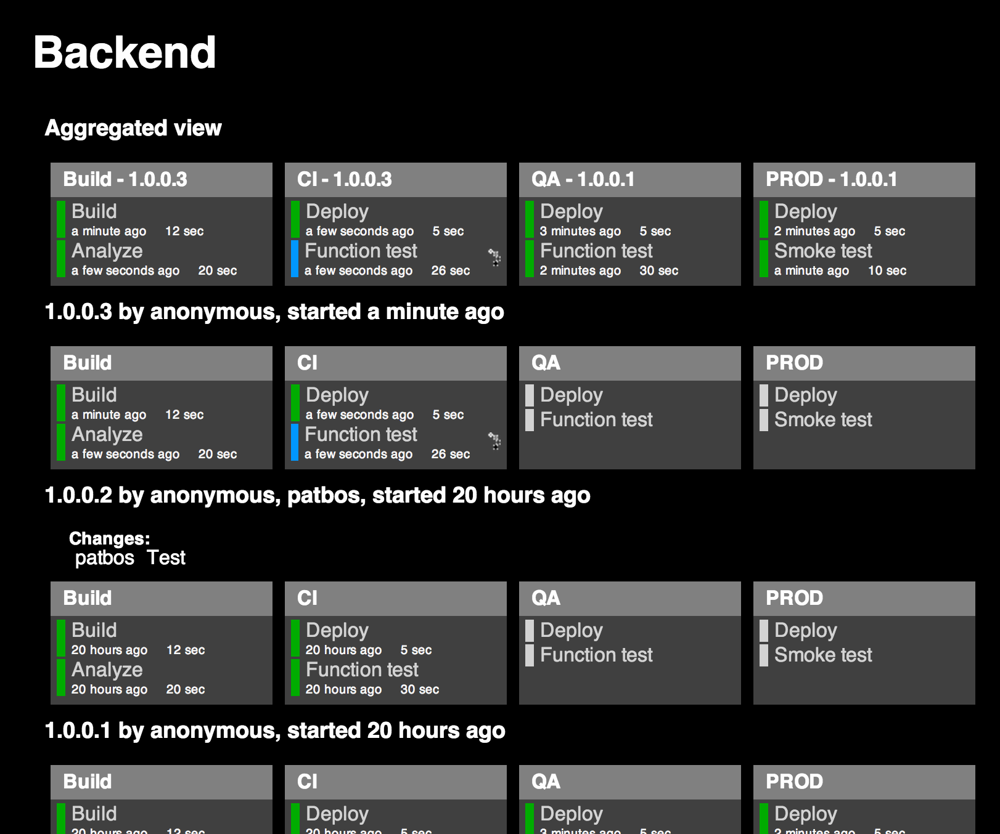
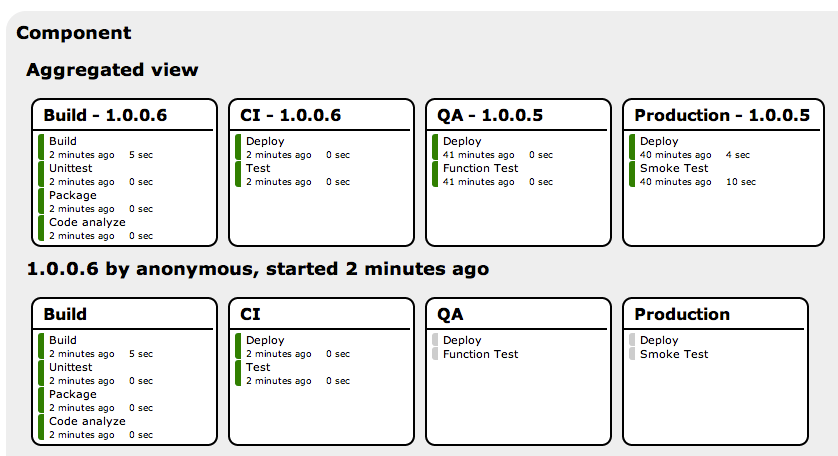

A pipeline consists of several stages, usually one stage will be the same as one job in Jenkins. An example of a pipeline which can consist of both build, unit test, packaging and analyses the pipeline can be quite long if every Jenkins job is a stage. So in the Delivery Pipeline Plugin it is possible to group jobs into the same stage, calling the Jenkins jobs tasks instead.

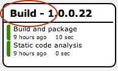

Stage

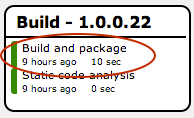

Task

The version showed in the header is the version/display name of the first Jenkins job in the pipeline, so the first job has to define the version.

The plugin also has possibility to show what we call a Aggregated View which shows the latest execution of every stage and displays the version for  that stage.

[@patbos](http://twitter.com/patbos)


# IS YOUR DELIVERY PIPELINE AN ARRAY OR A LINKED LIST?
**2013-12-02 MARCUS PHILIP**

**CONTINUOUS DELIVERY, CONTINUOUS INTEGRATION, JENKINS**

## The fundamental data structure of a delivery pipeline and its implications

A delivery pipeline is a system. A system is something that consists of parts that create a complex whole, where the essence lies largely in the interaction between the parts. In a delivery pipeline we can see the activities in it (build, test, deploy, etc.) as the parts, and their input/output as the interactions. There are two fundamental ways to define interactions in order to organize a set of parts into a whole, a system:

1. Top-level orchestration, aka array
2. Parts interact directly with other parts, aka linked list

You could also consider sub-levels of organization. This would form a tree. The sub-level of interaction could be defined in the same way as its parents or not.

**My question is: Is one approach better than the other for creating delivery pipelines?**

I think the number one requirement on a pipeline is maintainability. So better here would mean mainly more maintainable, that is: easier and quicker to create, to reason about, to reuse, to modify, extend and evolve even for a large number of complex pipelines. Let’s review the approaches in the context of delivery pipelines:

### 1. Top-level orchestration
This means having one config (file) that defines the whole pipeline. It is like an array.

An example config could look like this:

```
globals:
  scm: commit
  build: number
triggers:
  scm: github org=Diabol repo=delivery-pipeline-plugin.git
stages:
  - name: commit
    tasks:
      - build
      - unit_test
  - name: test
    vars:
      env: test
    tasks:
      - deploy: continue_on_fail=true
      - smoke_test
      - system_test
  - name: prod
    vars:
      env: prod
    tasks:
      - deploy
      - smoke_test
```

The tasks, like build, is defined (in isolation) elsewhere. Travis, Bamboo and Go does it this way.

### 2. Parts interact directly
This means that as part of the task definition, you have not only the main task itself, but also what should happen (e.g. trigger other jobs) when the task success or fails. It is like a linked list.

An example task config:

```
name: build
triggers:
  - scm: github org=Diabol repo=delivery-pipeline-plugin.git
steps:
  - mvn: install
post:
  - email: committer
    when: on_fail
  - trigger: deploy_test
    when: on_success
```

The default way of creating pipelines in Jenkins seems to be this approach: using upstream/downstream relationships between jobs.

## Tagging
There is also a supplementary approach to create order: Tagging parts, aka Inversion of Control. In this case, the system materializes bottom-up. You could say that the system behavior is an emerging property. An example config where the tasks are tagged with a stage:

```
- name: build
  stage: commit
  steps:
    - mvn: install
    ...

- name: integration_test
  stage: commit
  steps:
    - mvn: verify -PIT
  ...
```

Unless complemented with something, there is no way to order things in this approach. But it’s useful for adding another layer of organization, e.g. for an alternative view.

## Comparisons to other systems

Maybe we can enlighten our question by comparing with how we organize other complex system around us.

**Example A: (Free-market) Economic Systems, aka getting a shirt**

### 1. Top-level organization

Go to the farmer, buy some cotton, hand it to weaver, get the fabric from there and hand that to the tailor together with size measures.

### 2. Parts interact directly

There are some variants.

1. The farmer sells the cotton to the weaver, who sells the fabric to the tailor, who sews a lot of shirts and sells one that fits.
2. Buy the shirt from the tailor, who bought the fabric from the weaver, who bought the cotton from the farmer.
3. The farmer sells the cotton to a merchant who sells it to the weaver. The weaver sells the fabric to a merchant who sells it to the tailor. The tailor sells the shirts to a store. The store sells the shirts.

The variations is basically about different flow of information, pull or push, and having middle-mens or not.

### Conclusion

Economic systems tends to be organized the second way. There is an efficient system coordination mechanism through demand and supply with price as the deliberator, ultimately the system is driven by the self-interest of the actors. It’s questionable whether this is a good metaphor for a delivery pipeline. You can consider deploying the artifact as the interest of a deploy job , but what is the deliberating (price) mechanism? And unless we have a common shared value measurement, such as money, how can we optimize globally?

**Example B: Assembly line, aka build a car**

Software process has historically suffered a lot from using broken metaphors to factories and construction, but lets do it anyway.

### 1. Top-level organization

The chief engineer designs the assembly line using the blueprints. Each worker knows how to do his task, but does not know what’s happening before or after.

### 2. Parts interact directly

Well, strictly this is more of an old style work shop than an assembly line. The lathe worker gets some raw material, does the cylinders and brings them to the engine assembler, who assembles the engine and hands that over to …, etc.

### Conclusion

It seems the assembly line approach has won, but not in the [tayloristic](http://en.wikipedia.org/wiki/Scientific_management) approach. I might do the wealth of experiences and research on this subject injustice by oversimplification here, but to me it seems that two frameworks for achieving desired quality and cost when using an assembly line has emerged:

1. **The Toyota way:** The key to quality and cost goals is that everybody cares and that the everybody counts. Everybody is concerned about global quality and looks out for improvements, and everybody have the right to ‘stop the line’ if their is a concern. The management layer underpins this by focusing on the long term goals such as the global quality vision and the learning organization.
2. **Teams:** A multi-functional team follows the product from start to finish. This requires a wider range of skills in a worker so it entails higher labour costs. The benefit is that there is a strong ownership which leads to higher quality and continuous improvements.
The approaches are not mutually exclusive and in software development we can actually see both combined in various agile techniques:
* Continuous improvement is part of Scrum and Lean for Software methodologies.
* It’s all team members responsibility if a commit fails in a pipeline step.

## Conclusion

For parts interacting directly it seems that unless we have an automatic deliberation mechanism we will need a ‘planned economy’, and that failed, right? And top-level organization needs to be complemented with grass root level involvement or quality will suffer.

## Summary

My take is that the top-level organization is superior, because you need to stress the holistic view. But it needs to be complemented with the possibility for steps to be improved without always having to consider the whole. This is achieved by having the team that uses the pipeline own it and management supporting them by using modern lean and agile management ideas.

## Final note

It should be noted that many desirable general features of a system framework that can ease maintenance if rightly used, such as inheritance, aggregation, templating and cloning, are orthogonal to the organizational principle we talk about here. These features can actually be more important for maintainability. But my experience is that the organizational principle puts a cap on the level of complexity you can manage.

[@marcus_phi](https://twitter.com/marcus_phi)

**Tags: CONTINUOUS DELIVERY, DELIVERY PIPELINE, JENKINS**

## Comments:

### Andreas Rehn
**2013-12-05 AT 09:04**

Great post! I agree that a top-level orchestration approach is superior when designing and implementing delivery pipelines. It is very important that you do have a holistic approach when implementing a lean pipeline and in a linked list approach it is very difficult to get this overview making it more fragile and vulnerable to local sub-optimizations. That said, if you run continuous delivery at scale, it is equally important to have good reusability and maintainability of your pipelines which means advanced templating mechanisms and encapsulation of common tasks like visualization, feedback, reporting, authorization, artifact management etc.


# GIST: ANSIBLE 1.3 CONDITIONAL EXECUTION EXAMPLES
**2013-10-02 MARCUS PHILIP**

**CONFIGURATION MANAGEMENT**

I just published a gist on Ansible 1.3 Conditional Execution

It is a very complete example with comments. I find the conditional expressions to be ridiculously hard to get right in Ansible. I don’t have a good model of what’s going on under the surface (as I don’t know Python) so I often get it wrong.

What makes it even harder is that there has been at least three different variants over the course from version 0.7 to 1.3. Now ‘when’ seems to be the recommended one, but I used to have better luck with the earlier versions.

One thing that makes it hard is that the type of the variable is very important, and it’s not obvious what that is. It seems it may be interpreted as a string even if defined as False. The framework doesn’t really help you. I think a language like this should be able to ‘do what I mean’.

[Here](http://www.ansibleworks.com/docs/playbooks2.html#conditional-execution) is the official Ansible docs on this.

**Tags: ANSIBLE**

[@marcus_phi](https://twitter.com/marcus_phi)


# PUPPET CHANGE PROMOTION AND CODE BASE DESIGN
**2013-09-25 MARCUS PHILIP**

**CONFIGURATION MANAGEMENT, CONTINUOUS DELIVERY**

I have recently introduced puppet at a medium sized development organizations. I was new to puppet when I started, but feel like a seasoned and scarred veteran by now. Here’s my solution for puppet code base design and change promotion.

Like any change applied to a system we want to have a defined pipeline to production that includes testing. I think the problem is not particular to the modern declarative CM tools like puppet, it’s just that they makes the problem a lot more explicit compared to manual CM.

## Solution Summary
We have a number of environments: CI, QA, PROD, etc. We use a puppet module path with $environment variable to be able to update these environments independently.

We have built a pipeline in Jenkins that is triggered by commits to the svn repo that contains the Puppet (and Hiera) code. The initial commit stage jobs are all automatically triggered as long as the preceding step is OK, but QA and PROD application is manually triggered.

The steps in the commit stage is:
1. Compile
    1. Update the code in CI environment on puppet master from svn.
    2. Use the master to parse the manifests and validate the erb templates changed in this commit.
    3. Use the master to compile all nodes in CI env.
2. Apply to CI environment (with puppet agent --test)
3. Apply to DEV environment
4. Apply to Test (ST) environment

The compile sub-step is run even if the parse or validate failed, to gather as much info as possible before failing.

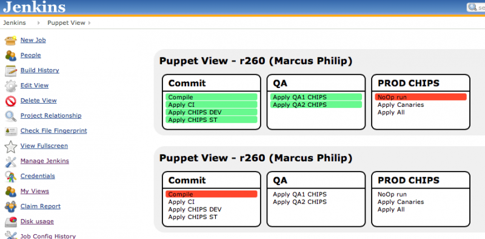

Jenkins puppet pipeline visualized in Diabols new Delivery Pipeline plugin
Jenkins puppet pipeline visualized in Diabols new Delivery Pipeline plugin
The great thing about this is that the compile step will catch most problems with code and config before they have any chance of impacting a system.

Noteworthy is also that we have a noop run for prod before the real thing. Together with the excellent reporting facilities in Foreman, this allows me to see with a high fidelity exactly what changes that will be applied, line by line diff if needed, and what services that will be restarted.

## Triggering agent runs
The puppet agents are not daemonized. We didn’t see any important advantage in having them run as daemons, but the serious disadvantages of having no simple way to prevent application of changes before they are tested (with parse and compile).

The agent runs are triggered using [Ansible](http://www.ansibleworks.com/docs/). It may seem strange to introduce another CM tool to do this, but Ansible is a really simple and powerful tool to run commands on a large set of nodes. And I like YAML.

Also, Puppet run is [deprecated](http://projects.puppetlabs.com/issues/15735) with the suggestion to use MCollective instead. However, that involves setting up a message queue, i.e. another middleware to manage and monitor. Every link in your tool chain has to carry it’s own weight (and more) and the weight of Ansible is basically zero, and for MQ > 0.

We also use Ansible to install the puppet agents. Funny bootstrapping problem here: You can’t install puppet without puppet… Again, Ansible was the simplest solution for us since we don’t manage the VMs ourselves (and either way, you have to be able to easily update the VMs, which takes a machinery of it’s own if it’s to be done the right way).

## External DMZ note
Well, all developers loves network security, right? Makes your life simple and safe… Anyway, I guess it’s just a fact of life to accept. Since, typically, you do not allow inwards connections from your external DMZ, and since it’s the puppet agent that pulls, we had to set up an external puppet master in the external DMZ (with rsync from internal of puppet modules and yum repo) that manages the servers in external DMZ. A serious argument for using a push based tool like Ansible instead of puppet. But for me, puppet wins when you have a larger CM code base. Without the support of the strict checking of puppet we would be lost. But I guess I’m biased, coming from statically typed programming languages.

## Code organization
We use the [Foreman](http://theforeman.org/) as an [ENC](http://docs.puppetlabs.com/guides/external_nodes.html), but the main use of it is to get a GUI for viewing hosts and reports. We have decided to use a puppet design pattern where the nodes are only mapped to one or a few top level role classes in Foreman, and the details is encapsulated inside the role class, using one or more layers of puppet classes. This is inspired by Craig Dunn’s [Roles and Profiles pattern](http://www.craigdunn.org/2012/05/239/).

Then we use [Hiera](http://docs.puppetlabs.com/hiera/1/index.html) yaml files to put in most of the parameters, using the [automatic-parameter-lookup](http://docs.puppetlabs.com/hiera/1/puppet.html#automatic-parameter-lookup) heavily.

This way almost everything is in version control, which makes refactoring and releasing a lot easier.

But beware, you [cannot use the future parser of puppet with Foreman as of now](http://projects.theforeman.org/issues/2878). This is needed for the new puppet lambda functions. This was highly annoying, as it prevents me from designing the hiera data structure in the most logical way and then just slicing it as necessary.

The create_resources function in puppet partly mitigates this, but it’s strict on the parameters, so if the data structure contains a key that doesn’t correspond to a parameter of the class, it fails.

## Releasable Units
One of the questions we faced was how and whether to split up the puppet codebase into separately releasable components. Since we are used to trunk based development on a shared code base, we decided that is was probably easier to manage everything together.

## Local testing
Unless you can quickly test your changes locally before committing, the pipeline is gonna be red most of the time. This is solved in a powerful and elegant way using Vagrant. Strongly recommended. In a few seconds I can test a minor puppet code change, and in a minute I can test the full puppet config for a node type. The box has puppet and the Vagrantfile is really short:

```
Vagrant.configure("2") do |config|
  config.vm.box = "CentOS-6.4-x86_64_puppet-3_2_4-1"
  config.vm.box_url = "ftp://ftptemp/CentOS-6.4-x86_64_puppet-3_2_4-1.box"

  config.vm.synced_folder "vagrant_puppet", "/home/vagrant/.puppet"
  config.vm.synced_folder "puppet", "/etc/puppet"
  config.vm.synced_folder "hieradata", "/etc/puppet/hieradata"

  config.vm.provision :puppet do |puppet|
    puppet.manifests_path = "manifests"
    puppet.manifest_file  = "site.pp"
    puppet.module_path = "modules"
  end
end
```
As you can see it’s easy to map in the hiera stuff that’s needed to be able to test the full solution.

## Foot Notes
It’s been suggested in the DevOps community that you should [treat servers as cattle, not pets](http://www.gregarnette.com/blog/2012/05/cloud-servers-are-not-our-pets/). At the place where I implemented this, we haven’t yet reached that level of maturity. This may somewhat impact the solution, but large parts of it would be the same.

A while ago I posted [Puppet change promotion – Good practices](http://www.linkedin.com/groups/Puppet-change-promotion-Good-practices-2825397.S.266869196)? in [LinkedIn DevOps group](http://www.linkedin.com/groups/DevOps-2825397). The solution I described here is what I came up with.

## Resources
[Environment based DevOps Deployment using Puppet and Mcollective](http://workblog.intothenevernever.com/?p=86)
[Advocates master less puppet](https://www.braintreepayments.com/braintrust/decentralize-your-devops-with-masterless-puppet-and-supply-drop)
[The NBN Puppet Journey](http://www.slideshare.net/PuppetLabs/christopher-fegan)
[De-centralise and Conquer: Masterless Puppet in a Dynamic Environment](http://www.slideshare.net/PuppetLabs/bashton-masterless-puppet)

## Code Examples

### Control script

This script is used from several of the Jenkins jobs.

```bash
 #!/bin/bash
set -e  # Exit on error

function usage {
echo "Usage: $0 -r  (-s|-p|-c|-d)
example:
$0 -pc -r 123
$0 -d -r 156
-r The svn revision to use
-s Add a sleep of 60 secs after svn up to be sure we have rsync:ed the puppet code to external puppet
-p parse the manifests changed in
-c compile all hosts in \$TARGET_ENV
-d Do a puppet dry-run (noop) on \$TARGET_HOSTS

Updates puppet modules from svn in ```\$TARGET_ENV``` on puppet master at the
beginning of run, and reverts if any failures.

The puppet master is used for parsing and compiling.

This scrips relies on environment variables:
* \$TARGET_ENV for svn
* \$TARGET_HOSTS for dry-run
";
}

if [ $# -lt 1 ]; then
usage; exit 1;
fi

# Set options
sleep=false; parse=false; compile=false; dryrun=false;
while getopts "r:spcd" option; do
case $option in
r) REVISION="$OPTARG";;
s) sleep=true;;
p) parse=true;;
c) compile=true;;
d) dryrun=true;;
*) echo "Unknown parameter: $opt $OPTARG"; usage; exit 1;;
esac
done
shift $((OPTIND - 1))

if [ "x$REVISION" = "x" ]; then
usage; exit 1;
fi

# This directory is updated by a Jenkins job
cd /opt/tools/ci-jenkins/jenkins-home/common-tools/scripts/ansible/

# SVN UPDATE ##################################################################
declare -i OLD_SVN_REV
declare -i NEXT_SVN_REV
## Store old svn rev before updating so we can roll back if not OK
OLD_SVN_REV=`ssh -T admin@puppetmaster svn info /etc/puppet/environments/${TARGET_ENV}/modules/| grep -E '^Revision:' | cut -d ' ' -f 2`
echo $'\n######### ######### ######### ######### ######### ######### ######### #########'
echo "Current svn revision in ${TARGET_ENV}: $OLD_SVN_REV"
if [ "$OLD_SVN_REV" != "$REVISION" ]; then
# We could have more than on commit since last run (even if we use post-commit hooks)
NEXT_SVN_REV=${OLD_SVN_REV}+1
# Update Puppet master
ansible-playbook puppet-master-update.yml -i hosts --extra-vars="target_env=${TARGET_ENV} revision=${REVISION}"
# SLEEP #############################
$sleep {
echo 'Sleep for a minute to be sure we have rsync:ed the puppet code to external puppet...'
sleep 60
}
else
echo 'Svn was already at required revision. Continuing...'
NEXT_SVN_REV=$REVISION
fi

# Final result ################################################################
declare -i RESULT
RESULT=0
set +e  # Don't exit on error. Collect the errors instead.

# PARSE #######################################################################
$parse {
# Parse manifests ###################
## Get only the paths to the manifests that was changed (to limit the number of parses).
MANIFEST_PATH_LIST=`svn -q -v --no-auth-cache --username $JENKINS_USR --password $JENKINS_PWD -r $NEXT_SVN_REV:$REVISION \
  log http://scm.company.com/svn/puppet/trunk \
  | grep -F '/puppet/trunk/modules' | grep -F '.pp' |  grep -Fv '   D' | cut -c 28- | sed 's/ .*//g'`
echo $'\n######### ######### ######### ######### ######### ######### ######### #########'
echo $'Manifests to parse:'; echo "$MANIFEST_PATH_LIST"; echo "";
for MANIFEST_PATH in $MANIFEST_PATH_LIST; do
# Parse this manifest on puppet master
ansible-playbook puppet-parser-validate.yml -i hosts --extra-vars="manifest_path=/etc/puppet/environments/${TARGET_ENV}/modules/${MANIFEST_PATH}"
RESULT+=$?
done

# Check template syntax #############
TEMPLATE_PATH_LIST=`svn -q -v --no-auth-cache --username $JENKINS_USR --password $JENKINS_PWD -r $NEXT_SVN_REV:$REVISION \
  log http://scm.company.com/svn/platform/puppet/trunk \
  | grep -F '/puppet/trunk/modules' | grep -F '.erb' |  grep -Fv '   D' | cut -c 28-`
echo $'\n######### ######### ######### ######### ######### ######### ######### #########'
echo $'Templates to check syntax:'; echo "$TEMPLATE_PATH_LIST"; echo "";
for TEMPLATE_PATH in $TEMPLATE_PATH_LIST; do
erb -P -x -T '-' modules/${TEMPLATE_PATH} | ruby -c
RESULT+=$?
done
}

# COMPILE #####################################################################
$compile {
echo $'\n######### ######### ######### ######### ######### ######### ######### #########'
echo "Compile all manifests in $TARGET_ENV"
ansible-playbook puppet-master-compile-all.yml -i hosts --extra-vars="target_env=${TARGET_ENV} puppet_args=--color=false"
RESULT+=$?
}

# DRY-RUN #####################################################################
$dryrun {
echo $'\n######### ######### ######### ######### ######### ######### ######### #########'
echo "Run puppet in dry-run (noop) mode on $TARGET_HOSTS"
ansible-playbook puppet-run.yml -i hosts --extra-vars="hosts=${TARGET_HOSTS} puppet_args='--noop --color=false'"
RESULT+=$?
}

set -e  # Back to default: Exit on error

# Revert svn on puppet master if there was a problem ##########################
if [ $RESULT -ne 0 ]; then
echo $'\n######### ######### ######### ######### ######### ######### ######### #########'
echo $'Revert svn on puppet master due to errors above\n'
ansible-playbook puppet-master-revert-modules.yml -i hosts --extra-vars="target_env=${TARGET_ENV} revision=${OLD_SVN_REV}"
fi

exit $RESULT
```

### Ansible playbooks
The ansible playbooks called from bash are simple.

**puppet-master-compile-all.yml**

```yml
---
# usage: ansible-playbook puppet-master-compile-all.yml -i hosts --extra-vars="target_env=ci1 puppet_args='--color=html'"

- name: Compile puppet catalogue for all hosts for a given environment on the puppet master
  hosts: puppetmaster-int
  user: ciadmin
  sudo: yes      # We need to be root
  tasks:
    - name: Compile puppet catalogue for in {{ target_env }}
      command: puppet master {{ puppet_args }} --compile {{ item }} --environment {{ target_env }}
      with_items: groups['ci1']
```

**puppet-run.yml**

```yml
---
# usage: ansible-playbook puppet-run.yml -i hosts --forks=12 --extra-vars="hosts=xyz-ci puppet_args='--color=false'"

- name: Run puppet agents for {{ hosts }}
  hosts: $hosts
  user: cipuppet
  tasks:
    - name: Trigger puppet agent run with args {{ puppet_args }}
      shell: sudo /usr/bin/puppet agent {{ puppet_args }} --test || if [ $? -eq 2 ]; then echo 'Notice - There were changes'; exit 0; else exit $?; fi;
      register: puppet_agent_result
      changed_when: "'Notice - There were changes' in puppet_agent_result.stdout"
```

### Ansible inventory file (hosts)

The hosts file is what triggers the ansible magic. Here’s an excerpt.

```
# BUILD SERVERS ###############################################################
[puppetmaster-int]
puppet.company.com

[puppetmaster-ext]
extpuppet.company.com

[puppetmasters:children]
puppetmaster-int
puppetmaster-ext

[puppetmasters:vars]
puppet_args=""

# System XYZ #######################################################################
[xyz-ci]
xyzint6.company.com
xyzext6.company.com

# PROD
[xyz-prod-ext]
xyzext1.company.com

[xyz-prod-ext:vars]
puppet_server=extpuppet.company.com

[xyz-prod-int]
xyzint1.company.com

[xyz-prod:children]
xyz-prod-ext
xyz-prod-int

...

# ENVIRONMENT AGGREGATION #####################################################
[ci:children]
xyz-ci
pqr-ci

[prod:children]
xyz-prod
pqr-prod

[all_envs:children]
dev
ci
st
qa
prod

# Global defaults
[all_envs:vars]
puppet_args=""
puppet_server=puppet.company.com
```

[@marcus_phi](https://twitter.com/marcus_phi)

**Tags: ANSIBLE, CHANGE PROMOTION, CONFIGURATION MANAGEMENT, FOREMAN, HIERA, JENKINS, PUPPET**

## Comments:

### Nathan
**2013-09-26 AT 17:02**

Marcus,

If you don’t mind sharing what you’re trying to accomplish with Hiera + lambdas I might be able to present a work-around. The scenarios I’m able to cook up in my head…seems like create_resources() and Hiera hashes should accomplish most things.

Let me know.

### Marcus Philip
**2013-09-26 AT 17:44**

Thank you @Nathan. Good point.

I am already using create_resources, and yes, it does solve some of my issue. However, if the data structure contains a key that does not correspond to a parameter of the class, it fails. I find it to be more strict than necessary.

So I can still not have a large data structure with e.g. all my services. The thing is I have to correlate e.g. a port with a service so I cannot have just flat lists.

What I did in one case, which I strongly dislike, was to add a class parameter THAT IS NOT USED just to be able to reuse the same data structure.

I updated the blog post to include a note on this as well.


# CONTINUOUS DELIVERY TESTING LEVELS
**2013-05-29 TOMMY TYNJÄ**

**CONTINUOUS DELIVERY, TEST**

This blog post is a summary of thoughts discussed between me, Andreas Rehn ([@andreasrehn](http://twitter.com/andreasrehn)) and Patrik Boström ([@patbos](http://twitter.com/patbos)).

A key part of Continuous Delivery is automated testing and even the simplest delivery pipeline will consist of several different testing stages. There is unit tests, integration tests, user acceptance tests etc. But what defines the different test levels?

We realized that we often mean different things regarding each testing level and this was especially true when talking about integration tests. For me, integration tests can be tests that test the integrations within one component, e.g. testing an internal API or integration between a couple of business objects interacting with each other, a database etc. This is how the Arquillian (an integration testing framework for Java) community is referring to integration testing. Another kind of integration tests are those testing an actual integration with e.g. a third party web service. What we’ve been referring to when talking about integration tests in the context of Continuous Delivery, is testing a component in a fully integrated environment and testing the component from the outside, rather than the inside, so called black box testing. These are often more functional by nature.

We came to the conclusion that we would like to redefine the terminology for the latter type of integration testing to avoid confusion and fuzziness. Since these kind of tests are more functional tests, testing the behavior and flows of the component, we decided to start calling these types of tests component tests instead. That leaves us with the following levels of testing in the early stages of a delivery pipeline:

* Unit tests
* Smoke tests
* Component tests
* Integration tests

When should you run the different tests? You want feedback as soon as possible but you don’t want to have a too big test suite too early in the pipeline as this could severely delay the feedback. It’s inefficient to force developers to run a five+ minute build before each commit. Therefore you should divide your test suite into different phases. The first phases typically includes unit tests and smoke tests. The second phase will run the component tests in a fully integrated production like environment. The third phase will execute integration tests, e.g. with Arquillian. Certain integration tests will not need to be run in a fully integrated environment, depending on the context, but there are definitely benefits of running all of them in such an environment. These tests can also test integrations towards databases, third party dependencies etc.

To be fully confident in the quality of your releases you need to make use of these different tests as they all fulfill a specific purpose. It is worth considering though, in what phase certain tests should be placed as you don’t want rerun tests in different phases. If you’re validating an algorithm, the unit test phase is probably the most appropriate phase, while testing your database queries fits well into the integration test phase and user interface and functional tests as component tests. This raises the question, how much should you actually test? As that is a topic on its own, we’ll leave that for another time.

**Conclusion:**
Unit tests – testing atomic pieces of code on their own. Typically tested with a unit testing framework
Integration tests – putting atomic pieces together to moving parts, testing integration points, internal APIs, database interactions etc. Typically tested with Arquillian and/or with a unit testing framework along with mocks and stubs.
Component tests – functional tests of the component, so called black box testing. Often tested with Selenium, acceptance testing frameworks or through web service calls, depending on the component. Also a subject for testing with Arquillian.

[@tommysdk](http://twitter.com/tommysdk)


# TESTING THE PRESENCE OF LOG MESSAGES WITH JAVA.UTIL.LOGGING
**2013-05-28 TOMMY TYNJÄ**

**JAVA, TEST**

Sometimes there is value in creating a unit test to assert that a specific log message actually gets printed. It might be for audit logs or making sure that system misconfigurations get logged properly. A couple of years ago my colleague Daniel blogged about how to create a custom Log4j appender and to use that in your unit tests to assert the presence of certain log messages. Read about it here.

Today I was resolving an issue in the Arquillian (the open source integration testing framework for Java) codebase. This involved in logging a warning in a certain use case. I obviously wanted to test my code by adding a test case for the different use cases, asserting that the log message got printed out correctly. I’ve used the approach of asserting log messages in unit tests many times in the past, but I’ve always used Log4j in those cases. This time around I was forced to solve the problem for plain java.util.logging (JUL) which Arquillian uses. Fun, as I’m always up for a challenge.

What I did was similar to the log4j approach. I need to add a custom log handler which I attach to the logger in the affected class. I create an outputstream, which I attach to a StreamHandler. I then attach the StreamHandler to the logger. As long as I have a reference to the output stream, I can then get the logged contents and use that in my assertions. Example below using JUnit 4:

```java
private static Logger log = Logger.getLogger(AnnotationDeploymentScenarioGenerator.class.getName()); // matches the logger in the affected class
private static OutputStream logCapturingStream;
private static StreamHandler customLogHandler;
 
@Before
public void attachLogCapturer()
{
  logCapturingStream = new ByteArrayOutputStream();
  Handler[] handlers = log.getParent().getHandlers();
  customLogHandler = new StreamHandler(logCapturingStream, handlers[0].getFormatter());
  log.addHandler(customLogHandler);
}
 
public String getTestCapturedLog() throws IOException
{
  customLogHandler.flush();
  return logCapturingStream.toString();
}
```

… then I can use the above methods in my test case:

```java
@Test
public void shouldLogWarningForMismatchingArchiveTypeAndFileExtension() throws Exception
{
  final String expectedLogPart = "unexpected file extension";
 
  new AnnotationDeploymentScenarioGenerator().generate(
        new TestClass(DeploymentWithMismatchingTypeAndFileExtension.class));
 
  String capturedLog = getTestCapturedLog();
  Assert.assertTrue(capturedLog.contains(expectedLogPart));
}
```

[@tommysdk](http://twitter.com/tommysdk)

## Comments:

### Marcus Philip
**2013-05-28 AT 19:14**

Great post!

Nothing is untestable!

I think it’s perfectly valid case to want to unit test your logging. When you use format string (%s, {}, etc.) they can get quite complicate. Especially since there are different variants of format strings.

### tommy
**2013-05-29 AT 11:19**

One problem I’ve encountered with JUL though, is that the logging level seems to be locale specific. In some cases you might want to assert that the log message is outputted on the appropriate logging level, e.g. WARN. On my machine though, with Swedish locale, warnings are outputted as “VARNING”, which can be troublesome form a testing/CI perspective.


# TEST DATA – PART 1
**2013-05-09 MARCUS PHILIP**

**CONFIGURATION MANAGEMENT, TEST**

When you run an integration or system test, i.e. a test that spans one or more logical or physical boundaries in the system, you normally need some test data, as most non­trivial operations depends on some persistent state in the system. Even if the test tries to follow the advice of favoring to verify behavior over state, you may still need specific input to even achieve a certain behavior. For example, if you want to test an order flow for a specific type of product, you must know how to add a product of that type to the basket, e.g. knowing a product name.

But, and here is the problem, if you don’t have strict control of that data it may change over time, so suddenly your test will fail.

When unit testing, you’ll want to use mocks or fakes for dependencies (and have well factored code that lets you easily do that), but here I’m talking about tests where you specifically want to use the real dependency.

Basically, there are only two robust ways to manage test data:
1. Each tests creates the data it needs.
2. Create a managed set of data that covers all of your test needs.
You can also use a combination of the two.

For the first strategy, either you have an idempotent approach so that you just ensure a certain state, or, you create and delete the data for each run. In some cases you can use transactions to be able to safely parallelize your tests and not modify persistent state. Just open one at the start of the test and then abort it instead of committing at the end. Obviously you cannot test functionality that depends on transactions this way.

The second strategy is a lot easier if you already have a clear separation between reference data, application data and transactional data.

By *reference data* I mean data that change with very low frequency and that often is of limited size and has a list or key/value structure. Examples could be a list of supported languages or zip code to address lookup. This should be fairly easy to keep in one authoritative, version controlled location, either in bulk or as deltas.

The term *application data* is not as established as reference data. It is data that affects the behavior of the application. It is not modified by normal end user actions, but is continuously modified by developers or administrators. Examples could be articles in a CMS or sellable products in an eCommerce website. This data is crucial for tests. It’s typically the data that tests use as input or for assertions.

The challenge here is to keep the production data and the test data set in synch. Ideally there should be a process that makes it impossible (or at least hard) to update the former without updating the second. However, there are often many complicating factors: the data can be in another system owned by another team and without a good test double, the data can be large, or it can have complex relationships or dependencies that sometimes very few fully grasp. Often it is managed by non­technical people so their tool set, knowledge and skills are different.

Unit or component tests can often overcome these challenges by using a strategy to mock systems or create arbitrary test data and verify behavior and not exact state, but acceptance tests cannot do that. We sometimes need to verify that a specific product can be ordered, not a fictional one created by the test.

Finally, *transactional data* is data continuously created by the application. It is typical large, fast growing and of medium complexity. Example could be orders, article comments and logs.

One challenge here is how to handle old, ‘obsolete’ data. You may have data stored that is impossible to generate in the current application because the business rules (and the corresponding implementation) have changed. For the test data it means you cannot use the application to create the test data if that was you strategy. Obviously, this can make the application code more complicated, and for the test code, hopefully you have it organized so it’s easy to correlate the acceptance test to the changed business rule and easy to change them accordingly. The tests may get more complicated because there can now e.g. be different behavior for customers with an ‘old’ contract. This may be hard for new developers in the team that only know of the current behavior of the app. You may even have seemingly contradicting assertions.

Another problem can be the sheer size. This can be remediated by having a strategy for aggregating, compacting and/or extracting data. This is normally easy if you plan for it up front, but can be hard when your database is 100 TB. I know that hardware is cheap, but having a 100 TB DB is inconvenient.

The line between application data and transactional data is not always clear cut. For example when an end user performs an action, such as a purchase, he may become eligible for certain functionality or products, thus having altered the behavior of the application. It’s still a good approach though to keep the order rows and the customer status separated.

I hope to soon write more on the tougher problems in automated testing and of managing test data specifically.

[@marcus_phi](https://twitter.com/marcus_phi)

**Tags: INTEGRATION TEST, TEST DATA, TESTING**

## Comments

### Andreas Rehn
**2013-05-13 AT 11:10**

Great summary of the different type of test data and their specific challenges. It is clear that the strategy for handling these types of test data becomes very important to think of even when designing the system, e.g. providing api:s / utilities to setup and tear-down test data should be a natural part of the application, “build quality in”. Even in a green-field project this is a challenge to get right and working with legacy is almost always a lot more difficult in terms of testing and test data. However, just doing the categorization you have outlined here will be very helpful, only then can you start finding ways of managing the data.


# WRITING INTEGRATION TESTS WITH AN IN-MEMORY MONGO DB
**2012-12-21 TOMMY TYNJÄ**

**JAVA, TEST**

As I mentioned in my previous post, I’ve been working closely to the document oritented NoSQL database Mongo DB lately. As an advocate of sustainable systems development (test driven development that is), I took the lead in our team for designing tests for our business logic towards Mongo. For relational databases there are a lot of options, a common solution for testing against relational databases is to use an in-memory database such as H2. For NoSQL databases the options are not always as generous from an automated test perspective. Luckily, we found an in-memory version for Mongo DB from Flapdoodle which is easy to use and fits our use case perfectly. If your (Java) code base relies on Maven, just add the following dependency:

```xml
<dependency>
    <groupId>de.flapdoodle.embed</groupId>
    <artifactId>de.flapdoodle.embed.mongo</artifactId>
    <version>1.27</version>
    <scope>test</scope>
</dependency>
```

Then, in your test class (here based on JUnit), use the provided classes to start an in-memory Mongo DB, preferrably in a @Before method, and tear down the instance in a @After method, as in the example below:

```java
public class TestInMemoryMongo {
 
    private static final String MONGO_HOST = "localhost";
    private static final int MONGO_PORT = 27777;
    private static final String IN_MEM_CONNECTION_URL = MONGO_HOST + ":" + MONGO_PORT;
 
    private MongodExecutable mongodExe;
    private MongodProcess mongod;
    private Mongo mongo;
 
    /**
     * Start in-memory Mongo DB process
     */
    @Before
    public void setup() throws Exception {
        MongodStarter runtime = MongodStarter.getDefaultInstance();
        mongodExe = runtime.prepare(new MongodConfig(Version.V2_0_5, MONGO_PORT, Network.localhostIsIPv6()));
        mongod = mongodExe.start();
        mongo = new Mongo(MONGO_HOST, MONGO_PORT);
    }
 
    /**
     * Shutdown in-memory Mongo DB process
     */
    @After
    public void teardown() throws Exception {
        if (mongod != null) {
            mongod.stop();
            mongodExe.stop();
        }
    }
 
    @Test
    public void shouldAssertSomeInteractionWithMongo() {
        // Create a connection to Mongo using the IN_MEM_CONNECTION_URL property
        // Execute some business logic towards Mongo
        // Assert the expected the behaviour
    }
 
    protected MongoPersistenceContext getMongoPersistenceContext() {
        // Returns an instance of the class containing business logic towards Mongo
        return new MongoPersistenceContext();
    }
}
```

… then you have an in-memory Mongo DB available for your test cases. The private member named ```mongo``` in the example above is of type ```com.mongodb.Mongo```, which you can use for interaction with the Mongo database. As you notice, all you need is basically JUnit och Mongo, nothing more. But life is not always as easy as the simplest examples. In our case, we leverage from EJBs and other components which relies on running inside an container. As I’m contributor to the JBoss Arquillian project, a Java framework for integration tests, I was obviously curious about trying the approach of making the in-memory available when executing tests inside the container. If you use Arquillian already like we do, the transition is smooth. Just make sure to put the in-memory Mongo and Java driver on your classpath. The following Arquillian test extends the JUnit test class above, but with a bean injection for the business class under test:

```java
@RunWith(Arquillian.class)
public class TestInMemoryMongoWithArquillian extends TestInMemoryMongo {
 
    @Deployment
    public static Archive getDeployment() {
        return ShrinkWrap.create(WebArchive.class, "mongo.war")
                .addClass(MongoPersistenceContext.class)
                .addAsManifestResource(EmptyAsset.INSTANCE, "beans.xml")
                .addAsWebInfResource(new StringAsset("<web-app></web-app>"), "web.xml")
                .addAsLibraries(DependencyResolvers.use(MavenDependencyResolver.class)
                        .artifact("de.flapdoodle.embed:de.flapdoodle.embed.mongo:jar:1.27")
                        .artifact("org.mongodb:mongo-java-driver:jar:2.9.1")
                        .resolveAs(JavaArchive.class));
    }
 
    @Inject MongoPersistenceContext mpc;
 
    @Override
    protected MongoPersistenceContext getMongoPersistenceContext() {
        return mpc;
    }
}
```

I’ve uploaded a full example project, based on Java 7, Maven, Mongo DB, Arquillian and Apache TomEE (embedded) on GitHub to demonstrate how to use an in-memory Mongo DB in a unit test as well as with Arquillian inside TomEE. This should serve as a good base when starting to write automated tests for your business logic towards Mongo.

[@tommysdk](http://twitter.com/tommysdk)

**Tags: ARQUILLIAN, JAVA, JAVA EE, MONGODB, NOSQL, TDD, TOMEE**


# APPLYING INDEXES IN MONGO DB
**2012-12-19 TOMMY TYNJÄ**

**JAVA**

For the past year I’ve been consulting at a client where we’ve been using the document oriented NoSQL database Mongo DB in production (currently v2.0.5). Primarily we store PDF documents together with some arbitrary metadata, but in some use cases we also store a lot of completely dynamic documents, where there might be no similar columns shared between documents in the same collection.

For one of our collections, which holds PDF documents in a GridFS structure (~ 1 TB of data/node), we sometimes need to query for documents based on a couple of certain keys. If these keys are not indexed, queries can take a very long time to execute. How indexes are handled are very well explained in the [Mongo documentation](http://docs.mongodb.org/manual/applications/indexes/). Per default, GridFS provides us indexes for the _id, filename + uploadDate fields. To view indexes on the current collection, execute the following command from the Mongo shell:

```java
db.myCollection.getIndexes();
```

Ideally, you want your indexes to reside completely within RAM. The following command returns the size of the current index:

```java
db.myCollection.totalIndexSize();
```

To apply a new index for keyX and keyY, execute the following command:

```java
db.myCollection.ensureIndex({"keyX":1, "keyY":1});
```

Applying the index took roughly about a minute per node in our environment. The index should be displayed when executing ```db.myCollection.getIndexes();```

```java
{
        "v" : 1,
        "key" : {
                "keyX" : 1,
                "keyY" : 1
        },
        "ns" : "myDatabase.myCollection",
        "name" : "keyX_1_keyY_1"
}
```

After applying the index, assure that the total size of the index is still managable (less than avaiable memory). Now, executing a query based on the indexed fields should yield its result much faster:

```java
db.myCollection.find({"keyX":9281,"keyY":3270});
```

[@tommysdk](http://twitter.com/tommysdk)

**Tags: MONGODB NOSQL**


# USE OF GENERICS IN EJB 3.1
**2012-12-06 TOMMY TYNJÄ**

**JAVA**

With EJB 3.1 it is possible to make use of generics in your bean implementations. There are some aspects that needs to be considered though to make sure you use them as intended. It requires basic understanding of how Java generics work.

Imagine the following scenario. You might want to have a business interface such as:

```java
@Local(Async.class)
public interface Async<TYPE> {
    public void method(TYPE t);
}
```

… and an implementation:

```java
@Stateless
public class AsyncBean implements Async<String> {
    @Asynchronous
    public void method(final String s) {}
}
```

You would then like to dependency inject your EJB into another bean such as:

```java
@EJB Async<String> asyncBean;
```

A problem here is that due to type erasure, you cannot be certain that the injected EJB is of the expected type which will produce a ClassCastException in runtime. Another problem is that the method annotated with @Asynchronous in the bean implementation will not be invoked asynchronously as might be expected. This is due to the method not actually being part of the business interface. The method in the business interface is in fact public void method(final Object s) due to type erasure, which in turn calls the typed method. Therefore the call to the typed method won’t be intercepted and made asynchronous. If the type definition in the AsyncBean class is removed (infers Object type), the call will be asynchronous. One solution to ensure type safety would be to treat the Async interface as a plain interface without the @Local annotation, mark the AsyncBean with @LocalBean (to make sure the bean method is part of the exposed business methods for that bean), and inject an AsyncBean where used. Another solution would be to insert a local interface between the plain interface and the bean implementation:

```java
@Local(AsyncLocal.class)
public interface AsyncLocal extends Async<String> {
    @Override
    public void method(final String s);
}
```

… and then make the AsyncBean implement the AsyncLocal interface instead, and use the AsyncLocal interface at the injection points.

This behaviour might not be all that obvious, even though it makes perfect sense due to how generics are treated in Java. It is also unfortunate that the EJB specification does not clarify the expected behaviour for this use case. The following can be read in the specification, which feels a bit vague:
*“3.4.3 Session Bean’s Business Interface
The session bean’s interface is an ordinary Java interface. It contains the business methods of the session bean.”*

I’ve created a minimal sample project where the behaviours can be tried out by just running a simple test case written with Arquillian. The test case will be run inside an embedded TomEE container. Thanks to the blazing speed of TomEE, the test runs just as fast as a unit test. The code can be found [here](https://github.com/tommysdk/showcase/tree/master/async-ejb31-generic-interface), and contains a failing test representing the scenario described above. Apply the proposed soultion to make the test pass.

As demonstrated, there are some caveats which needs to be considered when using generics together with EJBs. Hopefully this article can shed some light on what is happening under the hood.

[@tommysdk](http://twitter.com/tommysdk)

**Tags: ARQUILLIAN, EJB, TOMEE**

## Comments:

### Jin Kwon
**2012-12-27 AT 19:05**

Thank you for sharing this. You’re the EJB teacher for me. Can you please add a tag cloud pane for me?

### Jin Kwon
**2013-01-09 AT 07:40**

Sir (Ma’am?), can you please take a look http://stackoverflow.com/questions/14228830/locating-a-localbean-by-its-class


# THE IMPORTANCE OF INTEGRATION TESTING
**2012-09-21 TOMMY TYNJÄ**

**JAVA, TEST**

I’ve been studying integration testing quite close for the past year, especially since being a contributor to the JBoss Arquillian and ShrinkWrap projects, which target automated enterprise integration testing. This is a part which is almost non-existent in the enterprise today. Sure, if you have > 95% code coverage by unit tests you can be pretty certain that the business logic behaves like it is supposed to. But you are still testing your code in the wrong context. You still need to test your code in your target environment, e.g. how does the code actually behave when run in your application server, with a specific Java version, etc?

Unit tests are great and should be the cornerstone for each application that is developed today. But unit tests alone are not enough. You also need to test your code in the proper context, in the context where it is going to live in for a far longer time than it took to implement and release the first version. You need to test your code in the same environment that is going to be used in production. Why? Imagine a Formula 1 team creating a new aerodynamic part. If their simulations return promising results, they evaluate the part in the wind tunnel. But if the wind tunnel tests turn out good, they don’t put the part onto their race car five minutes before the start of the next race. It sounds like a silly thing to do, but that is exactly what is going on in system development today! The Formula 1 teams test new parts on the test track for days, in the right context – with wind, humidity, heat, stress, endurance, etc. Every parameter playing its part for the new detail that is being tested. Then they carefully analyze the results, before they decide whether this new component fits into the production environment (which is on the car during a Grand Prix weekend).

It’s when we connect pieces together, cogwheels to moving parts, when it gets interesting. How are the pieces working together? Do the cogwheels fit together at all? Is there friction which causes overheating? Can the pieces survive high torque? This is something that is extremely important also in software development, but is often neglected. I’ve been in projects where large teams works in two, three or four week sprints, but at the end of the sprint when all new code is integrated, the artifact doesn’t even deploy! It then usually takes a couple of developers two days just to integrate the code to make it deployable. And when it finally deploys, it doesn’t say anything about if the code works or not. A deployment is just like turning the key when starting a car. Only because the engine starts, it doesn’t guarantee that you can actually drive it. Integration tests should be a part of the continuous feedback cycle. As soon as a part doesn’t fit with its surroundings, you should be notified as soon as possible, not four weeks later.

Integration testing is a broad topic and there are different types of integration tests, which needs be handled differently when incorporated in a deployment pipeline. But that’s a subject for a later blog post. All in all, integration tests are important. If you wan’t to have a streamlined development process, where getting new features into production fast without sacrificing quality, you’ll need to have proper integration testing in place.

[@tommysdk](http://twitter.com/tommysdk)


# TIME FOR A NEW TAKE ON ENTERPRISE TESTING
**2012-07-13 TOMMY TYNJÄ**

**TEST**

TDD and test automation tools such as JUnit, Selenium etc. have been around for such a long time, that you would expect every modern application platform to leverage from test automation by now. But still it amazes me how little proper testing is adopted in the enterprise today. Usually, the test frameworks are in place, but the development teams lacks the discipline to keep coverage up during an extended period of time. I have gotten the feeling that some companies have given up on automated testing, like “we tried TDD and unit tests, but it didn’t work out for us”. Maybe the tools weren’t mature enough, or the organization itself. Maybe getting a buggy software out to market fast, rather than securing its quality was more important for stakeholders at the time. Maybe it was an organizational concern where testing belonged to the test department and the test department only. It’s always easy to afterwards say that something should have been done differently. However, I think there are plenty of reasons to revisit the thought on proper automated enterprise testing. We are half way through 2012 and there are so many amazing test tools and frameworks available that every opportunity exist to make complete and automated test suites, from unit tests to integration tests and acceptance tests.

Unit tests are obviously the most fundamental part. I’ve been writing unit tests so much, that I now have difficulties writing code without tests! For instance, the other day I was reading a book on a for me new JVM language. The book started out with covering basic operations in the language, and I was encouraged to try out the example code in a REPL. One of my first thoughts though was, “alright, but how do I write an equivalent unit test”! Obviously, a REPL is perfect for trying out language features, but in an enterprise context, it is just as natural to try out new code through unit tests. For me, it’s natural that the first context which uses new code is a test context, and I believe it should be for every developer. Testing isn’t something that is separated from development, it’s part of the development process. There are so many reasons why you should have automated testing, that the excuse “we didn’t have time” just don’t cut it.

Hardly no-one disagrees with the fundementals of testing and why you should do it, so lets focus on how to take enterprise testing to the next level instead. I plan to share more of my thoughts on automated enterprise testing in future blog posts, what lies beyond unit tests, what you should test and how you can do it. So keep a close eye on this space!

[@tommysdk](http://twitter.com/tommysdk)


# GENERATE JAVA CODE FROM AN EXISTING WSDL WITH APACHE CXF
**2012-06-08 TOMMY TYNJÄ**

**JAVA**

When developing web services, there are occasions when you would like to generate Java code from an existing WSDL document. You might adopt the contract-first approach or just have an existing web service running on a non-Java platform which you want to migrate to Java. You can then start implementing your service from the generated classes. You can use the Apache CXF wsdl2java tool to generate fully annotated JAX-WS (Java EE 6) compliant Java code. Generating the Java code is as simple as:

```
apache-cxf-2.6.1\bin$ wsdl2java -p se.diabol.api.ws -d /home/tommy/ /home/tommy/webservice.wsdl
```

… where the ```-p``` parameter sets the target package namespace to ```se.diabol.api.ws```, ```-d``` points to the target directory for the generated files and the last parameter specifies the source WSDL path.

Resources:
* [Apache CXF home](http://cxf.apache.org/)
* [Apache CXF wsdl2java reference](http://cxf.apache.org/docs/wsdl-to-java.html)

[@tommysdk](http://twitter.com/tommysdk)


# ADD MAVEN DEPENDENCIES TO YOUR ARQUILLIAN MICRO-DEPLOYMENTS
**2012-06-04 TOMMY TYNJÄ**

**JAVA**

Arquillian is a testing framework which lets you write real integration tests, run inside the container of your choice. With Arquillian you will be writing micro-deployments for your tests, small Java artifacts that is, which contains the bare minimum of classes and resoruces needed for your test to be executed within your container. To build these artifacts you will be using the ShrinkWrap API. You don’t have to adopt the micro-deployment strategy of course, but do you really want your whole project classpath available for the test of e.g. a single EJB component? Micro-deployments will isolate your test scenario and deploy to the container much faster than if you would bring in the entire classpath of your project.

When writing integration tests with Arquillian and ShrinkWrap you will probably, sooner or later, run into a use case where your test depend on a third party library. Since it would be very inconvenient to declare all the necessary classes in the third party library by hand, ShrinkWrap provides a way to attach complete libraries to your micro-deployment. If you’re using Maven, the Maven dependency resolver feature is very convenient. The 1.0.0.Final version of Arquillian is using a 1.0 beta version of the ShrinkWrap resolver module. The resolver API has in my opinion improved a lot for the latest 2.0 version (currently in Alpha) and I really recommend anyone using the resolver API to use the 2.0 version instead.

If you want to use the latest resovler API, you have to add it to the dependencyManagement tag in your Maven pom.xml before the actual Arquillian BOM, to make sure the 2.0 version of the resolver module will be loaded first:

```xml
<dependencyManagement>
    <dependencies>
        <dependency>
            <groupId>org.jboss.shrinkwrap.resolver</groupId>
            <artifactId>shrinkwrap-resolver-bom</artifactId>
            <version>2.0.0-alpha-1</version>
            <scope>test</scope>
            <type>pom</type>
        </dependency>
        <dependency>
            <groupId>org.jboss.arquillian</groupId>
            <artifactId>arquillian-bom</artifactId>
            <version>1.0.0.Final</version>
            <scope>test</scope>
            <type>pom</type>
        </dependency>
    </dependencies>
</dependencyManagement>
```

To add third party libraries from your Maven dependencies to your micro-deployment, use the ShrinkWrap resolver API to add the necessary libaries to your artifact. In the example below, the commons-io and json libraries are specified with their respective Maven coordinates:

```java
@Deployment
public static Archive createDeployment() {
    return ShrinkWrap.create(WebArchive.class, "fileviewer.war")
            .addClass(EnableRest.class)
            .addClass(FileViewer.class)
            .addAsWebInfResource(EmptyAsset.INSTANCE, "beans.xml")
            .addAsLibraries(
                DependencyResolvers.use(MavenDependencyResolver.class)
                    .artifact("commons-io:commons-io:2.1")
                    .artifact("org.json:json:20090211")
                    .resolveAsFiles());
}
```

As you can see, it’s very easy to add libraries from your Maven dependencies to your ShrinkWrap micro-deployments. The behaviour of the ShrinkWrap resolver API can also be customized far more than what was shown in the above example. It is worth noting that in the example, any dependencies of the specified artifacts will be included as well. Transitivity is however one aspect which can be customized further through the API. An example project which uses the ShrinkWrap Maven dependency resolver can be found on GitHub.

[@tommysdk](http://twitter.com/tommysdk)

**Tags: ARQUILLIAN, MAVEN, SHRINKWRAP**

## Comments:

### Dan Allen
**2012-06-05 AT 06:44**

Thanks Tommy!

It’s worth nothing that any dependencies of the artifacts specified will be included as well. In this case, that doesn’t apply since the two libraries in the example don’t have any dependencies. If you don’t want transitive dependencies to be resolved, there’s a method to disable that behavior per artifact or globally.

### tommy
**2012-06-05 AT 07:45**

Thanks for your feedback Dan. I’ve now clarified the transitive dependencies aspect in the blog post.

### Shashank
**2013-03-08 AT 03:18**

Hello Everyone, I am a newbie to shrinkwrap.
In my project i am using Arquillian as my integration testing framework and I am trying to resolve a blocking issue.
I am trying to make a war file using the following code

```java
MavenDependencyResolver resolver = DependencyResolvers.use(
MavenDependencyResolver.class).loadMetadataFromPom(“pom.xml”)
.artifacts(“org.jboss.spec:jboss-javaee:6.0.1.0.0.Final”,…);

File[] ExtLibs =resolver.resolveAsFiles();
return ShrinkWrap.create(WebArchive.class, “test.war”). addClasses(LoginModule.class,Realm.class,IAccount.class).addAsLibraries(ExtLibs).addAsManifestResource(EmptyAsset.INSTANCE, “beans.xml”);
```

When i run this test case i am getting the following error

```
java.lang.RuntimeException: Could not invoke deployment method: public static org.jboss.shrinkwrap.api.spec.WebArchive com.auth.ControllerLoginModuleTest.createDeployment()
at org.jboss.arquillian.container.test.impl.client.deployment.AnnotationDeploymentScenarioGenerator.invoke(AnnotationDeploymentScenarioGenerator.java:160)
```

I don’t understand what i am doing wrong. Any light on the above issue is greatly appreciated.
Thanks

### tommy
**2013-03-11 AT 11:11**

Hi Shashank. Without seeing the actual stacktrace, the error message “java.lang.RuntimeException: Could not invoke deployment method” when working with MavenDependencyResolver will most likely occur when a specified artifact cannot be resolved from a local or remote repository. You specify that you want to get hold of the artifact “org.jboss.spec:jboss-javaee:6.0.1.0.0.Final”, but it should be on the following format: “org.jboss.spec:jboss-javaee-6.0:1.0.0.Final”. You’re not specifying what container you’re using, but you should most likely not need to include this dependency as it should be provided by your Java EE 6 container at runtime. You could therefore try to just omit that dependency from your micro-deployment.

### Shashank
**2013-03-11 AT 19:13**

Thanks for quick reply Tommy,
I tried removing it. I am still getting the same error.
So, my project had dependency on many other projects. I made jars of each project and tried to insert into maven repository and then through dependency resolver I am trying to access the jars.
I have one question here. If the path in the maven repository is say

```
~/.m2/repository/junit/junit/4.11/junit-4.11.jar
```

I am including ```junit:junit:4.11``` in Dependency resolver as artifact. I wanted some help from you in confirming wether this method is correct or I am missing something.

I am using Glassfish -remote-3.1 as my Application server.
Below is the full stack trace that I am getting after i removed the dependency for javaee.

```
java.lang.RuntimeException: Could not invoke deployment method: public static org.jboss.shrinkwrap.api.spec.WebArchive com.appdynamics.auth.ControllerLoginModuleTest.createDeployment()
at org.jboss.arquillian.container.test.impl.client.deployment.AnnotationDeploymentScenarioGenerator.invoke(AnnotationDeploymentScenarioGenerator.java:160)
at org.jboss.arquillian.container.test.impl.client.deployment.AnnotationDeploymentScenarioGenerator.generateDeployment(AnnotationDeploymentScenarioGenerator.java:94)
at org.jboss.arquillian.container.test.impl.client.deployment.AnnotationDeploymentScenarioGenerator.generate(AnnotationDeploymentScenarioGenerator.java:57)
at org.jboss.arquillian.container.test.impl.client.deployment.DeploymentGenerator.generateDeployment(DeploymentGenerator.java:79)
at sun.reflect.NativeMethodAccessorImpl.invoke0(Native Method)
at sun.reflect.NativeMethodAccessorImpl.invoke(NativeMethodAccessorImpl.java:39)
at sun.reflect.DelegatingMethodAccessorImpl.invoke(DelegatingMethodAccessorImpl.java:25)
at java.lang.reflect.Method.invoke(Method.java:597)
at org.jboss.arquillian.core.impl.ObserverImpl.invoke(ObserverImpl.java:94)
at org.jboss.arquillian.core.impl.EventContextImpl.invokeObservers(EventContextImpl.java:99)
at org.jboss.arquillian.core.impl.EventContextImpl.proceed(EventContextImpl.java:81)
at org.jboss.arquillian.core.impl.ManagerImpl.fire(ManagerImpl.java:135)
at org.jboss.arquillian.core.impl.ManagerImpl.fire(ManagerImpl.java:115)
at org.jboss.arquillian.core.impl.EventImpl.fire(EventImpl.java:67)
at org.jboss.arquillian.container.test.impl.client.ContainerEventController.execute(ContainerEventController.java:100)
at sun.reflect.NativeMethodAccessorImpl.invoke0(Native Method)
at sun.reflect.NativeMethodAccessorImpl.invoke(NativeMethodAccessorImpl.java:39)
at sun.reflect.DelegatingMethodAccessorImpl.invoke(DelegatingMethodAccessorImpl.java:25)
at java.lang.reflect.Method.invoke(Method.java:597)
at org.jboss.arquillian.core.impl.ObserverImpl.invoke(ObserverImpl.java:94)
at org.jboss.arquillian.core.impl.EventContextImpl.invokeObservers(EventContextImpl.java:99)
at org.jboss.arquillian.core.impl.EventContextImpl.proceed(EventContextImpl.java:81)
at org.jboss.arquillian.test.impl.TestContextHandler.createClassContext(TestContextHandler.java:75)
at sun.reflect.NativeMethodAccessorImpl.invoke0(Native Method)
at sun.reflect.NativeMethodAccessorImpl.invoke(NativeMethodAccessorImpl.java:39)
at sun.reflect.DelegatingMethodAccessorImpl.invoke(DelegatingMethodAccessorImpl.java:25)
at java.lang.reflect.Method.invoke(Method.java:597)
at org.jboss.arquillian.core.impl.ObserverImpl.invoke(ObserverImpl.java:94)
at org.jboss.arquillian.core.impl.EventContextImpl.proceed(EventContextImpl.java:88)
at org.jboss.arquillian.test.impl.TestContextHandler.createSuiteContext(TestContextHandler.java:60)
at sun.reflect.NativeMethodAccessorImpl.invoke0(Native Method)
at sun.reflect.NativeMethodAccessorImpl.invoke(NativeMethodAccessorImpl.java:39)
at sun.reflect.DelegatingMethodAccessorImpl.invoke(DelegatingMethodAccessorImpl.java:25)
at java.lang.reflect.Method.invoke(Method.java:597)
at org.jboss.arquillian.core.impl.ObserverImpl.invoke(ObserverImpl.java:94)
at org.jboss.arquillian.core.impl.EventContextImpl.proceed(EventContextImpl.java:88)
at org.jboss.arquillian.core.impl.ManagerImpl.fire(ManagerImpl.java:135)
at org.jboss.arquillian.core.impl.ManagerImpl.fire(ManagerImpl.java:115)
at org.jboss.arquillian.test.impl.EventTestRunnerAdaptor.beforeClass(EventTestRunnerAdaptor.java:80)
at org.jboss.arquillian.junit.Arquillian$2.evaluate(Arquillian.java:182)
at org.jboss.arquillian.junit.Arquillian.multiExecute(Arquillian.java:314)
at org.jboss.arquillian.junit.Arquillian.access$100(Arquillian.java:46)
at org.jboss.arquillian.junit.Arquillian$3.evaluate(Arquillian.java:199)
at org.junit.runners.ParentRunner.run(ParentRunner.java:309)
at org.jboss.arquillian.junit.Arquillian.run(Arquillian.java:147)
at org.eclipse.jdt.internal.junit4.runner.JUnit4TestReference.run(JUnit4TestReference.java:50)
at org.eclipse.jdt.internal.junit.runner.TestExecution.run(TestExecution.java:38)
at org.eclipse.jdt.internal.junit.runner.RemoteTestRunner.runTests(RemoteTestRunner.java:467)
at org.eclipse.jdt.internal.junit.runner.RemoteTestRunner.runTests(RemoteTestRunner.java:683)
at org.eclipse.jdt.internal.junit.runner.RemoteTestRunner.run(RemoteTestRunner.java:390)
at org.eclipse.jdt.internal.junit.runner.RemoteTestRunner.main(RemoteTestRunner.java:197)
Caused by: java.lang.reflect.InvocationTargetException
at sun.reflect.NativeMethodAccessorImpl.invoke0(Native Method)
at sun.reflect.NativeMethodAccessorImpl.invoke(NativeMethodAccessorImpl.java:39)
at sun.reflect.DelegatingMethodAccessorImpl.invoke(DelegatingMethodAccessorImpl.java:25)
at java.lang.reflect.Method.invoke(Method.java:597)
at org.jboss.arquillian.container.test.impl.client.deployment.AnnotationDeploymentScenarioGenerator.invoke(AnnotationDeploymentScenarioGenerator.java:156)
… 50 more
Caused by: java.lang.RuntimeException: Could not create new descriptor instance
at org.jboss.shrinkwrap.resolver.api.DependencyBuilderInstantiator.createFromUserView(DependencyBuilderInstantiator.java:101)
at org.jboss.shrinkwrap.resolver.api.DependencyResolvers.use(DependencyResolvers.java:39)
at com.appdynamics.auth.ControllerLoginModuleTest.createDeployment(ControllerLoginModuleTest.java:67)
… 55 more
Caused by: java.lang.reflect.InvocationTargetException
at sun.reflect.NativeConstructorAccessorImpl.newInstance0(Native Method)
at sun.reflect.NativeConstructorAccessorImpl.newInstance(NativeConstructorAccessorImpl.java:39)
at sun.reflect.DelegatingConstructorAccessorImpl.newInstance(DelegatingConstructorAccessorImpl.java:27)
at java.lang.reflect.Constructor.newInstance(Constructor.java:513)
at org.jboss.shrinkwrap.resolver.api.DependencyBuilderInstantiator.createFromUserView(DependencyBuilderInstantiator.java:96)
… 57 more
Caused by: java.lang.NoSuchMethodError: org.codehaus.plexus.DefaultPlexusContainer.lookup(Ljava/lang/Class;)Ljava/lang/Object;
at org.jboss.shrinkwrap.resolver.impl.maven.MavenRepositorySystem.getRepositorySystem(MavenRepositorySystem.java:220)
at org.jboss.shrinkwrap.resolver.impl.maven.MavenRepositorySystem.(MavenRepositorySystem.java:64)
at org.jboss.shrinkwrap.resolver.impl.maven.MavenBuilderImpl.(MavenBuilderImpl.java:105)
… 62 more
```

Thanks in advance for any help further.

### tommy
**2013-03-12 AT 15:36**

Shashank: I’m glad if I can help. First of all, you don’t need to package JUnit along with your deployment. Arquillian manages that for you by enriching each deployment with the needed classes from your test framework. This error is however indicating that some of the required dependencies for the ShrinkWrap Maven Resolver are not available on your test classpath. Make sure you have the proper dependencies available in your pom.xml. I also recommend you to post a question about this issue on the ShrinkWrap user forum: https://community.jboss.org/en/shrinkwrap?view=discussions. Hopefully this can help you navigate towards the root cause of your problem.

### Shashank
**2013-03-13 AT 01:38**

Thanks Tommy, I have posted the question on jboss communty.
In my pom I have the following entries

```
org.jboss.shrinkwrap.resolver
shrinkwrap-resolver-bom
${version.shrinkwrap.resolver}
import
pom

org.jboss.arquillian
arquillian-bom
${version.arquillian_core}
pom
import

com.controllerjars
controllerapi
2.0.0

com.controllerjars
controllerauth
1.0.0

com.controllerjars
controllerbeans
1.0.0
```

And i am using maven Resolver to resolve these dependencies.

```
File[] files = Resolvers.use(MavenResolverSystem.class).loadPomFromFile(“pom.xml”).resolve(“com.controllerjars:controllerbeans:1.0.0″,”com.controllerjars:controllerapi:2.0.0″,”com.controllerjars:controllerauth:1.0.0″)
.withTransitivity().as(File.class);

return ShrinkWrap.create(WebArchive.class, “test.war”).
addClasses(ControllerLoginModule.class,AuthRealm.class,IAccountManagerInternal.class).addAsLibraries(files).addAsManifestResource(EmptyAsset.INSTANCE, “beans.xml”);
```

Thanks for any help further.

### tommy
**2013-03-13 AT 14:07**

Shashank: I think the cause of this problem is due to ambiguous ShrinkWrap Resolver dependencies. You should declare the ShrinkWrap Resolver Bill of Materials in the dependency Management chain before the Arquillian BOM. I recommend using the ShrinkWrap Resolver 2.0.0-beta-2. In the dependency section you need to have JUnit, shrinkwrap-resolver-depchain and arquillian-junit-container dependencies present. The ShrinkWrap Resolver 2.0.0-beta-2 provides a new API for resolving artifacts, so you need to make sure you use that particular API. I threw together a quick example project with the bare minimum dependencies needed to make it work, and a test case using an embedded TomEE container. You can have a look at it here: https://github.com/tommysdk/showcase/tree/master/arquillian-shrinkres


# BIND A STRING TO JNDI IN JBOSS 7.1
**2012-05-31 TOMMY TYNJÄ**

**JAVA**

In JBoss 7.0.x there was no convenient way to bind an arbitrary java.lang.String to JNDI. This is however possible in JBoss 7.1.x. Just add your binding to the naming subsystem in standalone.xml such as:

```xml
<subsystem xmlns="urn:jboss:domain:naming:1.1">
    <bindings>
        <simple name="java:global/3rdparty/connection-url" value="http://localhost:12345"/>
    </bindings>
</subsystem>
```

You can then inject the value of your binding into your Java code through:

```java
@Resource(mappedName ="java:global/3rdparty/connection-url")
private String serviceRemoteAddress = null;
```

To verify your JNDI bindings in JBoss 7.1.1 you can use the ```jboss-cli``` located in your ```$JBOSS_HOME/bin```. Start the ```jboss-cli``` and type ```/subsystem=naming:jndi-view```, such as:

```java
[standalone@localhost:9999 /] /subsystem=naming:jndi-view
{
    "outcome" => "success",
    "result" => {
        "java: contexts" => {
            "java:" => {
                "TransactionManager" => {
                    "class-name" => "com.arjuna.ats.jbossatx.jta.TransactionManagerDelegate",
                    "value" => "com.arjuna.ats.jbossatx.jta.TransactionManagerDelegate@68fc12"
                },
...
```

[@tommysdk](http://twitter.com/tommysdk)

**Tags: JBOSS**


# CONTINUOUS DELIVERY IN THE CLOUD
**2012-05-24 ADMIN**

**CONTINUOUS DELIVERY**

During the last year or so, I have been implementing Continuous Delivery and delivery pipelines for several different companies. From 100+ employees down to less than 5. And in several different businesses. It is striking to see that the problems, once you dig them out, are soo similar in all companies. Even more striking maybe is that the solutions to the problems are soo similar. Implementing a low cycle time – high thoughput delivery pipeline in IT departments is very hard, but the challenges are very similar in most of the customers I have worked with. Implementing the somewhat immature tools and automation solutions that need to be connected and in sync (GO, Jenkins, Nolio, Rundeck, Puppet, Chef, Maven, Gails, Redmine, Liquibase, Selenium, Twist.. etc) is something that needs to be done over and over again.

This observation has given us the idea that continuous delivery is perfectly suited for a cloud offering. Therefore me and my colleges have started an ambitious initiative to implement a complete “from-requirement-to-production-to-validation” delivery pipeline as a could service. We will do it using our collective experience from the different solutions we have done for our various customers.

Why is it that every IT department need to be, not only experts of their business, but also experts in the craft of systems development. This is really strange, in particular since the challenges seem to be so similar in every single IT department. Systems development should be all about implementing the business requirements as efficient and correct as possible. Not so much about discussing how testing should be increased to maintain quality, or implementing solutions for deploying war-files to JBoss. That “development” is done in each and every company these days. Talk about breaking the DRY rule.

The solution to the problem above has traditionally been to try to purchase “off-the-shelf” systems that, at least on paper, fulfills the business needs. The larger the “off-the-shelf” system, the more business needs are fulfilled. But countless are the businesses that have come to realize that fulfilling on paper is not the same as fulfilling in production, with customers, making money. And worse, once the “off-the-shelf” system has been incorporated into every single corner of the company, it becomes very hard to adapt to changing markets and growing business requirements. And markets change rapidly these days – if in doubt, ask Nokia.

A continuous delivery pipeline solution might seem like a trivial thing when talking about large markets like the one Nokia is acting in. But there are many indicators that huge improvements can be achieved by relatively small means that are related to IT. Let me mention two strong indicators:

1. Most of the really large new companies in the world, all have leaders with a heavy legacy in hardcore systems development/programming. (Oracle, Google, Apple, Flickr, Facebook, Spotify, Microsoft to mention a few)

2. A relatively new concept “Lean-Startup”, by Eric Ries takes an extremely IT-close approach to business development as a whole. This concept has renderd huge impact in fortune 500 companies around the word. And Eric Ries has busy days coaching and talking to companies that are struggling to be innovative when the market they are in are moving faster than they can handle. As an example, one of the large european banks recently put their new internet bank system “on ice” simply because they realized that it was going to be out of date before it was launched.

All in all. To coupe with the extreme pace, systems development is becoming more and more industry like. And traditional industries have spent more that 80 years optimizing production lines. No one would ever get the stupid idea to try to build a factory to develop a toy or a new component for a car without seeking professional guidance and assistance. I mean, what kind of robot from Motoman Robotics would you choose? That is simply not core business value!

More on our continuous delivery pipeline in the cloud solution will follow on this channel!

**Tags: CONTINUOUS DELIVERYDEVOPS**


# ASYNCHRONOUS METHOD INVOCATIONS IN JAVA EE 6
**2012-05-13 TOMMY TYNJÄ**

**JAVA**

Lately I have been looking into asynchronous method invocations in Java EE 6. My use case was to execute multiple search engine queries in parallel and then collect the results afterwards, instead of having to wait for each query to finish before executing the next one etc. In Java EE 6 (EJB 3.1) you can implement asynchronous methods on your session beans, which means that the EJB container returns control to the client before executing the actual method. It is then possible to use the Java SE concurrency API to retrieve the results for this method. The asynchronous method must either have a void reutrn type or return a java.util.concurrent.Future<V>, where V is the result type value. This is very convenient for my use case, but also for exeuction of such tasks which are unimportant that they are executed before the application continues, e.g. sending an e-mail or putting a message on a message queue for processing by a third party application. In my use case I first execute the asynchronous methods which executes the actual queries, retrieve a Future object to each invocation and then I collect the results later on using these references. Here is a very simple example of an asynchronous method invocation:

```java
@Stateless
public class AsyncService {
    @Asynchronous
    public void execute() {
        doAsyncStuff();
    }
    ...
}

@Stateless
public class AnotherService {
    @EJB AsyncService async;
 
    public void doAsyncCall() {
        async.execute();
    }
}
```

You basically annotate your asynchronous business method with @Asynchronous, and the EJB container handles the rest. I’ve created a small Java EE 6 Web App which demonstrates the behaviour, the source code can be found on Github. The example exposes a RESTful web service, which can be used to invoke the asynchronous service. The example comes with a JBoss 7.1.1 distribution and Arquillian integration tests, so you can just execute the test cases in AsyncTest.java, to see the example in action. One of the test cases are executed within the actual application server, thus invoking the asynchronous service directly, while the other test case runs as a client, and makes a HTTP GET request to the exposed REST interface. The only thing you need to run the example is Maven and Java 7.

Please note that asynchronous method invocations are not supported in EJB 3.1 Lite, which is included in the Java EE 6 Web Profile.

[@tommysdk](http://twitter.com/tommysdk)


# WRITING INTEGRATION TESTS IN JAVA WITH ARQUILLIAN
**2012-04-22 TOMMY TYNJÄ**

**JAVA, TEST**

Arquillian is a JBoss project that focuses on integration testing for Java. It’s an Open Source project I’m contributing to and using on the current project I’m working on. It let’s you write integration tests just as you would write unit tests, but it adds some very important features into the mix. Arquillian actually lets you execute your test cases inside a target runtime, such as your application server of choice! It also lets you make use of dependency injection to let you test your services directly in your integration test. Arquillian comes with a whole bunch of adapters to different runtimes, such as JBoss 7,6,5, Glassfish 3, Weld, WebSphere and even Selenium. So if you’re working with a common runtime, it is probably already supported! If your runtime is not supported, you could contribute with an adapter for it! What Arquillian basically needs to know is how to manage your runtime, how to start and stop the runtime and how to do deployments and undeployments. Just put the adapter for your runtime on your classpath and Arquillian will handle the rest.

Let’s get down to business. What does an Arquillian test look like? Image that we have a very basic EJB which we want to integration test:

```java
@Stateless
public class WeekService {
  public String weekOfYear() {
      return Integer.toString(Calendar.getInstance().get(Calendar.WEEK_OF_YEAR));
  }
}
```

This EJB provides one single method which returns what week of the year it is. Sure, we could just as well unit test the functionality of this EJB, but imagine that we might want to extend this bean with more functionality later on and that we want to have a proper integration test already in place. What would an Arquillian integration test look like that asserts the behaviour of this bean? With JUnit, it would look something like this:

```java
@RunWith(Arquillian.class)
public class WeekServiceTest {
 
    @Deployment
    public static Archive deployment() {
        return ShrinkWrap.create(JavaArchive.class, "week.jar")
                .addClass(WeekService.class);
    }
 
    @EJB WeekService service;
 
    @Test
    public void shouldReturnWeekOfYear() {
        Assert.assertNotNull(service.weekOfYear());
        Assert.assertEquals("" + Calendar.getInstance().get(Calendar.WEEK_OF_YEAR),
                service.weekOfYear());
    }
}
```

The first thing you notice is the @RunWith annotation at the top. This tells JUnit to let Arquillian manage the test. The next thing you notice is the static method that is annotated with @Deployment. This method creates a Java Archive (jar) representation containing the WeekService class which we want to test. The archive is created using ShrinkWrap, which let’s you assemble archives through a fluent Java API. Arquillian will take this archive and deploy it to the target runtime before executing the test cases, and will after the test execution undeploy the same archive from the runtime. You are not forced to have a deployment method, as you might as well want to test something that is already deployed or available in your runtime. If you have a runtime that is already running somewhere, you can setup Arquillian to run in remote mode, which means that Arquillian expects the runtime to already be running, and just do deployments and undeployments in the current environment. You could also tell Arquillian to run in managed mode, where Arquillian expects to be able to start the runtime before the test execution, and will also shutdown the runtime when the test execution completes. Some runtimes also comes with an embedded mode, which means that Arquillian will run an own isolated runtime instance during the test execution.

Probably the biggest difference to a standard unit test in the above example is the @EJB annotation on the WeekService property. This actually lets you specify that you want an EJB dependency injected into your test case when executing your tests, and Arquillian will handle that for you! If you want to make sure that is the case, just remove the @EJB annotation and you will indeed get a NullPointerException when calling service.weekOfYear() in your test method. A feature which is going to be added to a feature version of Arquillian is to fail fast if dependencies can’t be fullfilled (instead of throwing NPE’s).

The @Test annotated method handles the actual test logic, just like a unit test. The difference here is that the test is actually executed within your target runtime!

This was just a basic example of what you can do with Arquillian. The more you work with it, the more you will start to recognize different use cases where integration tests becomes a natural way of testing the intended behaviour.

The full source code of the above example is available on GitHub: https://github.com/tommysdk/showcase/tree/master/arquillian/. It also contains a more sophisticated example which uses CDI and JPA within an integration test. The examples runs on a JBoss 7.0.2 runtime, which comes bundled with the example. For more details and a deeper dive into Arquillian, visit the project website at http://arquillian.org.

[@tommysdk](http://twitter.com/tommysdk)
**Tags: ARQUILLIAN, EJB, JAVA, JAVA EE, JBOSS, TDD**


# CONFIGURE DATASOURCES IN JBOSS AS 7.1
**2012-02-22 TOMMY TYNJÄ**

**JAVA**

JBoss released their latest application server 7.1.0 last week which is a full fledged Java EE 6 server (full Java EE 6 profile certified). As I wanted to start working with the application server right away, I downloaded it and the first thing I needed to do was to configure my datasource. Setting up the datasources was simple and I’ll cover the steps in the process in this blog post.

I’ll use Oracle as an example in this blog post, but the same procedure worked with the other JDBC datasources I tried. First, add your driver as a module to the application server (if it does not already exist). Go to JBOSS_ROOT/modules and add a directory structure appropriate for your driver, such as: com/oracle/ojdbc14/main (note the main directory at the end) which gives you the path: ```JBOSS_ROOT/modules/com/oracle/ojdbc14/main``.

In the main directory, add your driver jar-file and create a new file named ```module.xml```. Add the following content to the ```module.xml``` file:

```xml
<?xml version="1.0" encoding="UTF-8"?>
<module xmlns="urn:jboss:module:1.1" name="com.oracle.ojdbc14">
    <resources>
        <resource-root path="the_name_of_your_driver_jar_file.jar"/>
    </resources>
    <dependencies>
        <module name="javax.api"/>
        <module name="javax.transaction.api"/>
    </dependencies>
</module>
```

In the ```module.xml``` file, the module name attribute have to match the structure of the directory structure and the resource-root path should point to the driver jar-file name.

As I wanted to run JBoss in standalone mode, I edited the ```JBOSS_ROOT/standalone/configuration/standalone.xml```, where I added my datasource under the datasource subsystem, such as:

```xml
<subsystem xmlns="urn:jboss:domain:datasources:1.0">
  <datasources>
    <datasource jndi-name="java:jboss/datasources/OracleDS" pool-name="OracleDS" enabled="true" jta="true" use-java-context="true" use-ccm="true">
      <connection-url>jdbc:oracle:thin:@my_url:my_port</connection-url>
      <driver>oracle</driver>
      ... other settings
    </datasource>
  </datasources>
  ...
</subsystem>
```

Within the same subsystem, in the drivers tag, specify your driver module:

```xml
<subsystem xmlns="urn:jboss:domain:datasources:1.0">
  ...
  <drivers>
    <driver name="oracle" module="com.oracle.ojdbc14">
      <driver-class>oracle.jdbc.OracleDriver</driver-class>
    </driver>
  </drivers>
</subsystem>
```

Note that the driver-tag in your datasource should point to the driver name in standalone.xml and your driver module should point to the name of the module in the appropariate module.xml file.

Please also note that if your JDBC driver is not JDBC4 compatible, you need to specify your driver-class within the driver tag, otherwise it can be omitted.

Now you have your datasources setup, and when you start your JBoss AS 7.1 instance you should see it starting without any datasource related errors and see logging output along with the following lines:

```
org.jboss.as.connector.subsystems.datasources (ServerService Thread Pool — 27) JBAS010403: Deploying JDBC-compliant driver class oracle.jdbc.OracleDriver
org.jboss.as.connector.subsystems.datasources (MSC service thread 1-1) JBAS010400: Bound data source java language=”:jboss/datasources/OracleDS”
```

[@tommysdk](http://twitter.com/tommysdk)

**Tags: JAVA, JAVA EE, JBOSS**

## Comments: 

### Patrik
**2012-02-23 AT 21:29**

Nice post!

### Ajaz Jaffery
**2012-09-26 AT 00:22**

I did the way you mentioned. But I amgetting error.
JBAS014775: New missing/unsatisfied dependencies:
service jboss.jdbc-driver.oracle (missing) dependents: [service jboss.data-source.java:jboss/datasources/oracleDBAAA]

I have

jdbc:oracle:thin:@placatdev01:1535:catd
oracle

AAA
aaa

oracle.jdbc.OracleDriver

and

and ojdbc14.jar in the main directory. Any idea what is wrong.

### tommy
**2012-10-01 AT 10:07**

Ajaz, make sure the datasource definition (in your case with JNDI-name “java:jboss/datasources/oracleDBAAA”) has a driver-attribute, which specifies the name of the driver. E.g. <datasource ...><driver>oracle</driver>...</datasource> and driver definition in the drivers-section: <driver name="oracle" module="com.oracle.ojdbc14"><driver-class>oracle.jdbc.OracleDriver</driver-class></driver>


# RETROSPECTIVE FROM A JFOKUS PRESENTATION
**2012-02-18 ADMIN**

**CONTINUOUS DELIVERY**

I have been thrilled to get the chance to present my experience with DevOps and Continuous delivery at JFokus 2012! This is a short story, describing the experience.

Back in october 2011 when my proposal was approved, I immediately started to read the great Presentation Zen book by Garr Reynolds. This book is great! It makes presentation seem really simple and the recommendations are crystal clear. However, it turns out that the normal guidance a bullet point presentation gives, is considered a disaster in the book. This leaves the presentation clean and lean, but I soon realized it also leaves the presenter alone on the stage. Infront of 150 or so persons, you need to remember everything you have planned to say on each slide. I thought I was going to pull it off, but a repetition one week before the event, made me think twice. It was a disaster! But beeng somewhat stubborn, I decided to stick to the plan and luckily it got 100% better at the actual event.

DevOps and Continuous Delivery really is something that I’m passionate about, and I hope that helped in my attempt to deliver something meaningful to the ones that showed up. I got the feeling that people was listening and hopefully left the presentation with some thoughts that can help their companies be more productive and successful.

One question I got after was: “Are anyone actually doing this?” Well, I’d like to pass the question forward. send me a tweet @danielfroding, if you are doing this. I know at least four places, of which I have been highly involved in two, that has implemented an automated deployment pipeline and are developing the system according to Continuous Delivery principles.

My slides are here: http://www.jfokus.se/jfokus12/preso/jf12_RetrospectiveFromTheYearOfDevOps.pdf

JFokus is really a great conference and I’m proud that we have such event in Stockholm! A huge thanks to the organizers for setting this up!

See you next year!

**Tags: CONTINUOUS DELIVERY, DEVOPS, JFOKUS**


# OBEY THE DRY PRINCIPLE WITH CODE GENERATION!
**2012-01-24 TOMMY TYNJÄ**

**JAVA**

In the current project I’m in, we mostly use XML for data interchange between systems. Some of the XML schemas which have been handed to us (final versions) are unfortunatly violating the DRY (Don’t repeat yourself) principle. As we make use of Apache XMLBeans to generate the corresponding Java represenations, this gives us a lot of object duplicates. ArbitraryElement in schema1.xsd and ArbitraryElement in schema2.xsd seem identical in XML, but are defined once in each XSD, which makes XMLBeans generate duplicate objects, one for each occurance in the schemas. This is of course the expected outcome, but it’s not what we want in our hands. We have a lot of business logic surrounding the assembly of the XML content so we would like to use the same code to assemble ArbitraryElement, whether it’s the one from schema1.xsd or schema2.xsd. To implement the business logic with Java’s type safety, it would inevitable lead to Java code duplication. The solution I crafted for this was to use a simple code generator to generate the duplicate code.

First, I refactored the code to duplicate to it’s own class file which only contains such logic which is to be duplicated. I then wrote a small code generator using Apache Commons IO to read the contents of the class, replace the package names, specific method parameters and other appropriate stuff. Here is a simple example:

```java
public class GenerateDuplicateXmlCode {
    public static void main(final String args[]) {
        String code = IOUtils.toString(new FileInputStream(new File(PATH + SOURCE + ".java")), "UTF-8");
        code = code.replaceAll("my.package.schema1.", "my.package.schema2"); // Replace imports
        code = code.replaceAll("public class " + SOURCE, "public class " + TARGET); // Replace class name
        code = code.replaceAll("Schema1TYPE", "Schema2TYPE"); // Replace method parameter type
 
        if (code.contains("/**") // Add Javadoc if present
            code = code.replace("/**", "/**\n * Code generated from " + SOURCE + " by " + GenerateDuplicateXmlCode.class.getSimpleName() + "\n * ");
 
        IOUtils.write(code, new FileOutputStream(new File(PATH + TARGET + ".java")), "UTF-8");
    }
}
```

The example above can easily be extended to include more advanced operations and to produce more output files.

Now we just need to implement the business logic once, and for each addition/bug fix etc in the template class (SOURCE in the example above), we just run the code generator and get the equivalent classes with business logic for the duplicate XML object classes, which we check into source control. And yes, the generated classes are test covered!

[@tommysdk](http://twitter.com/tommysdk)

**Tags: JAVA**


# CULTURE HACKS
**2011-11-03 ANDREAS**

**CONTINUOUS DELIVERY**

On DevOpsDays in Gothenburg in mid October I attended a open session on the topic “Cultural Hacks”. It was one of the most interesting open sessions and I just want to share the ideas that came up.

## Why culture needs to be hacked

By definition culture is something that can not be replaced like a tool or even people in an organization and therefore in order to change culture it needs to be “hacked”. So what hacks can you do to start a cultural change in a company? Well I guess it depends on what you want to change but in this discussion it is the old devs vs. ops culture and what we want is a devops culture where developers and operations talk to each other, collaborate and strive for the same goal which is getting good software out the door and into production in a controlled way as often as possible (in one very simplified sentence)

## Proposed hacks

* **Metrics** that provides transparency though out the company. Measure everything and make it available to everyone. Not only technical metrics like server load, disk io or whatever but also useful business metrics and combine them in every possible way to find the real useful and interesting correlations.
* **Hackathons** would hopefully get people who does not normally interact with each other to talk (maybe about something completely out of work-scope) and collaborate and share ideas and thereby learn from each other.
* **Ops engineers in dev-teams** with shorter feedback loops and tighter collaboration devs will learn more about ops and infrastructure, how their code behaves in production and what they can do to help in that area. And at the same time making the ops involved in the development process early on and can contribute with deployment scripts, server provisioning scripts, tuning etc and enforce dev requirements that makes deployment and operation tasks better and easier.
* **Daily standsups** well this obvious as I see it but nevertheless very important and if you do it right it can defiantly make way for cultural change in a team.
* **Transparent backlog** exposing your teams backlog will hopefully create a bigger understanding of what you are doing and why. I guess the main purpose is to enforce better prioritizing and communication between those who requests your time and services.
* **Fail cake** funny little harmless hack which means that the one responsible for production failure has to buy cake for the team. Punishment enough for that person and since ever body likes cake no one can be that angry with him/her either. The purpose of this is of course to strive for better quality, embrace failure in the sense that it will happen just learn how handle it and prevent it the next time and of course to learn from others mistakes.
* **Exchange with other non competitor companies** This hack proposed a people exchange between two companies that has a lot to learn from each other but does not compete on the same market. I like this one, a day, week month or what you think is appropriate will for sure make people learn new stuff, bring home new good things and also learn to avoid the bad things. I’m sure knowledge exchange happens all the time at conferences and tech talks but to actually exchange people and work at other companies I guess is not very common.
* **Tech talks with external speakers** this, hack proposed to lift the tech talks that many companies have but consider very internal, by bringing in external speakers. That would hopefully spice up the discussions and make more people come and learn new stuff. Keep an eye open for when interesting people are in town for some event. Many times a 20 min tech talk over lunch is no big deal to squeeze in and does not have to cost you a lot either since they are already in town.
* **Give root access to developers** This hack, proposed by a ops guy of course, I think sound a lot like a “chaos monkey” experiment. However, I think there is a nig psychological point in giving devs root access, saying you have the power to do stuff but also the responsibility to make sure you do not mess up. It will hopefully erase some of the invisible boundaries between development and operations.
* **Draw a picture** Simple but also an important thing you can do to spread knowledge, get people to talk and build up truly cross-functional teams. This was also mentioned in Mitchell Hashimotos talk at DevOpsDays in Gothenburg as key part of bringing devs closer to ops.
* **Framing problems** To be honest I can’t really remember what this hack was about. Suggestions are welcome…
* Make people feel safe, give all the credit and take all the blame Good way of getting people that are reluctant to change to take the first step and try something new.
* **Take advantage of compelling events** I can’t remember exactly how the discussion around this was but I guess it is about keeping your eye open for things that you can use as an “excuse” to impose a change that normally would just be rejected.
* **Subjective metrics** Funny little pretty harmless hack that I’ve seen around. E.g. letting each individual in the team present a smiley of their mood. Purpose is to create an more open environment and encourage communication. You can track the level of satisfaction in a team and maybe do some correlation to how they are actually performing. However, you have to be careful not to pressure peoples personal integrity.
* **Force to set “confident level” on every checkin** I guess this is somewhat related to the subjective metrics above. I like the idea, and I think the cultural change it will hopefully create is to get people to think more about what quality of code they are checking in. If someone checks in with low confident level you can ask them why, are you checking in crappy code? If they check in with high confident level you can also ask them if they are so sure this will work and not break anything? I guess it will be like when you first start off with scrum , the first times the team will be over-optimistic but in time they till learn where their level is. I’ve also seen related subjective metrics e.g. “commit karma” where everybody starts at 100% and is decreased if their commit breaks something. Someone with low karma has a harder time getting their code out in production than someone with high karma.
  
[@andreasrehn](http://twitter.com/andreasrehn)

**Tags: DEVOPS**


# METRICS, METRICS EVERYWHERE WITH GRAPHITE
**2011-11-03 ANDREAS**

**CONTINUOUS DELIVERY, DEVOPS, JAVA**

What useful metrics does you application provide and how accessible are they?
In my experience, many times metrics of any application is bolted on by operations before going live or maybe even afterwards when you start experiencing strange problems and realize that the only way of knowing how the application performs is looking at cpu usage and stuff like that. Even though cpu, io and memory usage can be very helpful for ops it is probably not very useful metrics when looking at how your application performs in business terms.You need to build in metrics to your application and it should be as natural and common as any other logging you put there. Live metrics and stats presented in a appealing graphs are priceless feedback for practically everybody in the organisation ranging from operations, development, marketing, sales and even executives. Since all those people have very different views on what useful metrics are you need to start pushing out metrics of everything. You never know when you need it since it is so easy there’s really no excuse for not doing it. With very little effort you can be the graphing hero and hopefully cool dashboards with customized live metrics graphs will start to pop up everywhere.

## Install Graphite

[Graphite](http://graphite.wikidot.com/) is a cool little project that allows you to collect/aggregate metrics and in a very easy and flexible way create customized real time graphs on demand. It is a python/django app with a web front that hooks into Apache. The data aggregator is called Carbon and is essentially a python deamon that slurps data from a udp port. The whole “package” can be a bit tricky to install (at least when you are on REL), it depends on some image processing libraries and stuff but you will get it done in an hour or two at them most, just follow the install instructions. Needless to say it must be installed on a server that is accessible from where the applications are running so they can push metrics to it on a udp port, but I’m sure there’s one laying around running some old monitoring tools or something. There are default examples of all config files so once all the python packs and dependencies are installed you will be up n’ running in no time and can start to push metrics to Carbon.

## Start pushing metrics
They way you push data to Carbon is extremely easy, just push a udp package (udp for low cost fire-and-forget communication) like this:

```
node-123.myCoolApplication.enviroment.activeSessions 87 1320316143
```

The first part is a unique metric key which in a clustered environment also should include the node identifier. The second part is the actual metric value so in this case there are 87 active sessions. The last part is a timestamp.

This kind of metrics should preferably be pushed regularly with some scheduling utility like quartz or similar but you can of course also push metrics as events of business transactions like this:

```
node-123.myCoolApplication.service.buyBook.success 1 1320316143
```

In this case I push the metric of the event of 1 book being sold successfully. These metrics will be scattered in time but nevertheless very useful when you look at them cumulative for trends or compare them with other technical metrics.

It is also very important that you measure failures since they can provide powerful insights compared to other metrics. So in buyBook service I would also push this metrics every time it for some reason failed:

```
node-123.myCoolApplication.service.buyBook.failed 1 1320316143
```

My advice is to take a few minutes to think about a good naming convention for you metric keys since it will have some impact on they way you can aggregate data and graph it later and you don’t want to change a key once you have started to measure it.

Here’s a simple java utility class that would do the trick:

```java
public class GraphiteLogger {
    private static final Logger LOGGER = LoggerFactory.getLogger(GraphiteLogger.class);
    private String graphiteHost;
    private int graphitePort;
    private boolean enabled;
    private String nodeIdentifier;
 
    public static GraphiteLogger getDefaultLogger() {
        String gHost =  “localhost”;  // get it from application startup properties or something
        int gPort = 2003 ; // get it from application startup properties or something
        boolean enabled = true; // good thing to have a on/off switch in application config
        return new GraphiteLogger(gHost, gPort, enabled);
    }
 
    public GraphiteLogger(String graphiteHost, int graphitePort, boolean enabled) {
        this.enabled = enabled;
        this.graphiteHost = graphiteHost;
        this.graphitePort = graphitePort;
        try {
            this.nodeIdentifier = java.net.InetAddress.getLocalHost().getHostName();
        } catch (UnknownHostException ex) {
            LOGGER.warn("Failed to determin host name",ex);
        }
       if (this.graphiteHost==null || this.graphiteHost.length()==0 ||
           this.nodeIdentifier==null || this.nodeIdentifier.length()==0 ||
           this.graphitePort<0 || !logToGraphite("connection.test", 1L))
       {
            LOGGER.warn("Faild to create GraphiteLogger, graphiteHost graphitePost or nodeIdentifier could not be defined properly: " + about());
            this.enabled=false;
        }
    }
 
    public final String about() {
        return new StringBuffer().append("{ graphiteHost=").append(this.graphiteHost).append(", graphitePort=").append(this.graphitePort).append(", nodeIdentifier=").append(this.nodeIdentifier).append(" }").toString();
    }
 
    public void logMetric(String key, long value) {
        logToGraphite(key,value);
    }
 
    public boolean logToGraphite(String key, long value) {
        Map stats = new HashMap();
        stats.put(key, value);
        return logToGraphite(stats);
    }
 
    public boolean logToGraphite(Map stats) {
        if (stats.isEmpty()) {
            return true;
        }
 
        try {
            logToGraphite(nodeIdentifier, stats);
        } catch (Throwable t) {
            LOGGER.warn("Can't log to graphite", t);
            return false;
        }
        return true;
    }
 
    private void logToGraphite(String nodeIdentifier, Map stats) throws Exception {
        Long curTimeInSec = System.currentTimeMillis() / 1000;
        StringBuffer lines = new StringBuffer();
        for (Object entry : stats.entrySet()) {
            Entry stat = (Entry)entry;
            String key = nodeIdentifier + "." + stat.getKey();
            lines.append(key).append(" ").append(stat.getValue()).append(" ").append(curTimeInSec).append("\n"); //even the last line in graphite
        }
        logToGraphite(lines);
    }
    private void logToGraphite(StringBuffer lines) throws Exception {
        if (this.enabled) {
            LOGGER.debug("Writing [{}] to graphite", lines.toString);
            byte[] bytes = lines.toString().getBytes();
            InetAddress address = InetAddress.getByName(graphiteHost);
            DatagramPacket packet = new DatagramPacket(bytes, bytes.length,address, graphitePort);
            DatagramSocket dsocket = new DatagramSocket();
            try {
                dsocket.send();
            } finally {
                dsocket.close();
            }
        }
    }
}
```

As easy as you log info and debug to your logging framework of choice you can now use this to push technical and business metrics to graphite everywhere in your app:

```java
public class BookService {
private static final GraphiteLogger GRAPHITELOGGER = GraphiteLogger.getDefaultLogger();
    public void buyBook(..) {
        try {
        // do your service stuff
    } catch (ServiceException e) {
        // do your exception handling
        GRAPHITELOGGER.logMetric(“bookstore.service.buyBook.failed”, 1L);
    }
    GRAPHITELOGGER.logMetric(“bookstore.service.buyBook.success”, 1L);
}
```

## Start Graphing

Now when you have got graphite up n’ running and your app is pushing all sorts of useful metrics to it you can start with the fun part, graphing!Graphite comes with a web front for elaborating with graphs, just brows to it on the installed Apache (defaults as document root). There you can browse your metric keys and create graphs in a graph composer, apply misc functions and rendering options etc. From here you can also access the documentation and some experimental feature for flot and events.


However, the really useful interface graphite provides is the url for rendering a graph on demand. This url e.g.:

```
http://localhost:8000/render?target=keepLastValue(integral(sum(usbeta13.epsos-web.service.*.failed.*)))&target=keepLastValue(integral(sum(usbeta13.epsos-web.service.*.success.*)))&from=20111024
```

Will give you a png image of a graph of the sum of all service calls (success and failed) accumulated over time from 2011-11-24


Yes, it is that easy!

There’s also a great deal of functions you can apply to your data e.g integral, cumulative, sum, average, max, min, etc and there’s also a lot of parameters to customize the graph with colors, fonts, texts etc. So just go crazy and define all the graphs you can think of and put them on a self-refreshing webpage, embedd them in a wiki or some other dashboard mash-up you may already have.

And if you find the graphs a bit crude and want to do something more fancy you can just pull the raw data by adding these parameter to the url:

```
&rawData=true&format=csv
```

And then use your favorite graph tool and do what ever cool trix you want. The formats available are raw | csv | json. A cool thing to try would be to pull the raw data in json format into a grails app and do some cool eye-candy charts with google charts… I’ll put that in the list of cool-things-to-try

## Find the useful graphs

Now you have all the tools in place to make really useful dashboards about your applications real business performance in addition to the technical perfomance. You can in real time graph all kinds of interesting stuff and compare metrics that can give you very valuable insight, lets say you are running a business with a site of some sort and you wan’t to see the business impact on new released features, make sure you push metric to graphite when you deploy and then graph deploys vs what ever business metric you are interested in (e.g. sold books), hopefully you will see a boost after each deploy that contains new cool features and if not maybe you have something to think about. Like this you can combine technical metrics and business value metrics to see patterns and trends which can be really useful for a lot of people in the organisation.

## Make them visible

Put the graphs on the biggest displays you can find in a place where as many people as possible can see them. Make sure they are updated frequently enough to provide real-time information and continuously improve, create new and remove old graphs that wasn’t really useful. If you don’t have access to big dashboard displays maybe instead write a small script what will pick useful graphs on a daily basis and email them through out the company, just be sure to spread the knowledge that the graphs provide.

And again, don’t forget to measure failures, many times just visualizing the problems in a sometimes painful way to everyone will give a boost on quality because nobody wants to be the bad guy and everybody wants to be a hero like you!

[@andreasrehn](http://twitter.com/andreasrehn)

**Tags: DEVOPS, GRAPHITE, JAVA, METRICS


# DISTRIBUTED VERSION CONTROL SYSTEMS
**2011-08-03 TOMMY TYNJÄ**

**CONFIGURATION MANAGEMENT**

Distributed version control systems (DVCS) has been around for many years already, and is increasing in popularity all the time. There are however many projects that are still using a traditional version control system (VCS), such as Subversion. I have until recently, only been working with Subversion as a VCS. Subversion sure has its flaws and problems but mostly got the job done over the years I’ve been working with it. I started contributing to the JBoss ShrinkWrap project early this spring, where they use a DVCS in form of Git. The more I’ve been working with Git, the more I have been aware of the problems which are imposed by Subversion. The biggest transition for me has been to adopt the new mindset that DVCS brings. Suddenly I realized that my daily work has many many times been influenced on the way the VCS worked, rather than doing things the way that feels natural for me as a developer. I think this is one of the key benefits with DVCS, and I think you start being aware of this as soon as you start using a DVCS.

While a traditional VCS can be sufficent in many projects, DVCSs brings new interesting dimensions and possibilites to version control.

## What is a distributed version control system?
The fundamental of a DVCS is that each user keeps an own self-contained repository on his/her computer. There is no need to have a central master repository, even if most projects have one, e.g. to allow continuous integration. This allows for the following characteristics:

* Rapid startup. Install the DVCS of choice and start committing instantly into your local repository.
* As there is no need for a central repository, you can pull individual updates from other users. They do not have to be checked in into a central repository (even if you use one) like in Subversion.
* A local repository allows you the flexibility to try out new things without the need to send them to a central repository and make them available to others just to get them under version control. E.g. it is not necessary to create a branch on a central server for these kind of operations.
* You can select which updates you wish to apply to your repository.
* Commits can be cherry-picked, which means that you can select individual patches/fixes from users as you like
* Your repository is available offline, so you can check in, view project history etc. regardless of your Internet connection status.
* A local repository allows you to check in often, even though your code might not even compile, to create checkpoints of your current work. This without interfering with other peoples work.
* You can change history, modify, reorder and squash commits locally as you like before other users get access to your work. This is called rebasing.
* DVCSs are far more fault-tolerant as there are many copies of the actual repository available. If a central/master repository is used it should be backed up though.

One of the biggest differences between Git and Subversion which I’ve noticed is not listed above and is the speed of the version control system. The speed of Git has really been blowing me away and in terms of speed, it feels like comparing a Bugatti Veyron (Git) with an old Beetle (Subversion). A project which would take minutes to download from a central Subversion repository is literally taking seconds with Git. Once, I actually had to investigate that my file system acutally contained all the files Git told me it downloaded, as it went so incredibly fast! I want to emphasize that Git is not only faster when downloading/checking out source code the first time, it also applies to commiting, retrieving history etc.

## Squashing commits with Git
To be able to change history is something I’ve longed for in all these years working with Subversion. With a DVCS, it is possible! When I’ve been working on a new feature for instance, previously I’ve ususally wanted to commit my progress (as checkpoints, mentioned above) but in a Subversion environment this would screw things up for other team members. When I work with Git, it allows me the freedom to do what I’ve wanted to do during all these years, committing small incremental changes to the code base, but without disturbing other team members in their work. For example, I could add a new method to an interface, commit it, start working on the implementation, commit often, work some more on the implementation, commit some more stuff, then realize that I need to rethink some of the implementation, revert a couple of commits, redo the implementation, commit etc. All this without disturbing my colleagues working on the same code base. When I feel like commiting my work, I don’t necessarily want to bring in all small commits I’ve made at development time, e.g. just adding javadoc to a method in a commit. With Git I can do something called squash, which means that I can bunch commits together, e.g. bunch my latest 5 commits together to a single one, which I then can share with other users. I can even modify the commit message, which I think is a very neat feature.

Example: Squash the latest 5 commits on the current working tree
```bash
$ git rebase -i HEAD~5
```

This will launch a VI editor (here I assume you are familiar with it). Leave the first commit as pick, change the rest of the signatures to ```squash```, such as:

```
pick 79f4edb Work done on new feature
pick 032aab2 Refactored
pick 7508090 More work on implementation
pick 368b3c0 Began stubbing out interface implementation
pick c528b95 Added new interface method
```

to:

```
pick 79f4edb Work done on new feature
squash 032aab2 Refactored
squash 7508090 More work on implementation
squash 368b3c0 Began stubbing out interface implementation
squash c528b95 Added new interface method
```

On the next screen, delete or comment all lines you don’t want and add a more proper commit message:

```
# This is a combination of 5 commits.
# The first commit's message is:
Added new interface method
# This is the 2nd commit message:
Began stubbing out interface implementation
...
```

to:

```
# This is a combination of 5 commits.
# The first commit's message is:
Finished work on new feature
#Added new interface method
# This is the 2nd commit message:
#Began stubbing out interface implementation
...
```

Save to execute the squash. This will leave you with a single commit with the message you provided. Now you can just share this single commit with other users, e.g. via push to the master repository (if used).

Another interesting aspect of DVCSs is that if you use master repository, it won’t get hit that often since you execute your commits locally before squashing things together and send them upstream. This makes DVCSs more attractive from a scalability point of view.

## Summary
A DVCS does not enforce you to have a central repository and every user has its own local repository with full history. Users can work and commit locally before sharing code with other users. If you haven’t tried out DVCS yet, do it! It is actually as easy as stated earlier: Download, install and create your first repository! The concepts of DVCS may be confusing for a non-DVCS user at first, but there are a lot of tutorials out there and “cheat sheets” which covers the most basic (and more advanced) tasks. You will soon discover many nice features with the DVCS of your choice, making it harder and harder to go back to a traditional VCS. If you have experience from DVCSs, please share your experiences!

[@tommysdk](http://twitter.com/tommysdk)

**Tags: DISTRIBUTED VERSION CONTROL, GIT, SUBVERSION**

## Comments

### Iván Pazmiño
**2011-08-03 AT 16:13**

Very nice post. Something that really surprised me was how easy is to switch branches! Even if you are not using any plugin in Eclipse. You just switch the branch, refresh the project folder from the IDE and you are in a whole different branch, so you dont need to download the branch again.


# AN INTRODUCTION TO JAVA EE 6
**2011-08-01 TOMMY TYNJÄ**

**JAVA**

Enterprise Java is really taking a giant leap forward with its latest specification, the Java EE 6. What earlier required (more or less) third party frameworks to achieve are now available straight out of the box in Java EE. EJB’s for example have gone from being cumbersome and complex to easy and lightweight, without compromises in functionality. For the last years, every single project I’ve been working on has in one way or another incorporated the Spring framework, and especially the dependency injection (IoC) framework. One of the best things with Java EE 6 in my opinion is that Java EE now provides dependency injection straight out of the box, through the CDI (Context and Dependency Injection) API. With this easy to use, standardized and lightweight framework I can now see how many projects can actually move away from being dependent on Spring just for this simple reason. CDI is not enabled by default and to enable it you need to put a beans.xml file in the ```META-INF/WEB-INF``` folder of your module (the file can be empty though). With CDI enabled you can just inject your dependencies with the ```javax.inject.Inject``` annotation:

```java
@Stateless
public class MyArbitraryEnterpriseBean {
 
   @Inject
   private MyBusinessBean myBusinessBean;
}
```

Also note that the above POJO is actually a stateless session bean thanks to the @Stateless annotation! No mandatory interfaces or ```ejb-jar.xml``` are needed.

Working with JSF and CDI is just as simple. Imagine that you have the following bean, where the ```javax.inject.Named``` annotation marks it as a CDI bean:

```java
@Named("controller")
public class ControllerBean {
 
   public void happy() { ... }
 
   public void sad() { ... }
}
```

You could then invoke the methods from a JSF page like this:

```xml
<h:form id="controllerForm">
   <fieldset>
      <h:commandButton value=":)" action="#{controller.happy}"/>
      <h:commandButton value=":(" action="#{controller.sad}"/>
   </fieldset>
</h:form>
```

Among other nice features of Java EE 6 is that EJB’s are now allowed to be packaged inside a war package. That alone can definitely save you from packaging headaches. Another step in making Java EE lightweight.

If you are working with servlets, there are good news for you. The notorious web.xml is now optional, and you can declare a servlet as easy as:

```java
@WebServlet("/myContextRoot")
public class MyServlet extends HttpServlet {
   ...
}
```

To start playing with Java EE 6 with the use of Maven, you could just do mvn archetype:generate and select one of the jee6-x archetypes to get yourself a basic Java EE 6 project structure, e.g. jee6-basic-archetype.

Personally I believe Java EE 6 is breaking new grounds in terms of enterprise Java. Java EE 6 is what J2EE was not, e.g. easy, lightweight, flexible, straightforward and it has a promising future. Hopefully Java EE will from now on be the natural choice when building applications, over the option of depending on a wide selection of third party frameworks, which has been the case in the past.

[@tommysdk](http://twitter.com/tommysdk)


# APPLICATION STARTUP ORDER IN IBM WEBSPHERE APPLICATION SERVER
**2011-06-16 TOMMY TYNJÄ**

**JAVA**

If you are hosting an application server with multiple applications deployed and one of them is dependent on another, you might want to configure in what order they start. Typical use cases would be assuring that e.g. the server side of a web service is up before a client is available, or to assure that resources have been initialized into JNDI.

In IBM WebSphere Application Server (6.1) this has to be specified through container specific configuration. You need to make sure the application dependent on another has a higher startup order value than the one it depends on. You can set this either through the management console under Applications > Enterprise Applications > MY APPLICATION > Startup behaviour > General Properties > Startup order. It is also possible to specify this through the IBM WebSphere deployment.xml deployment descriptor by specifying an XML attribute startingWeight to the deployedObject tag for your application with dependencies. Example where the startup order has been set to the arbitrary value of 97:

```xml
<appdeployment:Deployment xmi:version="2.0" xmlns:xmi="http://www.omg.org/XMI"
         xmlns:appdeployment="http://www.ibm.com/websphere/appserver/schemas/5.0/appdeployment.xmi"
         xmi:id="Deployment_1">
   <deployedObject xmi:type="appdeployment:ApplicationDeployment" xmi:id="ApplicationDeployment_1"
            deploymentId="0" startingWeight="97" binariesURL="$(APP_INSTALL_ROOT)/node/myapplication.ear"
            useMetadataFromBinaries="false" enableDistribution="true" createMBeansForResources="true"
            reloadEnabled="false" appContextIDForSecurity="href:node/myapplication"
            backgroundApplication="false" filePermission=".*\.dll=755#.*\.so=755#.*\.a=755#.*\.sl=755"
            allowDispatchRemoteInclude="false" allowServiceRemoteInclude="false">
      ... other configuration omitted
   </deployedObject>
   <deploymentTargets xmi:type="appdeployment:ServerTarget" xmi:id="ServerTarget_1" nodeName="node"/>
</appdeployment:Deployment>
```

After the configuration has been saved, the next time you restart your server, the applications will be started in the desired order.

[@tommysdk](http://twitter.com/tommysdk)


# BTRACE CAN SAVE YOUR DAY
**2011-05-05 PATRIK BOSTRÖM**

**JAVA**

Today I had a problem with a scheduled job in a application deployed on GlassFish. The execution time was too long but I could not find out how long. The system was deployed in a test environment and to do changes in the code to log out execution time was possible, but the roundtrip time to do the changes and rebuild and deploy is always a little bit to long.

So I saw the chance to using some BTrace scripts instead. BTrace is a great tool for instrumenting your classes in runtime without any restart of your application. It just connects to the JVM process and installs the BTrace javaagent in runtime and compiles and connects to the javaagent and instruments the classes specified in your BTrace script.

So I downloaded BTrace for here. Installed it on the test server.

Created the java class MethodTime.java

```java
import static com.sun.btrace.BTraceUtils.*;
import com.sun.btrace.annotations.*;
 
@BTrace public class MethodTimer {
   // store entry time in thread local
   @TLS private static long startTime;
 
   @OnMethod(
     clazz="foo.bar.TheClass",
     method="doWork"
   )
   public static void onMethodEntry() {
       startTime = timeMillis();
   }
 
   @OnMethod(
    clazz="foo.bar.TheClass",
    method="doWork",
    location=@Location(Kind.RETURN)
   )
   public static void onMethodReturn() {
       println(strcat("Time taken (msec) ", str(timeMillis() - startTime)));
       println("==========================");
   }
}
```

Then I just issued the command:

```btrace <pid> MethodTimer.java```

Then the my little BTrace script prints the execution time for every invocation of foo.bar.TheClass.doWork. Without any recompilation and redeployment of the application.

**Tags: BTRACE, JAVA**

## Comments:

### Jaroslav Bachorik
**2011-05-06 AT 21:37**

In case you are using BTrace 1.2 you can use the builtin @Duration annotation to gather the time spent in a particular method. Also you should consider using the builtin Profiler class to collect the timing data – it is highly optimized and also removes rather high performance penalty of accessing thread local variables.

### Patrik Boström
**2011-05-09 AT 21:01**

Thanks for the tip!


# SHRINKWRAP TOGETHER WITH MAVEN
**2011-04-07 TOMMY TYNJÄ**

**JAVA**

I have lately been looking a bit into the [JBoss Shrinkwrap project](http://www.jboss.org/shrinkwrap), which is a simple framework for building archives such as JARs, WARs and EARs with Java code through a straightforward API. You can assemble a simple JAR with a single line of Java code:

```java
JavaArchive jar = ShrinkWrap.create(JavaArchive.class, "myJar.jar")
       .addClasses(MyClass.class, MyOtherClass.class)
       .addAsResource("my_application.properties");
```

With ShrinkWrap you basically have the option to skip the entire build process if you want to. What if you would want to integrate ShrinkWrap with your existing Maven based project? I found myself in a situation where I had a somewhat small web application project setup with Maven, with a single pom.xml which specified war packaging. Due to some external factors I suddenly found myself with a demand of being able to support one of my Spring beans as an EJB. One of the application servers the application should run on demanded that my application was packaged as an ear with the EJB in an own jar with the ejb-jar.xml descriptor file. In this case it would be too much of a trouble to refactor the Spring bean/EJB into an own module with ejb packaging, and then to assemble an ear through the maven-ear-plugin. I also wanted to remain independent of the application server, and wanted to be able to deploy the application as a war artifact on another application server if I wanted to. So I thought I could use ShrinkWrap to help me out.

## Add a ShrinkWrap packaging to Maven

I will now describe what I needed to do to add “ShrinkWrap awareness” to my Maven build. I tried to keep this example as simple as possible, therefore I have omitted “unnecessary” configuration, error handling, reusability aspects etc. This example shows you how to build a simple custom EJB jar file with Maven and ShrinkWrap, e.g. together with the build of a war module. First, I obviously had to add the maven dependencies:

```xml
<dependency>
   <groupId>org.jboss.shrinkwrap</groupId>
   <artifactId>shrinkwrap-api</artifactId>
   <version>1.0.0-alpha-12</version>
   <scope>compile</scope>
</dependency>
<dependency>
   <groupId>org.jboss.shrinkwrap</groupId>
   <artifactId>shrinkwrap-impl-base</artifactId>
   <version>1.0.0-alpha-12</version>
   <scope>provided</scope>
</dependency>
```

I added the api dependency with compile scope as I only need it when building my application. I then added the exec-maven-plugin which basically allows me to execute Java main classes in my Maven build process:

```xml
<build>
  <plugins>
    <plugin>
      <groupId>org.codehaus.mojo</groupId>
      <artifactId>exec-maven-plugin</artifactId>
      <version>1.1.1</version>
      <executions>
        <execution>
          <phase>package</phase>
          <goals>
            <goal>java</goal>
          </goals>
          <configuration>
            <mainClass>se.diabol.example.MyPackager</mainClass>
            <arguments>
              <argument>${project.build.directory}</argument>
            </arguments>
          </configuration>
        </execution>
      </executions>
    </plugin>
  </plugins>
</build>
```

Notice that I specified the package execution phase, which tells Maven to execute the plugin at the package phase of the build process. The plugin will execute the ```se.diabol.example.MyPackager``` class with the project build directory as an argument.

Let’s take a look at the ```se.diabol.example.MyPackager``` class and the comments on the end of the rows:

```java
public class MyPackager{
   public static void main(final String args[]){
      String buildDir = args[0];          // The build directory, passed as an argument from the exec-maven-plugin
      String jarName = "my_ejb_archive.jar";                   // Chosen jar name
      File actualOutFile = new File(buildDir + "/" + jarName); // The actual output file as a java.io.File
      JavaArchive ejbJar = ShrinkWrap.create(JavaArchive.class, jarName)
            .addClasses(MyEjbClass.class)                      // Add my EJB class and the ejb-jar.xml
            .addAsResource("ejb-jar.xml");                     // These exist on classpath so ShrinkWrap will find them
      ejbJar.as(ZipExporter.class).exportTo(actualOutFile);    // Create the physical file
   }
}
```
Now when you have successfully built your project with e.g. mvn clean package, you will now see that ShrinkWrap created ```my_ejb_archive.jar``` archive in the project build directory, containing the MyEjbClass.class and the ```ejb-jar.xml```! When you’ve started off by a simple example like this, you can now move on to more sophisticated solutions and take advantage of ShrinkWraps features.

[@tommysdk](http://twitter.com/tommysdk)

**Tags: JAVA, MAVEN, SHRINKWRAP**

## Comments:

### Franck
**2011-04-08 AT 16:34**

Cool to see that ShrinkWrap could be used independently from Arquillian. Nice Use Case!


# WHAT IS APP ORIENTED ARCHITECTURE?
**2011-03-28 ADMIN**

**ARCHITECTURE**

I have had the opportunity to discuss IT solutions in large governmental institutes and large companies with business people the last couple of days, and I have got to learn a new word: “app oriented architecture”. It is not one or two times, it is more a rule than exception that these people have been deeply influenced by applications on IPhone and Android.

– “We are looking at designing a central data storage where we have all the business logic and data, and then create small applications around that for all the functionality we need. Like this (a mandatory finger pointing at a phone – every time) small simple applications that can be replaced and easily developed by contractors.”

To me it sounds a bit like SOA, but these persons don’t share that view:

– “We had a SOA project a couple of years ago, it was a complete failure, we will do it right this time.”

Ok, being a software developer and architect I had never thought about IPhone applications as being something you should base an IT architecture around. But clarely there is something about the IPhone that makes people think in new ways.

So what is app oriented architecture then? Well when you think about it, the idea is not all bad, in fact it is really, really good. Not in a development/technical way, but in a pedagogical way. Suddenly we have means to talk about functionality and architecture in a way that the non geeks can understand, because suddenly they understand that functionality should be lightweight, contained, based on a common platform, available as a packaged solution on demand. And when I started to think more about that, it is clear that the geeks (developers and architects) can learn from that as well. Less integration, clearer interfaces, user driven deployments, unused apps gets outdated, improved rollout of upgrades, etc… The IT department could be organized as an “appstore” providing inhouse and near house developed functionality packaged as components and deployed on user demand.

But why is it that the business people thinks that this is all better than SOA (and why do I agree)? Well the main problem with SOA is that it is too technical, even the name Service Oriented Architecture talks about a technical solution on the IT side of the problem, not the business side. So SOA takes a technical approach to solve a business problem and at the same time limits the IT department to a heavy rigid platform with ESBs and WebServices.

The paradigm shift where is that it has suddenly been clear to business people what a “service” really is. It is not a WebService interface on the financial system, or a security service in an expensive product or some other technical beast. It is a piece of functionality that is clear to everyone what it does and why – just like “I use this app to look at the weather forecast”. Suddenly business people can talk about business (not weather) and geeks can focus on putting that business into systems. If we have to call it app oriented architecture, then that is fine by me. As long as I’m not forced to use web services or ESBs just because a “SOA provider” need to make money.

## Comments:

### Tommy Tynjä
**2011-03-29 AT 11:37**

My biggest concern regarding smartphone applications is the overall security. You have to think twice about what you’re actually providing through the apps. Your app should use information of such character that you have no problems sharing it on the world wide web.


# GET STARTED WITH AWS ELASTIC BEANSTALK
**2011-03-04 TOMMY TYNJÄ**

**CLOUD, JAVA**

Amazon Web Services (AWS) launched a beta of their new concept Elastic Beanstalk in January. AWS Elastic Beanstalk allows you to in a few clicks setup a new environment where you can deploy your application. Say you have a development team developing a web-app running on Tomcat and you need a test server where you can test your application. In a few simple steps you can setup a new machine with a fresh installation of Tomcat where you can deploy your application. You can even use the AWS Elastic Beanstalk command line client to deploy your application as simple as with:

```bash
elastic-beanstalk-update-application -a my_app.war -d "Application description"
```

I had the opportunity to try it out and I would like to share how you get started with the service.

As with other AWS cloud based services, you only pay for the resources your application consumes and if you’re only interested in a short evaluation, it will propably only cost you a couple of US dollars. This first release of Elastic Beanstalk is targeted for Java developers who are familiar with the Apache Tomcat software stack. The concept is simple, you simply upload your application (e.g. war-packaged web application) to a Elastic Beanstalk instance through the AWS web interface called the Management Console. The Management Console allows you to handle versioning of your applications, monitoring and log viewing straight throught the web interface. It also provides load balancing and scaling out of the box. The Elastic Beanstalk service is currently running on a 32-bit Amazon Linux AMI using Apache Tomcat 6.0.29.

But what if you would like to customize the software stack your application is running on? Common tasks you might want to do is adding jar-files to the Tomcat lib-directory, configure connection pooling capabilities, edit the Tomcat server.xml or even install third party products such as ActiveMQ. Fortunatly, all of this is possible! You first have to create your custom AMI (Amazon Machine Image). Go to the EC2 tab in the Management Console, select your default Elastic Beanstalk instance and select Instance Actions > Create Image (EBS AMI). You should then see your custom image under Images / AMIs in the left menu with a custom AMI ID. Back in the Elastic Beanstalk tab, select Environment Details of the environment you want to customize and select Edit Configuration. Under the Server tab, you can specify a Custom AMI ID to your instance, which should refer to the AMI ID of your newly created custom image. After applying the changes, your environment will “reboot”, running your custom AMI.

Now you might ask yourself, what IP address do my instance actually have? Well, you have to assign an IP address to it first. You can then either use this IP or the DNS name to log in to your instance. AWS is using a concept called Elastic IPs, which means that they provide a pool of IP addresses from where you can get a random free IP address to bind to your current instance. If you want to release the IP address from your instance, it is just as easy. All of this is done straight out of the Management Console in the EC2 tab under Elastic IPs. You just select Allocate Address and then bind this Elastic IP to your instance. To prevent users to have unused IP addresses lying around, AWS is charging your account for every unbound Elastic IP, which might end up a costful experience. So make sure you release your Elastic IP address back to the pool if you’re not using it.

To be able to log in to your machine, you will have to gerenate a key pair which is used as an authentication token. You generate a key pair in the EC2 tab under Networking & Security / Key Pairs. Then go back to the Elastic Beanstalk tab, select Environment Details of your environment and attach your key pair by providing it in the Server > Existing Key Pair field. You then need to download the key file (with a .pem extension by default) to the machine you will actually connect from. You also need to open the firewall for your instance to allow connections from the IP address you are connecting from. Do that by creating a security group Networking & Security Groups on the EC2 tab. Make sure to allow SSH over tcp for port 22 for the IP address you are connecting from. Then attach the security group to your Elastic Beanstalk environment by going to the Elastic Beanstalk tab and selecting Environment Details > Edit Configuration for your environment. Add the security group in the field EC2 Security Group on the Server tab.

So now you’re currently running a custom image (which is actually a replica of the default one) which has an IP address, a security group and a key pair assigned to it. Now is the time to log in to the machine and do some actual customization! Log in to your machine using ssh and the key you downloaded from your AWS Management Console, e.g.:

```bash
ssh -i /home/tommy/mykey.pem ec2-user@ec2-MY_ELASTIC_IP.compute-1.amazonaws.com
```

… where MY_ELASTIC_IP is the IP address of your machine, such as:

```bash
ssh -i /home/tommy/mykey.pem ec2-user@ec2-184-73-226-161.compute-1.amazonaws.com
```

Please note the hyphens instead of dots in the IP address! Then, you’re good to go and start customizing your current machine! If you would like to save these configurations onto a new image (AMI), just copy the current AMI through the Management Console. You can then use this image when booting up new environments. You find Tomcat under /usr/share/tomcat6/. See below for a login example:

```
tommy@linux /host $ ssh -i /home/tommy/mykey.pem ec2-user@ec2-184-73-226-161.compute-1.amazonaws.com
The authenticity of host 'ec2-184-73-226-161.compute-1.amazonaws.com (184.73.226.161)' can't be established.
RSA key fingerprint is 13:7d:aa:31:5c:3b:17:ed:74:6d:87:07:23:ee:33:20.
Are you sure you want to continue connecting (yes/no)? yes
Warning: Permanently added 'ec2-184-73-226-161.compute-1.amazonaws.com,184.73.226.161' (RSA) to the list of known hosts.
Last login: Thu Feb  3 23:48:38 2011 from 72-21-198-68.amazon.com
 
 __|  __|_  )  Amazon Linux AMI
 _|  (     /     Beta
 ___|\___|___|
```

See /usr/share/doc/amzn-ami/image-release-notes for latest release notes.

```
[ec2-user@ip-10-122-194-97 ~]$  sudo su -
[root@ip-10-122-194-97 /]# ls -al /usr/share/tomcat6/
total 12
drwxrwxr-x  3 root tomcat 4096 Feb  3 23:50 .
drwxr-xr-x 64 root root   4096 Feb  3 23:50 ..
drwxr-xr-x  2 root root   4096 Feb  3 23:50 bin
lrwxrwxrwx  1 root tomcat   12 Feb  3 23:50 conf -> /etc/tomcat6
lrwxrwxrwx  1 root tomcat   23 Feb  3 23:50 lib -> /usr/share/java/tomcat6
lrwxrwxrwx  1 root tomcat   16 Feb  3 23:50 logs -> /var/log/tomcat6
lrwxrwxrwx  1 root tomcat   23 Feb  3 23:50 temp -> /var/cache/tomcat6/temp
lrwxrwxrwx  1 root tomcat   24 Feb  3 23:50 webapps -> /var/lib/tomcat6/webapps
lrwxrwxrwx  1 root tomcat   23 Feb  3 23:50 work -> /var/cache/tomcat6/work
```

[@tommysdk](http://twitter.com/tommysdk)

**Tags: AWS, CLOUD, ELASTIC BEANSTALK**

## Comments

### Brian White
**2011-03-04 AT 19:58**

Great post. Two minor points. It is not necessary to create a separate security group as the default security group Elastic Beanstalk creates is already configured for SSH access. Secondly, you do not need to assign an Elastic IP in order to login to an instance. You can get the specific instance’s Public DNS name from the EC2 tab and use that to login.

If you have any thoughts on how we can improve the service from a Java developers perspective please do not hesitate to e-mail me.

### pazok
**2011-04-22 AT 10:59**

Hey! Do you use Twitter? I’d like to follow you if that would be okay. I’m definitely enjoying your blog and look forward to new posts.

### Urema
**2011-04-25 AT 15:07**

Hi,

Yea the editing configuration, i.e. setting a new CUstom_AMI for my Beanstalk doesnt work….I have tried literally 40 tutorials on editing and creating custom Beanstalk instances and none of them work…I have everything set up correctly.

What else is needed for updating the Beanstalk other than your own AMI? Each instance and Beanstalk are set up in the same availability zone, using the same certs, and keys and security groups, and OS etc. And it stays in an infinite loop of terminating and creating a new EC2 instance.

Any help would be greatly appreciated as I am the only person I can find that cannot do this step with 1 min – I have sitting at this since 2 weeks ago. Going insane here…

U.

### tommy
**2011-04-26 AT 09:18**

@pazok: You find us on @diabolab (http://twitter.com/diabolab) and myself at @tommysdk (http://twitter.com/tommysdk).

### tommy
**2011-04-26 AT 09:22**

@Urema: I had similar issues when setting up my custom AMI on Elastic Beanstalk. It took me some attempts to finally get my environment to switch over to my custom image. You should propably contact AWS and provide them some troubleshooting feedback. Keep in mind that Elastic Beanstalk is still a beta version only.

### Urema
**2011-04-26 AT 09:29**

Tommy,

I don’t have the premium account so the only support I have is on the web….and no-one is acknowledging my posts about this issue on the AWS forums….so its a waiting game? How did you get around your issues? Have you had to contact AWS team?

Cheers,
U.

### tommy
**2011-04-26 AT 13:18**

@Urema: I see that you’ve posted some questions on the AWS forum (https://forums.aws.amazon.com/thread.jspa?threadID=64800&tstart=0) and I guess that is as good as it gets as far as “support” for non-premium accounts. AWS claims it “should work”, but the custom AMI setup sure seems to have some issues (or the fact that the process seems to be undocumented), which might be related to Elastic Beanstalk still beeing a beta version.

### Urema
**2011-04-26 AT 16:08**

Nah your right…cheers for your help.

U.

### Jason N.
**2011-04-28 AT 15:26**

great post! I love it :)


# DEPLOYMENT PIPELINE OCH CONTINUOUS DELIVERY
**2011-03-02 ADMIN**

**CONTINUOUS DELIVERY**

En deployment pipeline är till stor utsträckning ett löpande band för att införa förändringar i ett befintligt system. Eller om man så vill automatisering av releaseprocessen.

Vad är nyttan med pipelines? Det finns massvis, men det är två fundamentala mekanismer som sticker ut: Det första är att en automatisk pipeline kräver att man faktiskt har kartlagt och fastställt vilken releaseprocess man har. Det är här den största svårigheten/nyttan finns. Att bara modellera den och komma överens om vilka steg som ska finnas, samt vilka aktiviteter som ska ingå i vilka steg gör att arbetet kommer gå otroligt mycket smidigare. Att sedan stoppa in ett verktyg som gör vissa av stegen automatiskt är mer eller mindre en bonus och ger en bra överblick över vilka steg som ingår i processen. Allt för många gör tvärt om, stoppar in verktyget först. Min erfarenhet är att det aldrig blir aldrig bra.

Det andra är att det främjar DevOps-samarbetet genom att alla får insyn i vad som händer på väg från utveckling till produktion. En pipeline går rakt i igenom Dev-QA-Ops vilket är väsentligt för att alla ska jobba mot samma mål. Devsidan får ett “API” mot releaseprocessen som gör att de håller sig inom de ramar som produktionsmiljön utgör. Rätt implementerat får QA-avdelningen får en knapp att trycka på för att lägga in vilken version som helt i en testmiljö. Ops avdelningens arbete blir även mer inriktat till att bygga automatiska funktioner (robotar på löpande bandet) som stödjer release processen istället för att arbeta med återkommande manuella uppgifter som behöver upprepas för varje release. Man har då gått från att vara en ren kostnad till att investera i sitt löpande band.

I dagsläget finns en uppsjö produkter som hanterar pipelines och nya dyker upp hela tiden.

ThoughtWorks har flaggskeppet [Go](http://www.thoughtworks-studios.com/go-agile-release-management/) (fd Cruise) som bygger helt och hållet på pipelines.

Jenkins/Hudson kräver en [plugin](http://wiki.jenkins-ci.org/display/JENKINS/Build+Pipeline+Plugin) för att hantera samma sak, fördelen är att både Jenkins och plugin är fritt att använda som opensource.

Atlassians Bamboo kan [kombineras](http://blog.sysbliss.com/uncategorized/release-management-with-atlassian-bamboo-and-jira.html) med Jira och en plugin från [SysBliss](http://www.sysbliss.com/bamboo-release-management-plugin/features) för att skapa pipelines.

Vill man ha bättre kontroll på vem som gör vad är [Nolio](http://www.noliosoft.com/) en produkt som kan hantera användarrättigheter i samband med pipelines.

[AnthillPro](http://www.anthillpro.com/html/solutions/lifecycle-automation.html) är ännu en produkt som är mycket bra på att bygga avancerad deployment autmation (pipelines).

Pipelines är mycket bra, men det finns några [fällor](http://continuousdelivery.com/2010/09/deployment-pipeline-anti-patterns/) att kliva i så det gäller att vara påläst, pragmatisk och hålla tungan rätt i mun.

Vill man läsa mer om detta, kan man förutom att följa denna blogg, läsa Jez Humbles bok: [Continuous Delivery](http://continuousdelivery.com/)


# GLASSFISH 3.1
**2011-02-28 ADMIN**

**JAVA**

Idag släpptes applikationsservern [GlassFish 3.1](http://glassfish.java.net/). Det mycket i den releasen som är värt att titta noga på och även om applikationsservrar ända sedan J2EE har haft svårt att få acceptans i systemutvecklarkretsar. Val av applikationsserver är ett strategiskt val, det är viktigt att man som företag “satsar på rätt häst”, efter som det är stor sannolikhet att man får leva med valet i flera år framöver.

GlassFish är referens implementation till [Java EE specifikationen](http://www.oracle.com/technetwork/java/javaee/tech/index.html). Det betyder konkret att GlassFish alltid kommer ligga i framkant när Java och Java EE standarden utvecklas. När detta skrivs är vi på Java EE 6, en standard som innehåller väldigt mycket som höjer abstraktionsnivån på hur avancerade system utvecklas GlassFish är i dagsläget enda applikationsservern som implementerar hela Java EE 6 standarden. Standarden kräver att applikationsservern sköter det mesta av det som man för bara några åt sedan var tvungen att hacka mängder med XML för att få till. Man har tagit best practices från ramverk som Spring, Hibernate, Google Guice och Seam för att bygga upp en programmeringsmodell som bevisligen fungerar. GlassFish är således verkligen en plattform för att programmera på ett effektivt sätt.

GlassFish är ombyggd från 2.x versionen till att vara helt modulär och baserad på OSGi plattformen [Apache Felix](http://felix.apache.org/site/index.html). Det betyder konkret att man har en plattform som är modulär och där man bara behöver köra de moduler som verkligen behövs. Det betyder dessutom att det är enkelt att vidareutveckla plattformen med OSGi boundles som deployas på Felix. GlassFish kan till och med interagera med [OSGi boundles via injections i Java EE](http://blogs.sun.com/sivakumart/entry/typesafe_injection_of_dynamic_osgi) applikationer (sk. Hybridapplikationer).

GlassFish har i och med 3.1 åter fått stöd för klusting och central administration. Det är goda nyheter för företag med stora data centers som behöver en bra överblick över installationer och miljö och en hög tillgänglighet. Kort sagt, GlassFish tillför så mycket värde att det kanske, nästan överväger debaclet med Oracle -> Sun.


# ATT UTVECKLA FÖR DRIFTBARHET
**2011-02-24 ADMIN**

**JAVA**

Ordet systemutveckling syftar till att handla om mer än programmering av affärslogik. Det syftar till att utveckla systemet som ska skapa affärsvärde. Har man väl vridit hjärnan till ett sådant tankesätt, är det lätt att ta till sig att saker som hur loggar skrivs ut potentiellt kan vara en väldigt viktig del av programmeringen. Den stackars jourpersonen som kl 03 ska försöka reda ut varför företaget plötsligt blöder pengar, vill nog gärna att Nagios, Hyperiq eller vad man nu använder; triggas på rätt sätt. Övervakningssystem som dem tittar ofta på loggar för att rapportera fel. Det betyder att loggar potentiellt kan vara väldigt viktiga == bör testas! Nedan visas ett exempel på hur vi gjorde ett enkelt test för att verifiera själva logutskriften hos en kund.

Vi tänker oss att vi har en service “MyService” som använder sig av en wrapper “RemoteProviderWrapper” för att anropa en extern tjänst av något slag.

```java
package se.diabol.test.logunit

import org.apache.log4j.Logger

class MyService {
    private Logger log = Logger.getLogger(MyService.class)

    RemoteProviderWrapper remoteProviderWrapper = new RemoteProviderWrapper()

    void shakyServiceMethod(String parameter) {
        try {
            remoteProviderWrapper.callRemoteProvider(parameter)
        } catch(RemoteProviderCommunicationException e) {
            log.error "Communication failure with external provider: ${e.message}"
            // Do cleanup, rollback transactions, report to the user..
        }
    }
}
```

Om man tittar vi på vad som händer i själva catch blocket (jag är fullt medveten om att det inte är optimalt att lösta exception hantering på detta sätt, men det är bara ett exempel). Det skrivs ut ett felmeddelande som talar om att det inte går att kommunicera med den externa tjänsten. Denna loggutskrift är guld värd för någon som, utan programmerardjup kunskap om systemet, ska förstå vad som är roten till problemet. Hela systemet kan ju just nu stå och kräkas ur sig stackutskrifter från exceptions. Antagligen finns det en trigger i övervakningssystemet på denna logutskrift. Alltså bör vi testa att detta logmeddelande verkligen kommer ut som en del i vårt testramverk. Jag har skapat en log4j appender som sväljer alla meddelenaden för att senare i en testkod kunna hämta ut dem och verifiera vad de innehåller:

```java
package se.diabol.test.logunit

import org.apache.log4j.AppenderSkeleton
import org.apache.log4j.spi.LoggingEvent

class UnitTestAppender extends AppenderSkeleton { 
    private List messages = []  

    protected void append(LoggingEvent event) {    
        messages += event.renderedMessage  
    }  

    void close() {}  

    boolean requiresLayout() {return false}  

    String[] getMessages() {
        return messages as String[]
    }
    
    void clear() {
        messages = []
    }
}
```

Ok, nu har vi en appender, då är det bara att tala om för log4j att den ska användas (sätter det på root loggern här)

```java
log4j.rootCategory=DEBUG, junittestappender
log4j.appender.junittestappender=se.diabol.test.logunit.UnitTestAppender
```

Därefter kan man skriva ett unittest som använder appendern för att verifiera loggningen som sker i koden.

```java
package se.diabol.test.logunit
 
import org.junit.Test
import groovy.mock.interceptor.*
import org.apache.log4j.LogManager
 
class MyServiceTest {
    @Test
    void makeFailedCallToRemoteProvider() {
        def appender = LogManager.rootLogger.getAppender("junittestappender")
        appender.clear()
 
        def mock = new MockFor(RemoteProviderWrapper.class)
        mock.demand.callRemoteProvider { throw new RemoteProviderCommunicationException("Communication link down!") }
        mock.use {
            new MyService().shakyServiceMethod("Test parameter")
        }
 
        assert appender.messages == ["Communication failure with external provider: Communication link down!"]
    }
}
```

Jag börjar med att hämta ut den appender som log4j har skapad och tömmer eventuella gamla meddelanden ```clear()```. Sen använder jag grooys inbyggda mockningsfunktionalitet för att skapa en mockad ```RemoteProviderWrapper```. Denna mock kommer skicka ett ```RemoteProviderCommunicationException``` varje gång den anropas. Innanför ```mock.use{``` blocket kommer alla försök att skapa en ```RemoteProviderWrapper``` returnera den mock jag angivit ovanför. Jag behöver alltså inte tala om för MyService att den ska använda den mockade klassen på något annat sätt. Sen anropar jag service metoden ```shakyServiceMethod```. När det är gjort, hämtar jag ut allt som lagrats i test appendern och verifierar att en logutskrift verkligen skett.

Vad var nu sysftet med detta? Jo, plötsligt har blicken lyfts lite. Här finns en tanke om att det inte bara är själva koden som är viktigt. Denna kod sitter antagligen i någon modul som ingår i ett system. För modulen och programmeraren är loggningen helt irrelevant. Men för systemet och verksamheten kan det vara fråga om skillnader i timmars felsökning för att hitta en extern tjänst som gått ner, eller se ett korrekt felmeddelande i övervakningssystemet. Det är vad utveckling för driftbarhet handlar om.

Nästa steg är att även involvera nämnt övervakningssystem i systemutvecklingen och börja göra automatiska funktionstester som även omfattar övervakning.


# MYTEN OM KVALITETSKOMPROMISSEN
**2011-02-22 ADMIN**

**TEST**

Alla som har hört frasen “varför är det så svårt att få produktägare att prioritera kvalitet istället för att trycka in massa funktioner hela tiden!” räcker upp en hand. — Ok ta ner.

Att hålla hög kvalitet är ingen trade-off eller kompromiss i systemutveckling. Det är inte ens förenat med en extra kostnad! Varför? Jo, för i systemutveckling går produktionstaken upp betydligt om systemet håller hög kvalitet. Har systemet dessutom ett test ramverk, som hjälper systemutvecklare att göra rätt, ökas möjligheten till kontinuerlig förbättring och därmed ytterligare kvalitet väsentligt. Att kvalitet skulle vara något man kan byta mot mer funktionalitet är därför helt felaktigt. Med högre kvalitet kommer istället mer funktionalitet. Det här skiljer sig ju från den gängse normen att “man får vad man betalar för”. Det fungerar inte riktigt på samma sätt i systemutveckling, här är det snarare: “Har man dålig kvalitet i sitt system får man betala mer!” och vilken produktägare skulle vilja betala mer för mindre om detta tydliggjordes?

Men hur får man då hög kvalitet i sitt system om man inte redan har det? Ja, det är här det börjar bli komplicerat. Hade detta varit enkelt hade det antagligen inte funnits system som håller dålig kvalitet, för alla vill ju göra ett bra jobb. Men det är en systemutvecklares skyldighet att införa förändringar som inte försämrar, utan snarare ständigt förbättrar kvalitet i de system de jobbar med. Advokater, Läkare och Mäklare är exempel på yrken som håller sig med förbund för att upprätthålla en god kvalitet i respektive bransch (den sistnämnda vet jag inte om de lyckas så bra). Här jobbar man ständigt med övergripande mål och förbättringar. Något motsvarande finns inte inom systemutveckling, men lika fullt är det viktigt att upprätthålla god kvalitet. Man kan dra det så långt som att det är viktigt för samhället och utvecklingen av landet att detta görs bra av oss som bor här – men det blir kanske lite högtravande.


# SYSTEMUTVECKLING VS LEAN MANUFACTURING
**2011-02-21 ADMIN**

**LEAN**

På senare tid har det höjts fler och fler röster (jag är ingen journalist, så jag slänger mig med en sån, istället för fakta) som förespråkar att man använder principer från Lean manufacturing i sin systemutvecklingsprocess. Det är en mycket god idé, men långt ifrån en fullständig lösning. Jag ska försöka underbygga varför det inte fullständigt här.

Lean Manufactoring har en lång historia bakom sig. Toyota production system skapades under 35 år av Taiichi Ohno genom hans erfarenhet från tygfabriker innan han stod på golvet i Toyota. Det är därför ganska naivt att tro att vi på några år ska kunna hitta en perfekt process för systemutveckling. Idag sitter många organisationer fast i en vattenfallsinspirerad organisation med olika avdelningar för utveckling, test och drift. I en sådan organisation kan en bok om Lean software development kännas som vägen till himmelriket. Dock finns det anledning att vara försiktig.

Det är viktigt att komma ihåg vad målsättningen är med Lean Manufactoring. Att skapa ett system som reglerar produktionstaken efter efterfrågan och ger så stor effektivitet som möjligt i produktionen. Kan man relatera det mot syftet för att bedriva systemutveckling? Att införa förändringar i system för att skapa tjänster och funktioner som ger värde åt företag. Inte riktigt. Det finns en viktig komponent i systemutveckling som inte alls ingår i Lean manufacturing. Det är ganska uppenbart om man tittar på det sista ordet “manufacturing” – tillverkning kontra utveckling i det andra fallet. I tillverkning är det underförstått att själva utvecklingen redan är gjord. En bil är ju redan designad och konstruerad innan tillverkningen ens har påbörjats. Vad betyder då det? Jo dels att varje iteration behöver innehålla en god del modellering, forskning och innovation och dels att det behövs utrymme för betydligt mer kreativ frihet än i en fabrik som producerar bilar. Detta ingår inte alls som en komponent i Lean manufacturing, det till och med motarbetas. Vad blir konsekvensen av det? Ja alla som har suttit i utvecklingsprojekt med otydligt arkitektur och som saknar tid för kreativ innovation vet var som händer med systemet som produceras på lång sikt. Det bildas ett vårtsvin – ett system som är lappat och trixat med för att införa funktioner under tidspress.

Vad är då lösningen? Den som kommer på det vinner en resa till Bahamas, som han/hon får betala själv. Men en viktig sak är att titta på helheten och inte fokusera på att optimera saker långt ner i kedjan som med stor sannolikhet är en suboptimering. Datamodellering, processkartläggning för verksamheten kan enkelt reducera hela it system som kanske kostar en förmögenhet att underhålla. Refaktorering av ett system med för många datalager kan skära bort 80-90% av fullständigt irrelevant konverteringskod.

Taiichi Ohno säger att den värsta formen av “waste” är “waste som döljer waste”. Framtagningen av ett onödigt delsystem kan skapa massvis med waste som går att reducera enligt konstens alla regler, men om man tar bort hela delsystemet är alla förbättringar förgäves, Lean eller inte.

Summering: Principer från Lean är mycket bra! Men det är långt ifrån hela sanningen. Vi får inte glömma helheten i systemutveckling. Ordning på modeller, ordning på systemarkitektur och utrymme för kreativ innovation som kontinuerligt förbättrar systemen. Eric Evans sa detta på senaste JFokus: “Every release is a preparation for the next one”.

**Tags: LEAN**


# DEVOPS MOVEMENT
**2011-01-12 ADMIN**

**DEVOPS**

Patrick Debois – jag vill skicka ett tack för att du sett mig! De senaste åren har jag haft stora problem att definiera mig själv och vad min roll är som konsult. Jag märker hur jag börjar svamla lite när kollegor frågar vad jag gör, även om jag alltid vetat att det jag gör och strävar efter har varit helt rätt och mycket viktigt! Jag visste inte vad som saknades innan jag för några månader sedan kom över en presentation från Patrick Debois som definierade en helt ny yrkesroll – DevOps. Plötsligt föll allt på plats! Det var otroligt, det finns fler som jag och några av mina kollegor på Diabol. Fler som förstår att systemutveckling kan göras mycket mer effektivt än vad vi generellt sett gör idag.

Jag har under flera år arbetat som DevOp utan att själv veta om det. Vägen dit för mig har varit via 10+ års Enterprise Java utveckling via en renodlad Applikationsserver (GlassFish) expert som mer naturligt hör till operationsavdelningen och i och med det, en insikt i hur lite dessa två avdelningar (utveckling och operations) pratar med varandra. En brist på kommunikation som är oerhört kostsam.

Det var det första biten som jag började slipa på, men det kändes som att försöka nysta upp en bäverfördämning det var så cementerat att det inte gick med några nya verktyg och välformulerade emails. Det måste in mer tungt artilleri. Ledningen måste förstå problemet och verkligen vilja göra något åt det, så kulturen i företaget ändras i grunden. När man väl är där inser man plötsligt att Developer – Operations problematiken bara är en liten topp av isberget. Det är här hela DevOps rörelsen kommer in på scenen. En DevOp definierar och bygger fabriken som ska producera systemet. Hela flödet, från hur business value bäst omhändertas, idéer och features hanteras, förändringar (koden, konfiguration), kvalitetssäkring och produktionssättning genomförs så effektivt som möjligt. Kultur, process och teknik (tools). Det nya är insikten att detta arbete har ett fundamentalt värde för företaget. Lika stort värde, om inte större än själva systemet som sitter i produktion. Ju bättre detta arbete görs, ju enklare blir det för företaget att kostnadseffektivt och med hög kvalité låta systemen följa företagets och dess marknads utveckling. Bilfabriker har länge slipat på detta. Produktionskostnader, omställningskostnader, kvalitetskostnader, materialkostnader, arbetande kapital, lagerkostnader.. allt är begrepp som är precis lika relevanta för en systemutvecklande it-avdelning, men som det talas alldeles för lite om. Ännu mindre görs något åt. Det man talar om istället är kostnader för löner och timpris på programmerare. Blir det för billiga, så kvaliteten går ner, skickar man utan att blinka in flera testare som åtgärd. Begrepp man hör som buggrättningsperioder, entrycriterias, överlämning, manuellt regressionstest, uppstädnings sprintar, omskrivning, maintenance fönster, planerad nertid, patch release, etc, är alla begrepp som borde generera en stor varningsklocka hos produktägrana: “Varför ska vi lägga tid och pengar på det?”. Nej in med ny kultur, automatiska tester, constant improvement, autmatic deploys, continuous delivery, multifunktionella team, pragmatisk arkitektur. Det är business value!


# ENTERPRISE 2.0
**2009-03-03 ADMIN**

**CONTINUOUS DELIVERY**

Vad är enterprise 2.0? – Jo det är början på en framtid som kommer ändra systemutveckling i grunden. Hur? – Genom att företag som använder enterprise 2.0 kommer att sopa banan med konkurrenter!

Men vad ÄR enterprise 2.0 då? Enligt min egen definition är det möjligheten att skapa system som hanterar stora mängder transaktioner (< 10000 om dagen) samtidigt som förändringar aldrig tar längre än en sprint att införa.

Det krävs att en mängd saker finns på plats för att det ska vara möjligt, men idag är det endast en bakåtsträvande eller möjlgen en “J2EE bränd” organisation som inte ser och tar den möjligheten. Med J2EE bränd menar jag en organisation som för ca 10 år sedan satsade enorma summor på att bygga en arkitektur enligt J2EE och upptäckte att den var värdelös aldeles för sent.

Vi lever i en ny tid idag, ramverken är bättre, teknikerna är bättre, hårdvaran är bättre och kanske framförallt JVM är bättre än den någonsin varit. Så vad krävs då för enterprise 2.0. Jo, framförallt två viktiga saker – Kreativitet och självförtroende! Kreativitet att bygga system som är enkla nog att underhålla samtidigt som man hela tiden inför ny funktionalitet. Självförtoende att ständigt förbättra -refakrorera- systemet (inom en sprint) utan att behöva tänka att “något kanske går sönder”. Det låter kanske enkelt, men det kräver mycket arbete för ett team att nå dit. Test driven utveckling, continuous integration som tar hand om alla byggen 100% autmatiskt, omfattande testramverk men automatisk regressionstest. Men även ett stort medvetande hos utvecklare hur produktionsmiljön faktiskt ser ut.

För att tydliggöra var jag menar med kännedom om produktionsmiljö: Det krävs till exempel kännedom om övervakningssystem och larmhantering. Ska ett system ut i produktion samma dag som sprinten är slut, håller det inte att börja anpassa ett övervakningssystem i efterhand. Det är en del av systemet och därmed en del av utvecklingen och ska utföras av det multifunktionella teamet i sprinten. Alla saker som idag normalt sett ligger utanför sprinten måste få plats i! Test (unit, integration, regression, last), byggen, konfigurering, acceptans, vaildering, etc. Det är svårt!

Tänk den företagsledare som får en idé som klart förbättrar konkurrensläget, som har en IT avdelning som kan leverera idéer ut mot kund på fyra veckor! Det är en ledare med en guldmotor i bolagen som endast begränsas av sin egen kreativitet för att nå framgång. – Det är enterprise 2.0!


# GROOVY OCH GRIZZLY HTTP UNIT TEST
**2008-12-17, ADMIN**

**JAVA, TEST**

Hur ofta är det inte som man stöter på legacy kod som vill göra ett externt TCP anrop (socket, http, webservice eller något annat) och så sliter man sitt hår för att hitta det optimala sättet att skriva ett unit test för koden (som naturligtvis inte finns där från början) för att kunna göra den lite mindre legacy.

Jag stötte på detta igen häromdagen och bestämde mig för att testa ett groovy-grepp på problemet. Det visade sig vara en strålade idé (ödmjukt).

Säg att vi har följande lilla demoklass att testa.
```java
package demo;
 
import java.io.IOException;
import java.net.HttpURLConnection;
import org.apache.commons.httpclient.HttpClient;
import org.apache.commons.httpclient.methods.PostMethod;
import org.apache.commons.httpclient.methods.StringRequestEntity;
 
public class HttpCallingBean {    
    public void sendMessage(String message) {
        HttpClient httpClient = new HttpClient();
        PostMethod postMethod = new PostMethod("http://localhost:8282");
 
        try {
            StringRequestEntity entity = new StringRequestEntity(message);
            postMethod.setRequestEntity(entity);
            httpClient.executeMethod(postMethod);
            if(postMethod.getStatusCode() != HttpURLConnection.HTTP_OK){
                throw new RuntimeException("Not ok!"); // Only a demo...
            }
        } catch(IOException e) {
            e.printStackTrace(); // Only a demo...
        } finally {
            postMethod.releaseConnection();
        }
    }
}
```

Vill vi skriva ett test för detta (utan att bryta ut anropet i en annan klass och mocka den) så måste vi sätta upp en liten lyssnare på porten 8282 på localhost, vi vill dessutom integrera detta i junittestet så att lyssnaren startas och stoppas tillsammans med tester. Med Grizzly och Groovy visar det sig att detta är mycket enkelt. Nedan följer testkoden för klassen ovan
```java
package demo
 
import groovy.util.GroovyTestCase
import com.sun.grizzly.http.SelectorThread
import com.sun.grizzly.tcp.Adapter
import com.sun.grizzly.tcp.Request
import com.sun.grizzly.tcp.Response
import com.sun.grizzly.util.buf.ByteChunk
import java.net.HttpURLConnection
 
class HttpCallingBeanTest extends GroovyTestCase {
    void testSayHello() throws Exception {
        def st = new SelectorThread()
        try {
            st.port = 8282
            st.adapter = new BasicAdapter()
            st.listen()
 
            HttpCallingBean beanUnderTest = new HttpCallingBean()
            beanUnderTest.sendMessage("Hello grizzly")
        } finally {
            st.stopEndpoint()
        }
    }
}
 
class BasicAdapter implements Adapter {
    public void service(Request request, Response response) {
        def content = new ByteChunk()
        request.doRead(content)
        def bytes = null
        if(content.equals("Hello grizzly")) {
            response.status = HttpURLConnection.HTTP_OK
            bytes = 'Success'.bytes<strong>
        } else {
            response.status = HttpURLConnection.HTTP_BAD_REQUEST
            bytes = 'Failure'.bytes
        }
 
        def chunk = new ByteChunk()
        chunk.append(bytes, 0, bytes.length)
        reponse.contentLength = bytes.length
        response.contentType = 'text/html'
        response.outputBuffer.doWrite(chunk, response)
        response.finish()
    }
 
    public void afterService(Request request, Response response) {
        request.recycle()
        response.recycle()
    }
 
    public void fireAdapterEvent(string, object) {}
}
```

Här har vi alltså ett unittest som startar en Grizzly SelectorThread och kopplar en enkel adapter (BasicAdapter) till den. Adaptern läser vad som kommer in och svarar med OK eller BAD_REQUEST. När testet är kört stoppas selector tråden i finally blocket och vi har ett komplett test för bönan med dess externa anrop i ett enda unittest.


# REFLEKTION OM PRODUKTIONSTAKT
**2008-10-20, ADMIN**

**CONTINOUS DELIVERY**

Jag har varit systemutvecklande konsult i tunga transaktionsintensiva projekt i över 10 år nu. Det är dags att börja göra några summeringar och reflektioner. Jag tror vi kan göra många saker mycket bättre!

Utvecklingen har verkligen tagit jättekliv sedan 1998. Du patchade man system direkt i produktion även om de var kritiska för versamheten. CVS var en uppstickare. Java var “för långsamt” och UML var det nya och heta som alla skulle använda, gärna i RUP projekt. CORBA och business components var framtiden!

Men då kom revolutionen – J2EE! Nu skulle man fokusera på business logik och inte tänka på något annat. Komponenter skulle produceras med en rasande hastighet för att jackas in i applikationsservermiljöer som automatiskt kunde kopplas mot vilket “legacy” system som helst. Men vi vet ju alla vilken vändning detta tog.

Faktum är att jag håller med Rod Johnson när han talar om “the dark years of enterprise java”. Även om många tagit klivet ur J2EE till förmån för Spring eller Java EE är det tyvärr mycket som lever kvar från den tiden. Objektorientering är helt borttappad, en mängd olika lager existerar för att lösa J2EE problem som ju inte finns längre, ägare och CM är livrädd för förändringar, domänmodell är inget man arbetar med över huvud taget, systemen växer på alla breddar istället för att kontinueligt justeras efter en verksamhet.

Men vad värre är att utvecklarna ses som skurkarna i många projekt idag. Man vill gärna bädda in dem i en mängd testare, QA-personer, driftpersoner, avlämningsdokument, junittestrapporter och kodgranskningar för att lösa ett problem som inte längre behöver existera! Tänk vad allt detta kostar. Hur mycket tid kan en modern systemutvecklare igentligen lägga på att producera vettig kod??

Men jag förstår personerna som bäddar in utvecklarna, lika mycket som jag förstår utveklarna som inte gnäller på detta. Utvecklingsteam har med J2EE producerat oanvändbara system i många år, de klarar inte pressen! Samtidigt som produktägarna har dåligt förtroende för teamen. De är trötta på att få höra att det tar upp till fyra månader att få ut sin lilla feature som gör att denne kan fånga den där viktiga kunden.

**Därför borde vi, som tycker att detta nära nog är en samhällsekonomisk katastrof, göra uppror och visa projekten vi deltar i att idag kan vi producera system som håller betydligt högre kvalité till betydligt lägre pris, om vi bara får ansvaret att göra det!**

Men ANSVAR är huvudordet här! En systemutvecklare som suttit inbäddad på detta sätt länge har glömt att det är det som kodas in i systemet som bestämmer hur bra det fungerar. Det gör inte hur många buggar man “lyckas” hitta i oändliga testperioder, eller hur lite tid en överdimensionerad driftavdelning har systemet nere. Det är hur få buggar som byggs in och framförallt, hur mycket systemet klarar sig självt i produktion som bestämmer hur väl utvecklingsteamet klarar uppgiften, helst utan någon systemtest utanför teamet.

Jag är säker på att frånvaron av alla timmar som lägs på överlämningsdokument och testmöten, skulle kunna halvera kostnader i många projekt om bara utvecklarna tog ansvar och produktägarna började lita på dem.